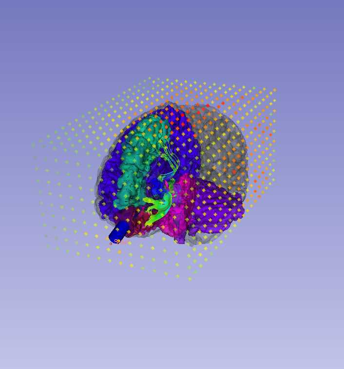

## Brain Tumour Segmentation
# Key Investigators
- Daiana Pur (Biomedical Engineering, Western University)

# Project Description
1. Learn and improve existing code for extension

2. Adding a Brain Tumour Segmentation feature to an existing Neurosurgical Planning tool

## Objective
1. Visualize Tumour
2. Learn the features of SegmentEditor
3. Learn features of module_segment_statistics
4. Introduce SegmentEditor features into existing scripted extension
5. Troubleshoot

## Approach and Plan

1. Work through different versions of NeuroPath extension (Adam Rankin)
2. Visualize different types of Tumours (high grade glioma vs low grade glioma etc) by obtaining sample data
3. Different types of tumours require different approaches depending on size, visiblility of contrast

## Progress and Next Steps
1. Troubleshooting existing extension

2. Obtained Sample Data, tried different settings for creating mask over tumors

3.  module_segment_statistics module computes volume, surface, mean intensity, and various other metrics for each segment.

# Illustrations

# Background and References

https://sites.duke.edu/pcqiba/2018/05/13/new-protocol-for-tumor-segmentation-using-3d-slicer/
http://www2.imm.dtu.dk/projects/BRATS2012/Jakab_TumorSegmentation_Manual.pdf
https://www.ncbi.nlm.nih.gov/pmc/articles/PMC3991434/
http://slicer.readthedocs.io/en/latest/user_guide/module_segmenteditor.html
