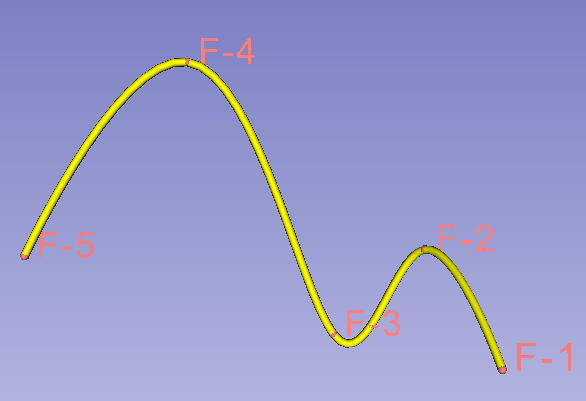

Back to [Projects List](../../README.md#ProjectsList)

## Add curve tool to Markups module

## Key Investigators
- Andras Lasso (PerkLab, Queen's)

# Project Description

Currently, defining and editing curves is inconvenient in Slicer. It requires multiple nodes: a markup fiducial node, markups to model node (provided by MarkupsToModule extension), and an output model node. It has also many limitations (not possible to insert points along the contour line, get basic statistics, snap to surface, very slow when hundreds or more points are managed, etc).

## Objective

Create new curve tool that fulfills the following requirements:
- Connect points with curve: with various interpolation and approximation methods; open/closed
- Add/remove points on line
- Snap slice view to curve
- Access to interpolated points
- Basic metrics: length, curvature
- Basic operations: fitting, resampling, smoothing
- Right-click on line for properties

Common markup requirements:
- Point selection by left click
- Point properties by right click (select on/off, delete, rename)
- Projection view in slice views (curve line and control points are visible even if not completely in the same plane as slice view; adjustable color/opacity - distance function)
- Allow defining point name without defining point position (allow placement and replacement)
- Constrain placement to other nodes (slice, model, maybe volume rendered volume)
- Store points in vtkPoints data structure
- Efficient interaction and rendering (using 3D glyph mapper)
- Highlight when hovering over
- Locking
- Nicer label rendering: smooth text label boundary; complete visibility in 3D

## Approach and Plan

1. Collect requirements
1. Prepare infrastructure in Markups module for a new markup type.
1. Implement markup curve

## Progress and Next Steps

- Initial requirements are collected - see list in Objective section

# Illustrations

<!--Add pictures and links to videos that demonstrate what has been accomplished.-->

# Background and References

<!--Use this space for information that may help people better understand your project, like links to papers, source code, or data.-->

- Source code: https://github.com/lassoan/Slicer (branch TBD)
- Markups to model extension: https://github.com/SlicerIGT/SlicerMarkupsToModel
