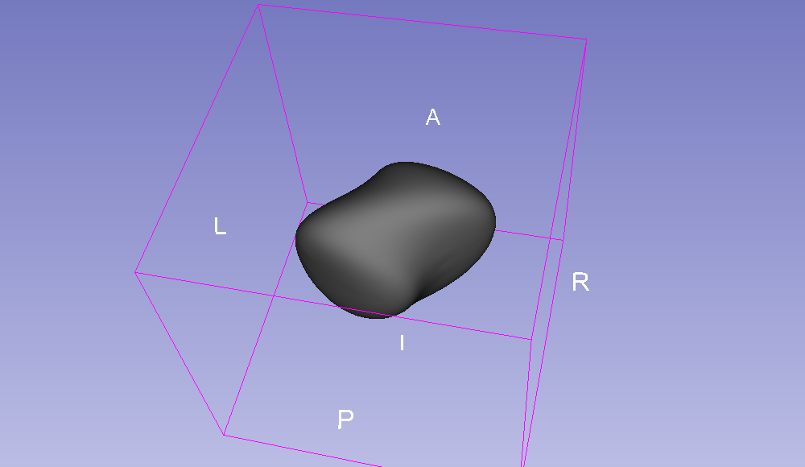

Back to [Projects List](../../README.md#ProjectsList)

# Performance test for deformable transforms

## Key Investigators

- Tamas Ungi (Queen's University)
- Tristan Watts-Willis (Verdure Imaging)
- Andras Lasso (Queen's University)
- Jean-Christophe Fillion-Robin (Kitware)

# Project Description

We have noticed in one application that registration using deformable transforms (vtkThinPlateSplineTransform) is significantly slower in Slicer 4.9 than in Slicer 4.8. This may cause FPS problems in IGT applications with real time tracking.

## Objective

1. Run real time updates (10 FPS) with deformable transforms and large models in the 3D view.

## Approach and Plan

1. Provide a script (Jupyter NB?) for reproducing the problem
1. Isolate what is responsible for performance issues
1. Fix the issue if possible

## Progress and Next Steps

1. Created a short test that runs from an empty scene and outputs profiling information
1. Found out that the total time Slicer is irresponsive is the same, but rendering output is faster on 4.8

# Illustrations

<!--Add pictures and links to videos that demonstrate what has been accomplished.-->

<!---->

# Background and References

<!--Use this space for information that may help people better understand your project, like links to papers, source code, or data.
- Documentation: https://link.to.docs
- Test data: https://link.to.test.data
-->

- Source code: https://github.com/ungi/DeformablePerformanceTest
- [Test data (skull model)](https://1drv.ms/u/s!AhiABcbe1DBygplqTSr_rYWPhdOQeQ)
