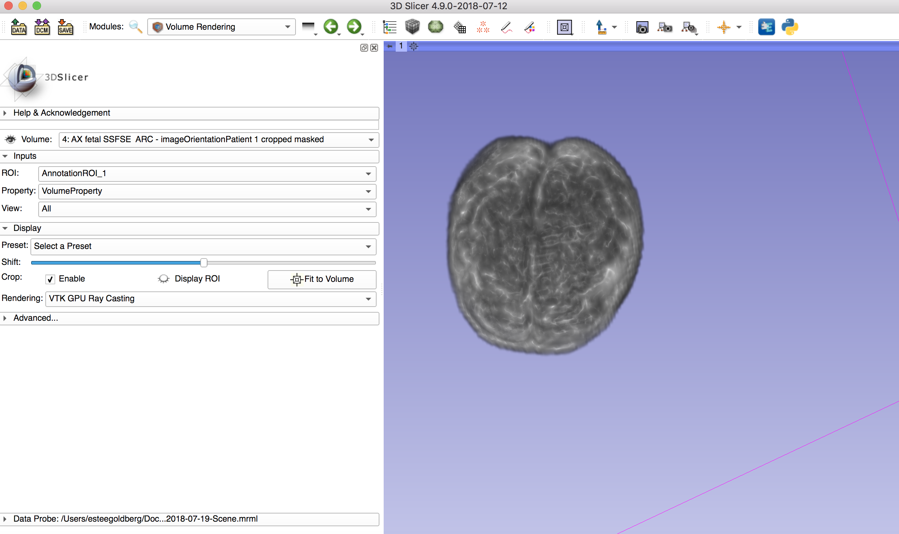

Back to [Projects List](../../README.md#ProjectsList)

## Fetal Brain Segmentation and Volumization

## Key Investigators
- Estee Goldberg (Biomedical Engineering, Western University)
- Denis Kikinov (Software Engineering, Western University)
- Wenyao Xia (Medical Biophysics, Robarts Research Institute)

# Project Description
<!-- Add a short paragraph describing the project. -->
This will be a tool to segment the fetal brain from the a fetal MRI. Afterwards the fetal brain will be compiled into a brain volume for later comparisons.

## Objective

1. Take any fetal MRI image
1. Semiautomatically segment the fetal brain
1. Semiautomatically produce a brain volume for the segmented brain

## Approach and Plan

1. Take fetal MRI images.
1. Segment the brain.
1. Create a model from the segmentation.
1. Compute the volume of the brain.

## Progress and Next Steps

<!--Describe progress and next steps in a few bullet points as you are making progress.-->
### Progress

After some search we found no automatic modules or extensions that work for fetal MRIs. As such we have experimented with ways to manually segment and get a volume. We had some success with segment editor's semiautomatic segmentation, just a lot of corrections were required.

### Next Steps

Implement program as a module in 3D Slicer.

# Illustrations

<!--Due to the secrecy of the fetal MRI images, the following artistic representations have been created.-->
<!--Add pictures and links to videos that demonstrate what has been accomplished.-->

<!---->
<!---->

# Background and References

<!--Use this space for information that may help people better understand your project, like links to papers, source code, or data.-->

<!-- - Source code: https://github.com/YourUser/YourRepository-->
<!-- - Documentation: https://link.to.docs
- Test data: https://link.to.test.data
-->
