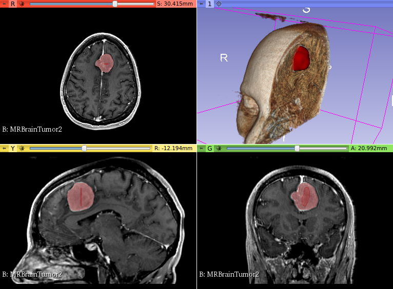
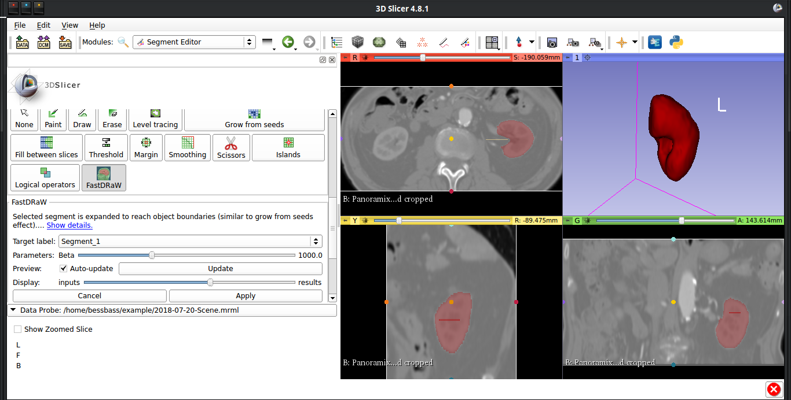

Back to [Projects List](../../README.md#ProjectsList)

## Interactive Segmentation Using the SegmentEditor

## Key Investigators
- Houssem Gueziri (MNI)

# Project Description
<!-- Add a short paragraph describing the project. -->
Fast Delineation by Random Walker (FastDRaW) is a graph-based interactive segmentation approach implemented in Python.
This project aims at implementing a plugin in the SegmentEditor to perform FastDRaW in 3D Slicer.

## Objective
1. Learn how to use the SegmentEditor to develop plugins
2. Integrate python-based code to Slicer

## Approach and Plan

1. Develop a toy example segmentation using the SegmentEditor
2. Starts from the __Grow from seeds__  plugin to adapt to FastDRaW

## Progress and Next Steps

1. Added FastDRaWEffect extension to the SegmentEditor
2. Added merged python implementation of fastDRaW
3. Get segmentation from numpy array and convert it to vtkImageData to display preview
4. Add GUI to set parameters (beta parameter)
5. Add GUI to select active label

## TODO
1. Currently, the segmentation does not update when a non-target label is beeing modified
2. Updating the graph costs when the beta parameter is modified (building the graph is time consuming, maybe create a dedicated button to rebuild the graph when beta changes?)
3. Clean code and group source files in single folder
4. Learn how to make downladable extension

# Illustrations

<!--Add pictures and links to videos that demonstrate what has been accomplished.-->

<!---->

# Background and References

<!--Use this space for information that may help people better understand your project, like links to papers, source code, or data.-->

- Source code: https://github.com/hgueziri/FastDRaW-Segmentation
- Documentation: [FastDRaW paper](http://www.hifiv.ca/wp-houssem/wp-content/uploads/2016/09/FastDRaW_camera-ready.pdf)
- Test data:
