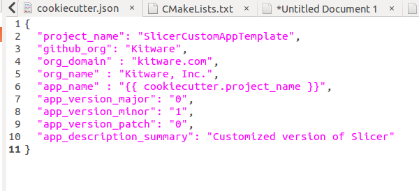

Back to [Projects List](../../README.md#ProjectsList)

# Slicer Custom App Template

## Key Investigators

- Jean-Christophe Fillion-Robin (Kitware)
- Tristan Watts-Willis (Verdure Imagine)
- Tamas Ungi (Queen's University)
- Andras Lasso (Queen's University)

# Project Description

SlicerCustomAppTemplate is a starting point for creating a custom 3D Slicer-based application. 3D Slicer have been used to develop research and commercial applications by customizing GUI, removing unnecessary modules, and adding custom functionality.

## Objective

1. Provide example of a custom application based on Slicer

## Approach and Plan

1. Test existing Slicer customization options
2. Provide examples/tutorials on how to use them
3. Fix any issues we run into

## Progress and Next Steps

* Identified issue related to CustomApp versioning and working on a fix

* Finalizing topic to improve both [KitwareMedical/SlicerCustomAppTemplate](https://github.com/KitwareMedical/SlicerCustomAppTemplate) and [Slicer/Slicer](https://github.com/Slicer/Slicer)
  * cookiecutter learned new parameters: `app_name`, `app_version_major`, `app_version_minor`, `app_version_patch` and `app_description_summary`
  * introduced file `slicer-application-properties.cmake` now required in each application. For example:
    * `Slicer/Application/SlicerApp/slicer-application-properties.cmake`
    * `CustomApp/App1/slicer-application-properties.cmake`
    * `CustomApp/App2/slicer-application-properties.cmake`

* Improved `SlicerCustomAppTemplate` to support packaging of Superbuild based extension

* Fixed [openigtlink/SlicerOpenIGTLink](https://github.com/openigtlink/SlicerOpenIGTLink) to support integration in Custom application.

* Next steps:
  * Move `qSlicerMainWindow`, `qSlicerAboutDialog` into `Slicer/Base/QtApp` for easier re-use
  * Submit pull request to fix [openigtlink/SlicerOpenIGTLink](https://github.com/openigtlink/SlicerOpenIGTLink)

# Illustrations

<!--Add pictures and links to videos that demonstrate what has been accomplished.-->

<!---->

# Background and References

<!--Use this space for information that may help people better understand your project, like links to papers, source code, or data.-->

- Existing project to create custom Slicer apps: https://github.com/KitwareMedical/SlicerCustomAppTemplate

<!--
- Source code: https://github.com/YourUser/YourRepository
- Documentation: https://link.to.docs
- Test data: https://link.to.test.data
-->
