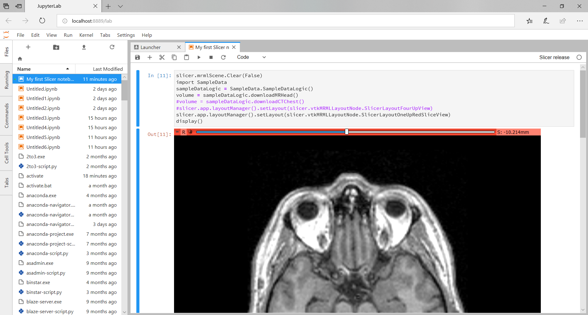

Back to [Projects List](../../README.md#ProjectsList)

# Use Slicer from Jupyter notebook

## Key Investigators

- [Jean-Christophe Fillion-Robin](https://www.kitware.com/jean-christophe-fillion-robin/) (Kitware Inc., USA)
- [Andras Lasso](https://github.com/lassoan) (Queen's University, Canada)

# Project Description

[Jupyter notebook](https://en.wikipedia.org/wiki/IPython) is an interactive shell for executing scripts and viewing execution results.

During last project week in Gran Canaria, we have implemented [SlicerJupyter](https://github.com/Slicer/SlicerJupyter) extension, which allows creating Jupyter notebooks that use Slicer. 

Notebooks are useful for developing data analysis and visualization scripts and for creating rich, interactive, shareable reports.

## Objective

This project week we will address some of the limitations of the current extension, which will make it more accessible and more convenient to use.

## Approach and Plan

1. Fix build/packaging errors on Linux and macOS.
1. Implement auto-completion.
1. Check if there are any additional notebook features that are very useful and easy to implement.
1. Try to set up a docker image to run Slicer kernels online using [binder](https://mybinder.org/).

## Progress and Next Steps

1. [SlicerJupyter](https://github.com/Slicer/SlicerJupyter) extension is implemented and published in the extension manager

# Illustrations

Side-by-side view of a Notebook and 3D Slicer:

Notebook showing code and viewer content:

Notebook showing code and viewer content:

Complete notebook rendered on GitHub: https://github.com/lassoan/SlicerNotebooks/blob/master/My%20first%20Slicer%20notebook.ipynb

# Background and References

- [SlicerJupyter extension](https://github.com/Slicer/SlicerJupyter)
- https://en.wikipedia.org/wiki/Project_Jupyter
- [Notebook format description](http://nbformat.readthedocs.io/en/latest/format_description.html)
