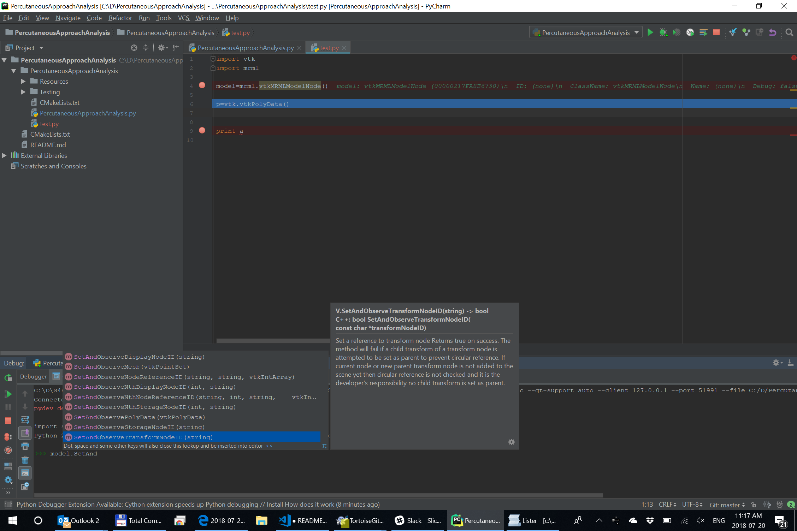

Back to [Projects List](../../README.md#ProjectsList)

# Improve usability of Slicer from Python

## Key Investigators

- [Jean-Christophe Fillion-Robin](https://www.kitware.com/jean-christophe-fillion-robin/) (Kitware Inc., USA)
- [Andras Lasso](https://github.com/lassoan) (Queen's University, Canada)

# Project Description

Python is getting the most widely used platform for medical image computing. It is important to make it easy to use and extend Slicer using Python.

[Jupyter notebook](https://en.wikipedia.org/wiki/IPython) is an interactive shell for executing scripts and viewing execution results. During last project week in Gran Canaria, we have implemented [SlicerJupyter](https://github.com/Slicer/SlicerJupyter) extension, which allows creating Jupyter notebooks that use Slicer.

## Objective

Improve Python IDE, debugging, and Jupyter support.

## Approach and Plan

1. Improve PyCharm auto-complete and debugging
1. Improve [SlicerJupyter](https://github.com/Slicer/SlicerJupyter): fix build/packaging errors on Linux and macOS, implement auto-completion, set up a docker image to run Slicer kernels online using [binder](https://mybinder.org/).

## Progress and Next Steps

- Updated Slicer's Python interpreter to be usable from PyCharm (https://github.com/Slicer/Slicer/pull/993)
  - Debugging of standalone Python scripts work (runs in the debugger same way as in Slicer)
  - Slicer's Python console can be used as a regular Python console (tested on linux only)
    - Improved applauncher to support interactive mode: https://github.com/commontk/AppLauncher/pull/100
  - Auto-completion in editor (without debugging) does not work yet

- SlicerJupyter: decided to fix build errors and auto-complete for now and leave more advanced features for later. Probably will not switch to IPython, but it is an option after Slicer switched to Python3.

# Illustrations

PyCharm auto-complete and documentation works great during debugging

# Background and References

- [SlicerJupyter extension](https://github.com/Slicer/SlicerJupyter)
- https://en.wikipedia.org/wiki/Project_Jupyter
- [Notebook format description](http://nbformat.readthedocs.io/en/latest/format_description.html)
