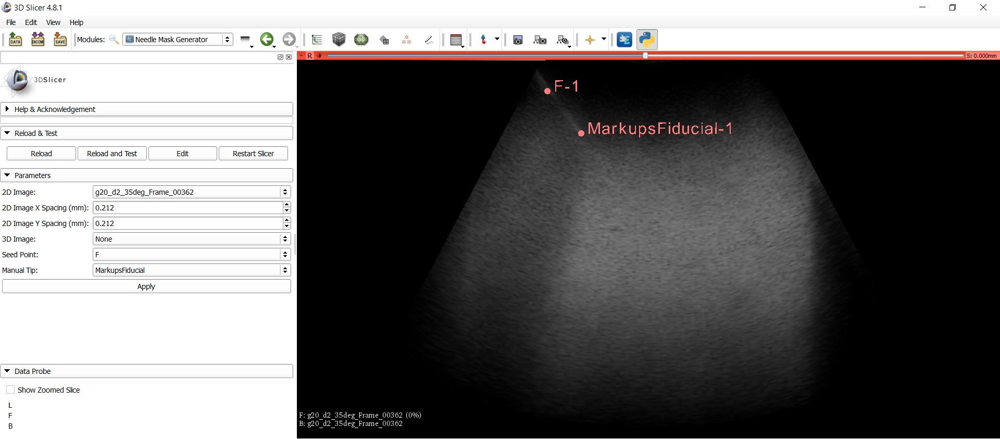
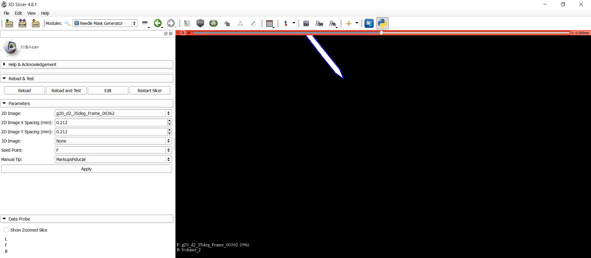
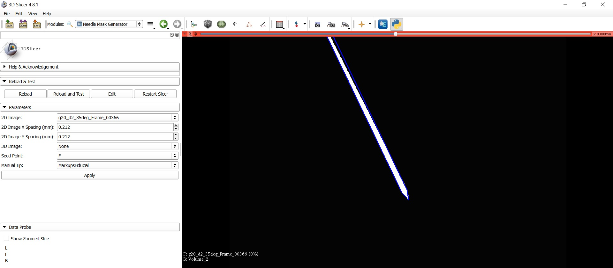

Back to [Projects List](../../README.md#ProjectsList)

# Using Extensions

## Key Investigators

- Derek Gillies (Robarts Research Institute)

# Project Description

Supervised machine learning methods require an input image with a corresponding mask for training a network. Currently, the Volume Clip extension is used with the Scene Views module to create these masks, but it is a multi-step process. This project will focus on automating these steps to create masks for applicators in 2D ultrasound liver images.

## Objective

1. Create a module that outputs masks for machine learning applications

## Approach and Plan

1. Dedicate time to learning
2. Talking to more knowledgable people

## Progress and Next Steps

- 3D images were loaded in as a Vector Volume, 2 points were used as inputs for tip and trajectory computation, then a needle model was created
- The Volume Clip to Model module was used on the needle model to change the image to be white inside and black outside
- Since 2D images were loaded into Slicer as a Vector Volume, the Vector to Scalar Volume module was used to convert the images to use with 3D logic
- 2D images do not have pixel spacing encoded, so a few "ctk.ctkDoubleSpinBox()" entry fields were added to accept user input

- TODO: The Volume Clip to Model does not always fill the inside of the model, but the cause is unknown since it is an inconsistent issue
- TODO: Deleting a node with slicer.mrmlScene.RemoveNode() does not restart the naming convention (i.e. creating the variable again will still add "Model_1" instead of just "Model")
- TODO: The needle model extends outside the ultrasound filed of view. The mask should be cropped to be present only where there is image data

<!--Describe progress and next steps in a few bullet points as you are making progress.-->

# Illustrations
Inputs to the module are an ultrasound image with a point on the shaft and a point on the tip:

Outputs to the module are a mask that can be used for supervised machine learning:

TODO: Occasionally the VolumeClip does not fill the entire model:

<!--Add pictures and links to videos that demonstrate what has been accomplished.-->

<!---->

<!---->

# Background and References

<!--Use this space for information that may help people better understand your project, like links to papers, source code, or data.-->

- Existing project to create custom Slicer apps: https://github.com/KitwareMedical/SlicerCustomAppTemplate
- VolumeClipWithModel.VolumeClipWithModelLogic().showInSliceViewers(outputVolume2, ["Red", "Yellow", "Green"]) was used to update the scene with the newly created image
- slicer.util.resetSliceViews() can be used if you rescale images and want to adjust the slicer viewer's field of view
- This website was helpful for getting Python module code: http://slicer.readthedocs.io/en/latest/developer_guide/slicer.html

<!--
- Source code: https://github.com/YourUser/YourRepository
- Documentation: https://link.to.docs
- Test data: https://link.to.test.data
-->
