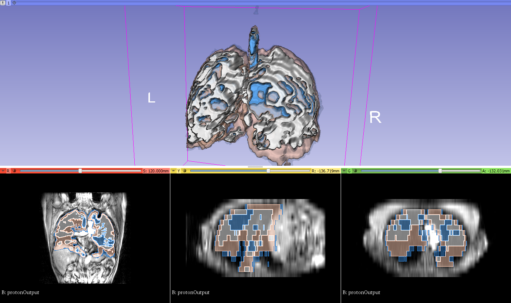
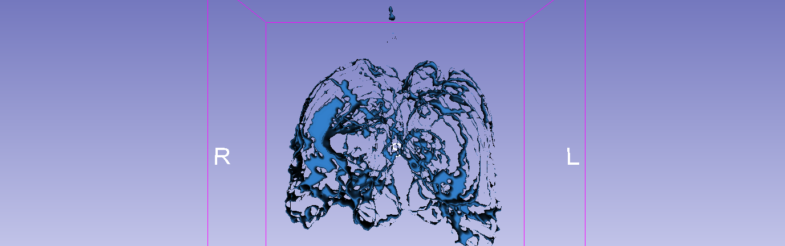
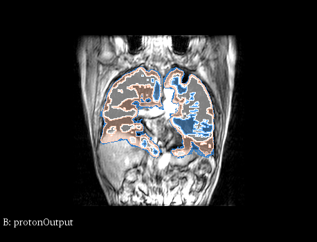

Back to [Projects List](../../README.md#ProjectsList)

## Segmentation, co-registration, and clustering of anatomical and functional respiratory MRI

## Key Investigators
- Andrew Westcott (Robart's Research Institute, Western University)
- Alex Matheson (Robart's Research Institute, Western University)

# Project Description
Imaging of the lung is extremely diffucult due to weak signal in conventional proton MRI. To remedy this, inhaled contrast agents are used in Helium and Xenon MRI
to visualize lung regions with poor ventilation. These functional images require registration to anatomical MRI to obtain and accurate computation
of the percentage of the lung that is non-functioning or poorly functioning. Our lab has an operational matlab pipeline that uses semi-automated segmentation to segment the
two MRI images, co-registration to align the two images, and k-means clustering to grade the lungs on ventilation extent. Our project will aim to replace this pipeline with
a 3D slicer tool. As the old pipeline has not been updated in 7 years, we will also aim to update the techniques used to modern research standards.

## Objective
1. Implement a 3D slicer segmentation script for both proton and contrast gas images
2. Implement a 3D slicer co-registration script
3. Implement a clustering algorithm for segmented contrast gas images
4. Combine different components into a single tool for ease of use.
5. Enable computation of Ventilation Defect Percent from the results, and allow for the addition of future biomarkers.

## Approach and Plan
1. Bridge some existing, efficient matlab functions to 3D sliceer.
2. Inventory different segmentation tools present in 3D slicer to determine the best fit to lung MRI.
3. Evaluate advantages and disadvantages to manual versus semi-automated segmentation tools.
4. Evaluate different alternatives to k-means clustering for grading ventilation from polarized gas images

## Progress and Next Steps

<!--Describe progress and next steps in a few bullet points as you are making progress.-->

# Illustrations

<!--Add pictures and links to videos that demonstrate what has been accomplished.-->

1. 
2. 
3. 

<!---->

# Background and References

<!--Use this space for information that may help people better understand your project, like links to papers, source code, or data.-->

- Source code: https://github.com/Tsintsuntsini/Slicer2018
<!-- - Documentation: https://link.to.docs -->
<!-- - Test data: https://link.to.test.data -->
