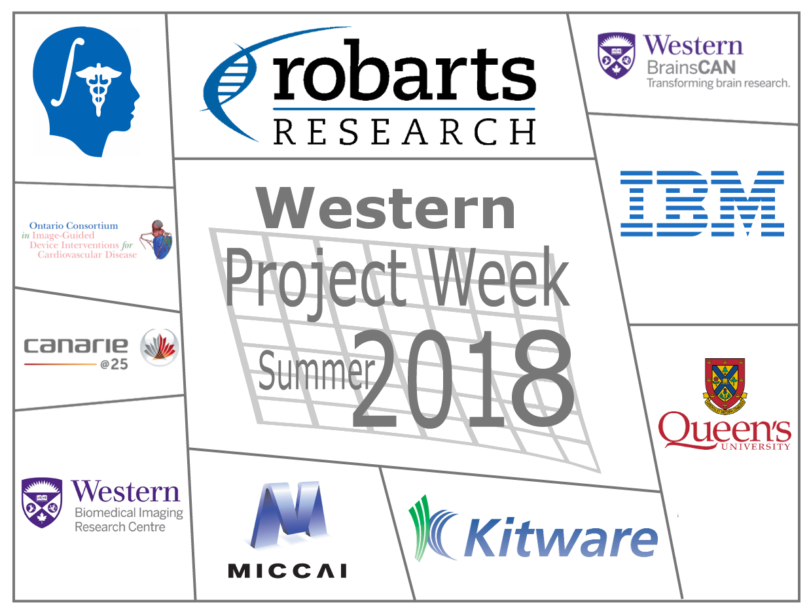

## Welcome to the web page for the 29th Project Week!
The 29th NA-MIC Project Week will be held during the week of July 16-20, 2018 at the [Robarts Research Institute](http://www.robarts.ca/), Western University.

Please read about our experience in running these events since 2005: [Increasing the Impact of Medical Image Computing Using
Community-Based Open-Access Hackathons: the NA-MIC and 3D Slicer Experience](http://www.spl.harvard.edu/publications/item/view/3004).

## Photo Album
The 29th NA-MIC PW [Event album](http://bit.ly/slicer-29pw-photos).

## Logistics

To receive information and announcements about the events please join the [Slack group](https://join.slack.com/t/spww/shared_invite/enQtMzk4MDQyMDI1NjU0LTIwZDU2MGY4N2MzYTdmMzE1ZTlmNzA2NmNhYjE5MTA0NWMyY2RhMDQyMWYwMjkzYmU3MTczZmE0NTM0ZDZjNDQ) (for questions dedicated to this event).

+ **Dates:** July 16-20, 2018.
+ **Location:** [Robarts Research Institute](https://www.google.ca/maps/@43.0113638,-81.2738561,3a,75y,340.63h,93.84t/data=!3m6!1e1!3m4!1sqB04BofO2fkNxgxlzynSRA!2e0!7i13312!8i6656)
+ **REGISTRATION:** [https://event-wizard.com/Slicer2018/0/register/](https://event-wizard.com/Slicer2018/0/register/)
+ **Hotel:** No formal arrangement has been made, but some options are:
  + Close, $, wide range of room styles: [http://guesthouseonthemount.ca/](http://guesthouseonthemount.ca/)
  + Close, $$, balanced offering: [https://windermeremanor.com/](https://windermeremanor.com/)
  + Downtown, $$/$$$, nice character, good location to explore London, [http://www.deltahotellondon.com/](http://www.deltahotellondon.com/)
+ **Parking:** Visitor parking is available at $12/day (sorry!) in the nearby [hospital visitor parking garage](https://www.google.ca/maps/@43.0142363,-81.2750746,3a,75y,186.07h,100.01t/data=!3m5!1e1!3m3!1sVo_3mg5ibFW_kPnYjVOrPQ!2e0!6s%2F%2Fgeo0.ggpht.com%2Fcbk%3Fpanoid%3DVo_3mg5ibFW_kPnYjVOrPQ%26output%3Dthumbnail%26cb_client%3Dmaps_sv.tactile.gps%26thumb%3D2%26w%3D203%26h%3D100%26yaw%3D62.77921%26pitch%3D0%26thumbfov%3D100). University of Western Ontario parking information is available [here](https://www.uwo.ca/parking/find/visitor/index.html)

## Local Organizing Committee

- Host: [Terry Peters](http://www.robarts.ca/terry-peters), Robarts Scientist; Professor Medical Imaging; Medical Biophysics; Biomedical Engineering

- Email Local Organizing Committee:
  - [Adam Rankin, Terry Peters, Jackie Williams](mailto:arankin@robarts.ca,tpeters@robarts.ca,jwilliams@robarts.ca?cc=tkapur@bwh.harvard.edu&subject=ProjectWeek29)

## Frequently Asked Questions

+ [What?](../README.md#what)
+ [When, where, how much?](./README.md#logistics)
+ [How does it work?](../README.md#how-does-it-work)
+ [Who can attend?](../README.md#who-can-attend)
+ [Who should attend?](../README.md#who-should-attend)
+ [What else?](../README.md#what-else)
+ [Who to contact?](./README.md#local-organizing-committee)

## Program
|   =    |Monday July 16 | Tuesday July 17 | Wednesday July 18 | Thursday July 19 | Friday July 20
|:---:   |     :---:     |     :---:       |     :---:         |     :---:        |     :---:
|9:00    |               |                 |                   |                  |
|10:00   |               | Segmentation tutorial/breakout  | Augmented/virtual reality demo/breakout  |                  |
|11:00   |               |                 |                   |                  |   Project reviews
|12:00   |Arrival and *Lunch*|  *Lunch*    |    *Lunch*        |     *Lunch*      |    --- Fin ---
|13:00   |Kick-off and projects|Registration tutorial/breakout||                  |
|14:00   |               |                 |                   |                  |
|15:00   |               |Image-guided therapy tutorial/breakout|  |              |
|16:00   |               |                 |                   |    Clinical interaction session |
|17:00   |               |                 |                   |                  |
|18:00   |               |                 |                   |                  |
|19:00   |    End of day |  End of day     |  End of day       |    [Organized](https://www.therecroom.com/?location=london-masonville)      |
|20:00   |               |                 |                   |    [off-site](https://www.therecroom.com/?location=london-masonville)  |
|21:00   |               |                 |                   |    [social event](https://www.therecroom.com/?location=london-masonville)              |
|22:00   |               |                 |                   |                  |

## Projects <a name="ProjectsList"/>

Please [follow these instructions](./Projects/README.md) to create a project page. For those new to Git who are daunted by this, you can email your project details to [Adam Rankin](mailto:arankin@robarts.ca) and he will add a project page for you.

### Virtual/Augmented Reality

### Image Guided Therapy
+ [TEE Probe Calibration](./Projects/TEECalibration/README.md) (Leah Groves and Golafsoun Ameri)
+ [Ultrasound-guided kidney needle simulator](./Projects/UltrasoundKidneySimulator/README.md) (Lyla Mu, Tamas Ungi)
+ [Real-time segmentation using machine learning](./Projects/UsingExtensions/README.md) (Derek Gillies)

### Vascular/Cardiac
+ [Working with the Slicer VMTK Extension](./Projects/CenterlinesVMTK/README.md) (Michael Schumaker, Eman Arnout, Olga Trichtchenko, Jean-Christophe Fillion-Robin)
+ [Slicer Mitral Valve](./Projects/SlicerMitralValve/README.md) (Patrick Carnahan)

### Segmentation
+ [Brain Tumour Segmentation](./Projects/Brain_Tumour_Segment/README.md) (Daiana Pur)
+ [Fetal Brain Segmentation and Volumization](./Projects/FetalBrainSegmentationAndVolumization/README.md) (Estee Goldberg, Denis Kikinov and Wenyao Xia)
+ [Interactive Segmentatin Using SegmentEditor](./Projects/InteractiveSegmentation/README.md) (Houssem Gueziri)
+ [Brain Ventricle Segmentation](./Projects/BrainVentricleSegment/README.md) (Hassan Haddad)

### Core infrastructure
+ [Improve Python support](./Projects/SlicerPython/README.md) (Andras Lasso, Jean-Christophe Fillion-Robin)
+ [Deformable transfoms performance test](./Projects/DeformableTransformTest/README.md) (Tamas Ungi, Tristan Watts-Willis, Andras Lasso, Jean-Christophe Fillion-Robin)
+ [Slicer Custom App](./Projects/SlicerCustomApp/README.md) (Tristan Watts-Willis, Tamas Ungi, Andras Lasso, Jean-Christophe Fillion-Robin)

### Quantification
+ [Endoscope View Quantification](./Projects/EndoscopeViewQuantification/README.md) (Franklin King)

### Application
+ [Scanner Remote Control](./Projects/Scanner%20Remote%20Control/README.md) (Ahmed Mahran, Franklin King, Jean-Christophe Fillion-Robin)

<a name="BreakoutSessions"/>

## Breakout sessions

+ [Segmentation](./BreakoutSessions/Segmentation.md)
+ [Registration](./BreakoutSessions/Registration.md)
+ [Augmented/Virtual reality](./BreakoutSessions/AR-VR.md)
+ SlicerIGT: presentation about how to build Slicer-based real-time image-guidance and navigation systems

## Clinical Interaction Session
We have invited a number of clinicians from a variety of specialties to visit, present, discuss, or just generally engage with the community in order to facilitate meaningful and useful progress.

## Registrants
1. Daniel Allen (Robarts Research Institute)
1. Golafsoun Ameri (Robarts Research Institute)
1. Udunna Anazodo (LHRI)
1. Eman Arnout (LHSC)
1. Patrick Carnahan (Robarts Research Institute, Western University) @pcarnah
1. Elvis Chen (Robarts Research)
1. Mamadou Diop (Western)
1. Mitchell Doughty (Sunnybrook Research Institute)
1. Mena Gaed (Robarts Research Institute)
1. Estee Goldberg (Western University )
1. Leah Groves (Robarts Research Institute)
1. Houssem Gueziri (MNI)
1. Hassan Haddad (Western University)
1. Ikhlas Hash (Western University)
1. Nobuhiko Hata (Brigham and Women's Hospital)
1. Dimuthu Henadeerage Don (Robarts Research Institute)
1. Mason Kadem (Brain and mind)
1. Denis Kikinov (Western University) @dkikinov
1. Franklin King (Brigham and Women's Hospital)
1. Andras Lasso (PerkLab, Queen's University) @lassoan
1. Jonathan Lau (Western University)
1. Derek	Gillies (Robarts Research Institute) @gilliesd
1. YingLi Lu (Robarts Research Institute)
1. Ahmed Mahran (Brigham and Women's Hospital)
1. Pankhuri Malik (Western University)
1. Lyla Mu (Western University)
1. Hareem Nisar (Student)
1. Daiana Pur (Western University) @dpuruwo
1. Adam Rankin (Robarts Research Institute) @adamrankin
1. Michael Schumaker (Sunnybrook Research Institute) @mschumak
1. Tamas Ungi (Queen's University) @ungi
1. Reid Vassallo (Robarts)
1. Tristan Watts-Willis (Verdure Imaging Inc.) @xTdub
1. Wenyao Xia (Western University)
1. Yiming Xiao (Robarts Research Institute, Western University)
1. Yaojie Zhou (Robarts Imaging)
1. Jean-Christophe Fillion-Robin (Kitware, Inc.) @jcfr

Do not add your name to this list - it is maintained by the organizers based on your paid registration.
