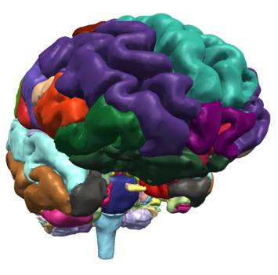
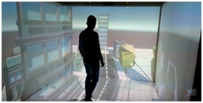
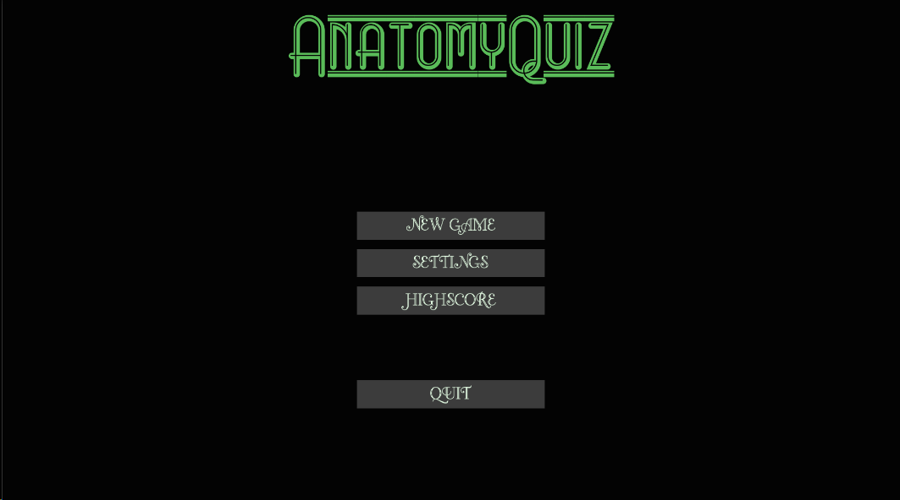
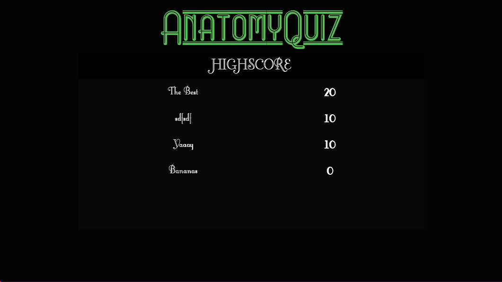
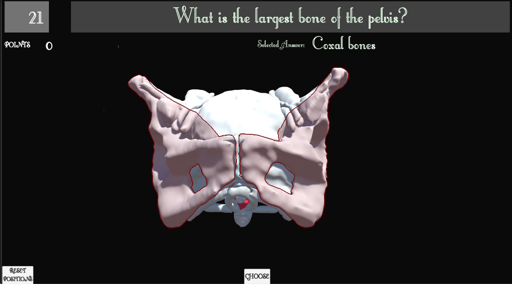
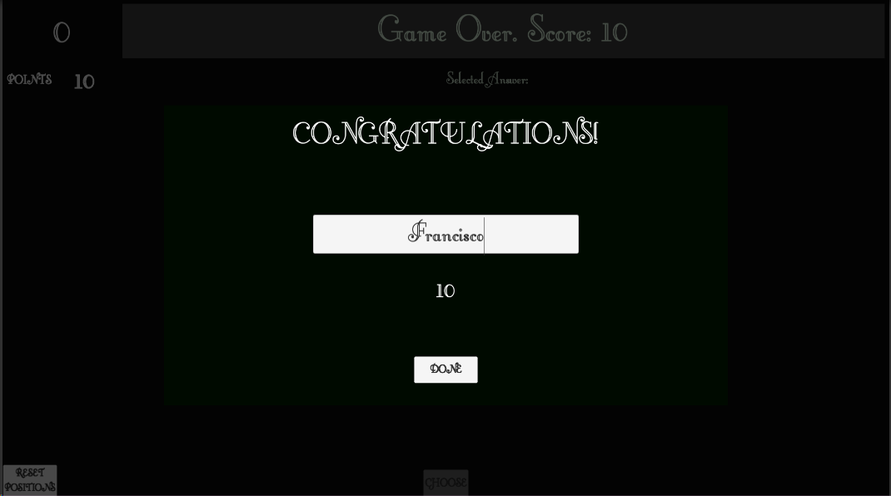

Back to [Projects List](../../README.md#ProjectsList)

# 3DSlicer Models for Brain Quiz - Serious Games

## Key Investigators

- Sergi Bermudez i Badia (M-ITI - MACbioIDi)
- Yuri Almeida (M-ITI - MACbioIDi)
- Abián Hernández-Guedes (ULPGC - GTMA-IUIBS - MACbioIDi)
- Artemisa Moreno (UniCV - MACbioIDi)
- María Dolores Afonso-Suárez (ULPGC - GTMA-IUIBS - MACbioIDi)
- Juan Ruiz-Alzola (ULPGC - GTMA-IUIBS - MACbioIDi)

## Project Description

### Designing training and divulgative tools from 3DSlicer models.

This proposal is a joint collaboration work: [M-ITI](https://www.m-iti.org/) and [ULPGC-IUIBS MACbioIDi](https://mt4sd.ulpgc.es/w/index.php/Proyecto_MACbioIDi). It is a proposal for the areas of education, scientific and medical projects. The objective of this project is to create a complete brain quiz application within the concept of Serious Game, by using scenarios developed in Unity -the cross platform game engine-. These scenarios will use models of images imported from 3DSlicer. This project is the continuation of the prototype developed during [PW28th NA-MIC](https://na-mic.github.io/ProjectWeek/PW28_2018_GranCanaria/Projects/3DSlicerModelsForSeriousGames/)

## Objectives

1. To develop a Brain Quiz to interact, aimed to both: training and as a divulgation tool for museums.
1. To study different possibilities of interaction.
1. To study the development of a template to create new applications.

## Approach and Plan

1. To consult with an anatomist the design of the quiz.
1. To design the quiz with different difficulty levels.
1. To study the use of the Intel RealSense and digital tablets as tools to interact with.

## Progress and Next Steps

1. We have created a template to build quizzes.
1. Document on how to create more questions.
1. Refine some interface issues.
1. Allow rotation of all models at the same time.
1. Add and test interaction with touch on android.

## Illustrations

| Prototype from PW28th| 3D Model for 30PW| 
| ---------------------|------------------|
|  |  |

Unity Scenario video examples.

30 PW NA-MIC Implementation.

| Main menu| Highscore| 
| ---------|----------|
|  |  |

| Question example | End game + New High Score Entry | 
| -----------------|---------------------|
|  |  |

## Background and References

+ [First prototype](https://na-mic.github.io/ProjectWeek/PW28_2018_GranCanaria/Projects/3DSlicerModelsForSeriousGames/)
+ [Virtual Reality with Customized Positive Stimuli in a Cognitive-Motor Rehabilitation Task: A feasibility study with subacute stroke patients with mild cognitive impairment
Mónica S. Cameirão, Fábio Pereira, Sergi Bermúdez i Badia](https://neurorehabilitation.m-iti.org/lab/wp-content/plugins/zotpress/lib/request/request.dl.php?api_user_id=161215&key=4ZQMQFB3&content_type=application/pdf)

+ Review work from [Summer Project Week 2013](https://na-mic.org/wiki/2013_Project_Week:WebbasedAnatomicalTeachingFrameworkSummer2013).  [Live Demo](http://fnndsc.github.com/babybrain)

