Back to [Projects List](../README.md#ProjectsList)

# Refining automatic segmentations from FreeSurfer in 3D Slicer

## Key Investigators

-	Nikos Makris (Brigham and Women’s Hospital and Harvard Medical School)
-	Juan Andrés Ramírez González (ULPGC – IUIBS)
- Yogesh Rathi (Laboratory for Mathematics in Imaging - Harvard Medical School)
-	Nayra Pumar Carreras (ULPGC – GTMA-IUIBS – MACbioIDi)
-	Juan Ruiz Alzola (ULPGC – GTMA-IUIBS – MACbioIDi)
- Zora Kikinis (Psychiatry Neuroimaging Laboratory, Harvard Medical School)

## Project Description

This project aims to improve the automatic segmentation results generated from the Freesurfer software, by loading these results in 3D Slicer and validating / editing these results in order to gain a better anatomical accuracy.

## Objectives

1.	To segment the brain using MRI images (images provided by Dr. Nikos Makris)
1.	To refine the generated automatic segmentations
1.	To identify the modules/tools in 3D Slicer used during the project

## Approach and Plan

1.	To import the labelmap and MRI files into Slicer
1.	To refine the existing segmentation following the guidance of an anatomist

## Progress and Next Steps

1. The image used on this project is the MIR of the brain labelled 103414.  
1. The two structures that have been segmented are:
   - Subcallosal area (SC)
     - Medial border: hemispheric margin
     - Lateral border: grey-white matter border 
     - Superior border: corpus callosum
     - Inferior border: inferior hemispheric curvature (45º line)
     - Anterior border: slice A 31.900mm
     - Posterior border: slice A 15.116 mm
   - Orbito Frontal Cortex (OFC)
     - Medial border: olfatory surcus
     - Lateral border: orbital surcus
     - Superior border: grey-white matter border
     - Inferior border: hemispheric margin
     - Anterior border: right hemisphere A 55.800mm, left hemisphere A 56.500mm
     - Posterior border: right hemisphere A 8.200mm, left hemisphere A 7.500mm
1. In the OFC segment the medial and two lateral segments have been merged into a single segment. The segmentation has been done manually, tracing the countours of the desired segments between the defined anterior and posterior boundaries on the coronal view.
We have taken, for the OFC, the traditional approach, following the olfatory surcus. Fiducial points were placed on the slices for guidance.

## Procedure
The Slicer module used was the Segment Editor. Once the fiducial points were placed, marking the boundaries, slice by slice, the draw/paint and erase tools (with an 1 to 3% diameter) were used to manually trace and fill the corresponding areas for each segment. No other segmentation tools were used, as the work was done in an entirely manual way. 
To ensure the correct overlap of the segment boundaries, when using the paint or draw tool, the setting for masking was set to editable area: outside all segments.

## Illustrations
<table border=0 width=100%>
  <tr><td colspan=3><b>Placement of the fiducial boundaries</b></td></tr>
  <tr valign=top align=center/
    <td>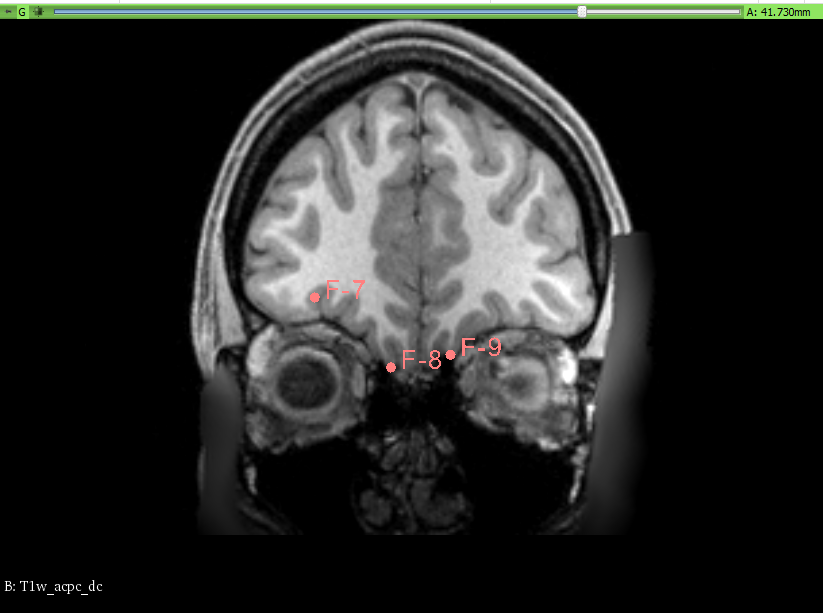</td>
    <td>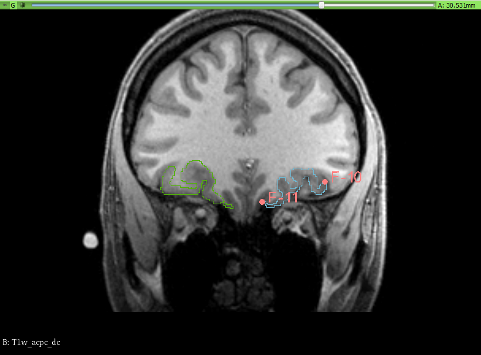</td>
    <td>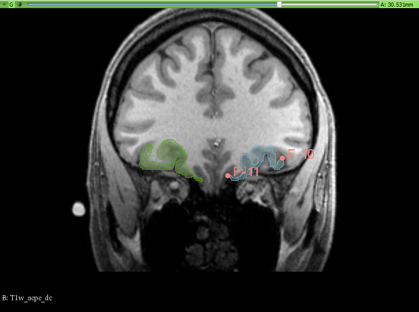</td>
  </tr>
  <tr valign=top align=center>
    <td><i>Manual segmentation</i></td>
    <td><i>FreeSurfer result</i></td>
    <td><i>Overlap</i></td>
  </tr>
  <tr><td colspan=3><b>Anterior view</b></td></tr>
  <tr valign=top align=center>
    <td>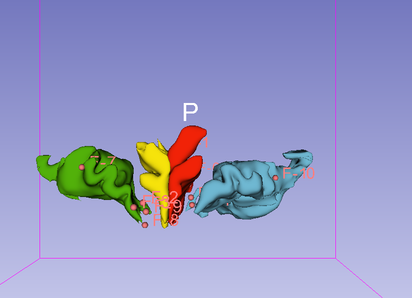</td>
    <td>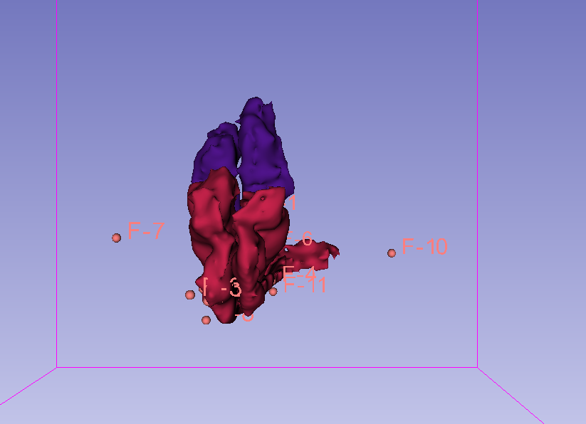</td>
    <td>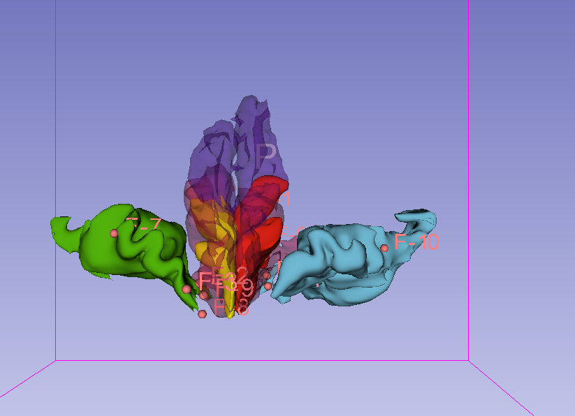</td>
  </tr>
  
  <tr><td colspan=3><b>Superior view</b></td></tr>
  <tr valign=top align=center>
    <td>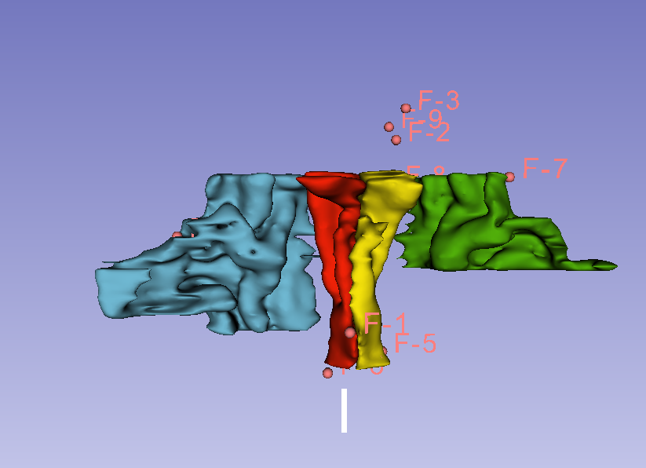</td>
    <td>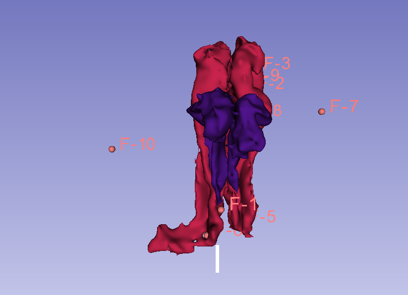</td>
    <td>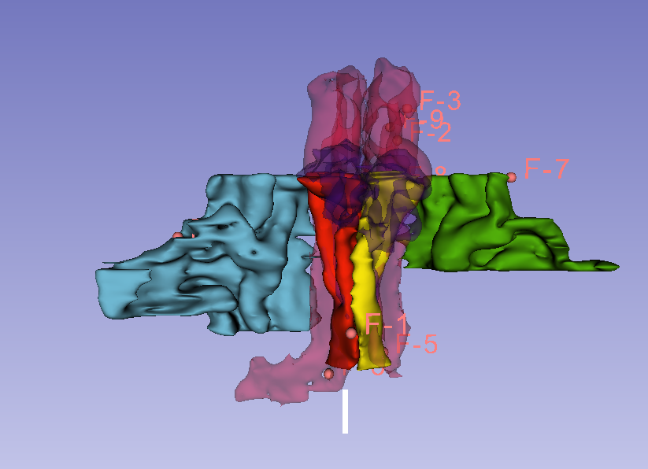</td>
  </tr>
  <tr><td colspan=3><b>Left view</b></td></tr>
  <tr valign=top align=center>
    <td>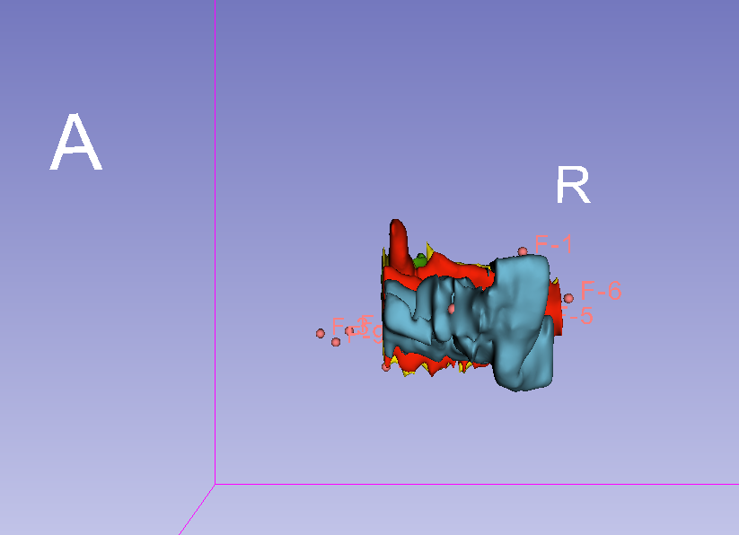</td>
    <td>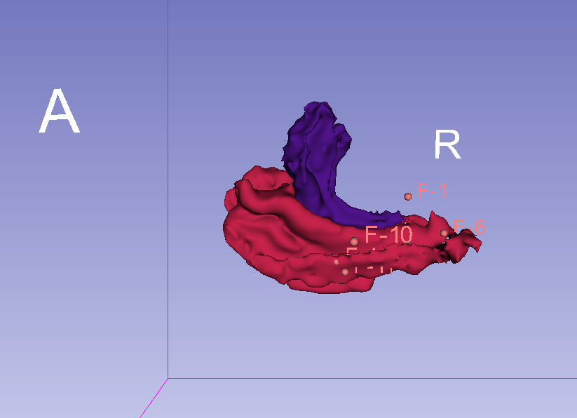</td>
    <td>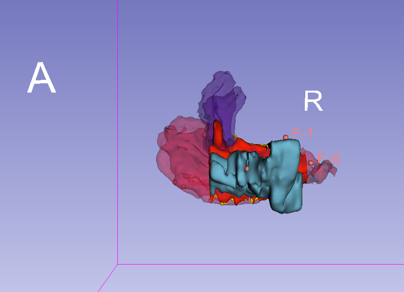</td>
  </tr>
  </table>

## Background and References

