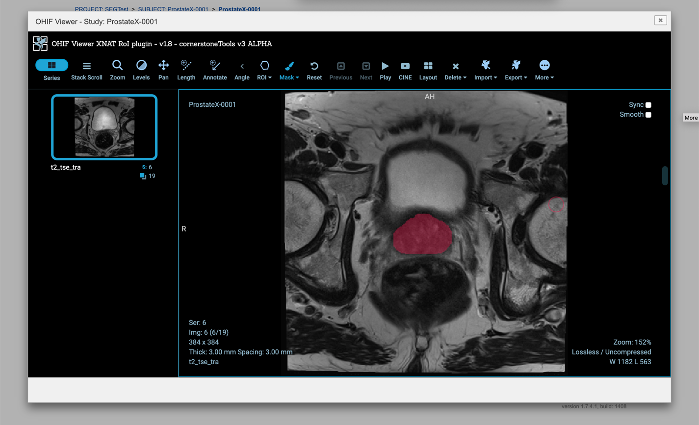

Back to [Projects List](../../README.md#ProjectsList)

# DICOM management platforms

## Key Investigators

- Andrey Fedorov (BWH)
- James Petts (Institute of Cancer Research, UK)
- Erik Ziegler (Radical Imaging)
- Marco Nolden (DKFZ)
- Jonas Scherer (DKFZ)

# Project Description

Evaluate existing/emerging platforms for managing DICOM data.

## Objective

<!-- Describe here WHAT you would like to achieve (what you will have as end result). -->

We need a platform to support management of the DICOM data within a lab. Required features include:
* user authentication
* storage of the variety of DICOM objects (should not be limited to DICOM images)
* integrated viewer for visualization of the images, and ideally annotations
* API for data access (read and write)
* integration of batch processing tools (e.g., automatically calculate radiomics features for an image when segmentation of that is submitted)
* should be possible to install on an "on-premises" server to allow handling of PHI data (i.e., cannot be a cloud-only solution)

## Approach and Plan

<!-- Describe here HOW you would like to achieve the objectives stated above. -->
Install and test the following solutions:
* XNAT (with James Petts)
* CCC? (with Erik Ziegler)
* Girder? (with JC)
* ...

## Progress and Next Steps

<!-- Update this section as you make progress, describing of what you have ACTUALLY DONE. If there are specific steps that you could not complete then you can describe them here, too. -->

1. Discussed the capabilities and planned release timeline of the platform being developed at DKFZ (Marco and Jonas). Looking forward to try it!
1. Installed XNAT with the OHIF plugin (very easy and "just works"!):
* [xnat-docker-compose](https://github.com/NrgXnat/xnat-docker-compose)
* [ohif-viewer-XNAT-plugi](https://github.com/JamesAPetts/ohif-viewer-XNAT-plugin) (the more recent packages are in non-master branches, e.g., see [https://github.com/JamesAPetts/ohif-viewer-XNAT-plugin/tree/xnatRoi-beta-1.10](https://github.com/JamesAPetts/ohif-viewer-XNAT-plugin/tree/xnatRoi-beta-1.10))
* learned that [xnatpy](https://xnat.readthedocs.io/en/latest/) exists, and is preferred over [pyxnat](https://pythonhosted.org/pyxnat/) (but neither is officially supported by the XNAT team :-( ...)
1. Did not get to try an improved version of the CCC infrastructure (OHIF + dcm4chee + keyckloak) - Jonas is working on it.
1. Did not get to Girder ...

# Illustrations

[Interpolation for contours in XNAT (Soon to be packaged as freely available `Cornerstone`/`OHIF` plugins)](https://gfycat.com/NervousPointlessJunebug)

[RTSTRUCT fetch/view in XNAT](https://gfycat.com/DevotedMarvelousBirdofparadise)

# Background and References

<!-- If you developed any software, include link to the source code repository. If possible, also add links to sample data, and to any relevant publications. -->
