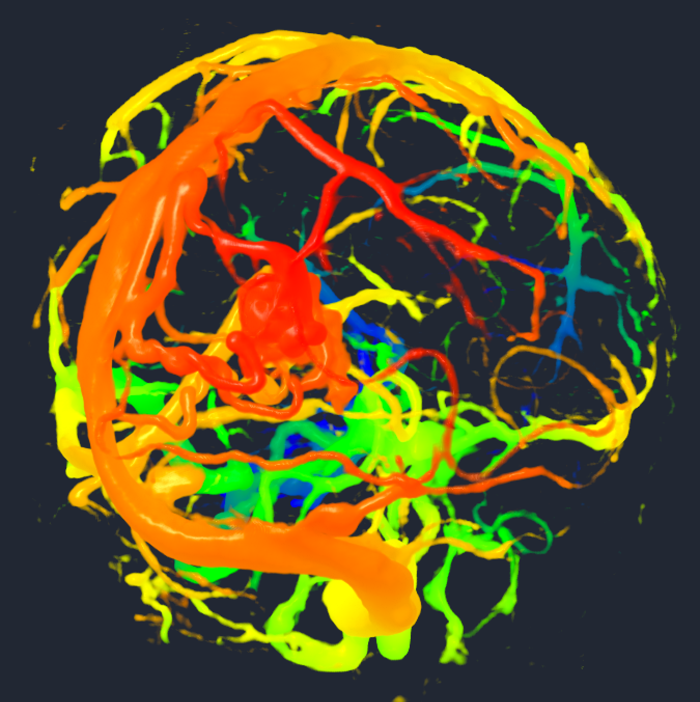
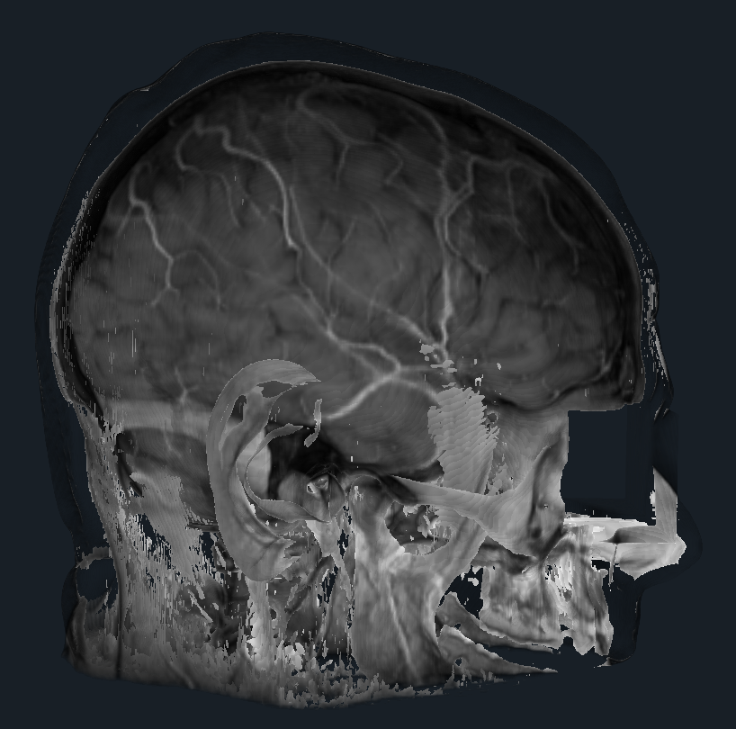

Back to [Projects List](../../README.md#ProjectsList)

# Custom shaders for volume rendering and data processing on GPU

## Key Investigators

- [Kyle Sunderland](http://perk.cs.queensu.ca/users/sunderland) (Queen's University, Canada)
- Steve Pieper (Isomics)
- [Andras Lasso](http://perk.cs.queensu.ca/users/lasso) (Queen's University, Canada)

# Project Description

## Objective

- Make custom GLSL shaders available in Slicer for:
  - custom volume rendering effects
  - GPU-accelerated image processing

## Approach and Plan

- Improve recently added GLSL uniforms class
- Add GLSL code and variables to MRML nodes and displayable managers (use case: depth-encoded rendering)
- Make GPU-based filters work that have been developed for fractional labelmap processing
- Investigate existing implementation of GLSL shaders for image processing ([vtkOpenGLFilters](https://github.com/Punzo/SlicerAstro/tree/master/vtkOpenGLFilters), [vtkOpenGLTexture](https://vtk.org/doc/nightly/html/classvtkOpenGLTexture.html))

## Progress and Next Steps

- [Progress made at last project week](../../../PW28_2018_GranCanaria/Projects/MultiVolumeRendering/README.md)
- [Get methods for uniforms](https://github.com/lassoan/VTK/tree/opengl-uniforms-get-methods)

- Discussed options for implementing and decided that it would be best to utilize and modify the classes in VTK
- Existing implementation can render from vtkImageData back to vtkImageData
- Need to implement a class that be used for multi-pass image processing algorithms to be run through GLSL shaders, without returning the intermediate result to memory

- Next steps:
  - Fork SlicerVTK and develop VTK based classes for GLSL image processing algorithms (see [vtkOpenGLImageAlgorithmHelper]( https://vtk.org/doc/nightly/html/classvtkOpenGLImageAlgorithmHelper.html))
  - Support for multipass algorithms wihtout writing back to memory

### Result

- To be completed

# Illustrations

| Philips 3D US | Chroma-depth in PRISM | Depth peeling in PRISM |
| --- | --- | --- |
|  |  |  |

# Background and References

<!--Use this space for information that may help people better understand your project, like links to papers, source code, or data.-->

- [Work at the previous Project Week](https://na-mic.github.io/ProjectWeek/PW28_2018_GranCanaria/Projects/MultiVolumeRendering/)
