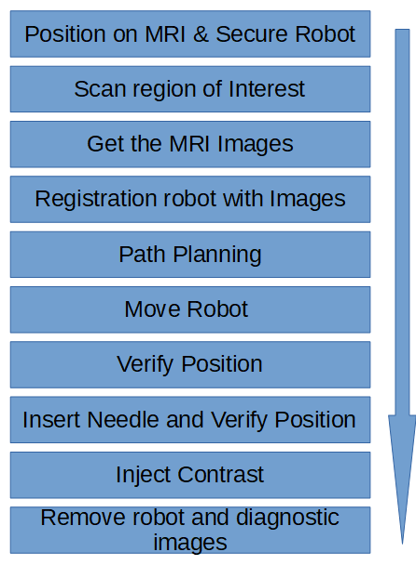
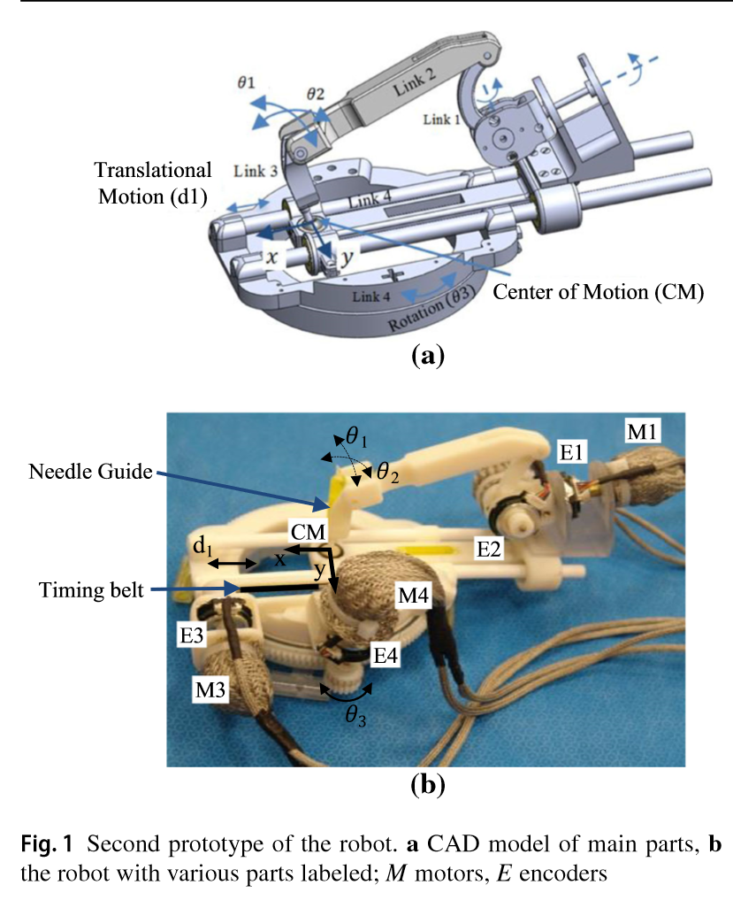
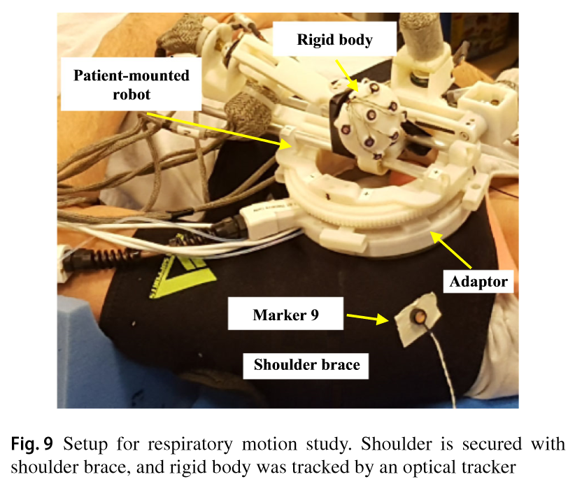
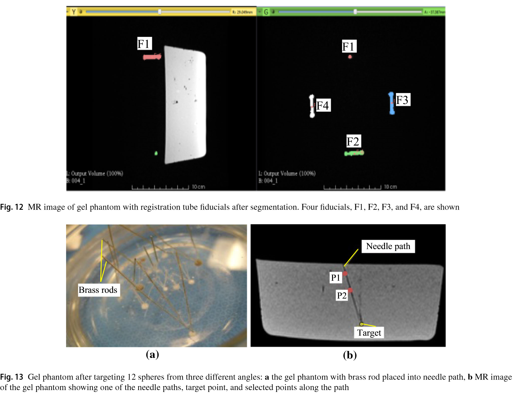
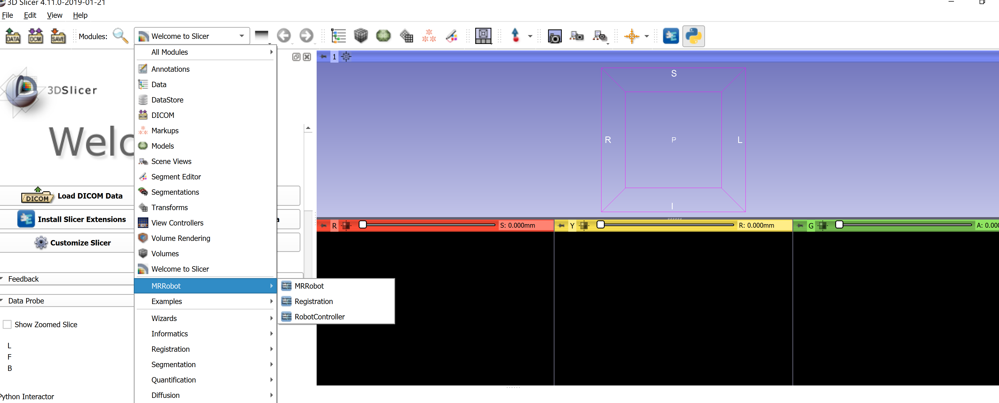
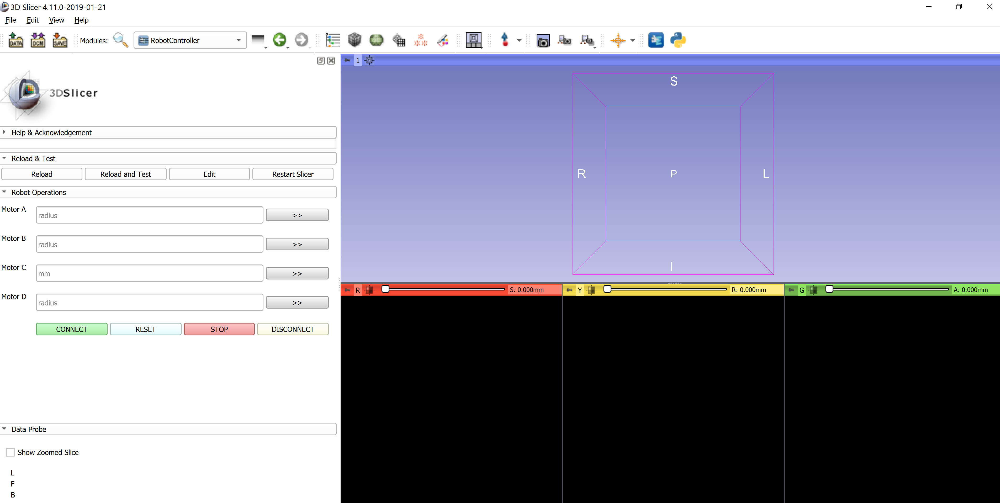
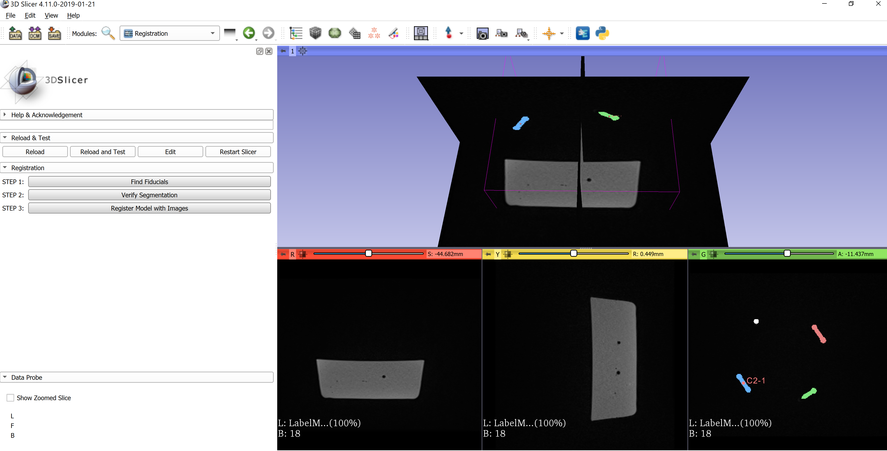
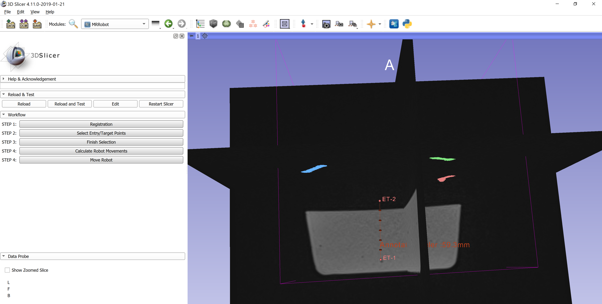

Back to [Projects List](../../README.md#ProjectsList)

# MRI Needle Placement Procedure

## Key Investigators

- Kevin Cleary (SZI - Children's National)
- Eleni Siampli (SZI - Children's National)
- Steve Pieper (Isomics)
- Andras Lasso (Queen's University, Canada)
- Andrey Fedorov (BWH)

# Project Description

MRI guided devices have been designed for biopsies or other interventions. 
The aim is to adapt Slicer for MR-guided needle placement procedures using MRI compatible robots.

## Objective

We are planning to collect information about best practices to use different toolboxes or modules at Slicer.

1. Understand how SliceTracker, SlicerIGT, OpenIGTLink, SlicerDevelopementToolbox works
1. Make Implementation decisions based on these

## Approach and Plan

1. Meet with developers with relevant experience
1. Collect list of potential issues and solutions, best practices, and pointers to reusable code.

## Progress and Next Steps

<!--  -->

# Illustrations
Workflow

Prototype of the robot

Body mounted robot - stydy for respiratory motion study

GUI for MR-needle guidance

Create MRI Robots extension

Robot Controller Modules

Registration module

MR Robot Module

# Publications
Development of a shoulder-mounted robot for MRI-guided needle placement

(https://github.com/NA-MIC/ProjectWeek/blob/master/PW30_2019_GranCanaria/Projects/MRINeedleGuidance/Monfaredi2018_Article_DevelopmentOfAShoulder-mounted.pdf)

# Background and References
+ [SliceTracker](https://slicerprostate.gitbooks.io/slicetracker/)
+ [SlicerIGT](http://www.slicerigt.org/wp/)
+ [OpenIGTLink](http://openigtlink.org/)
+ [SlicerDevelopmentToolbox](https://www.slicer.org/wiki/Documentation/Nightly/Extensions/SlicerDevelopmentToolbox), and [Documentation](https://sdt.readthedocs.io/en/latest/index.html)

