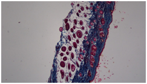
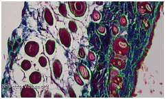
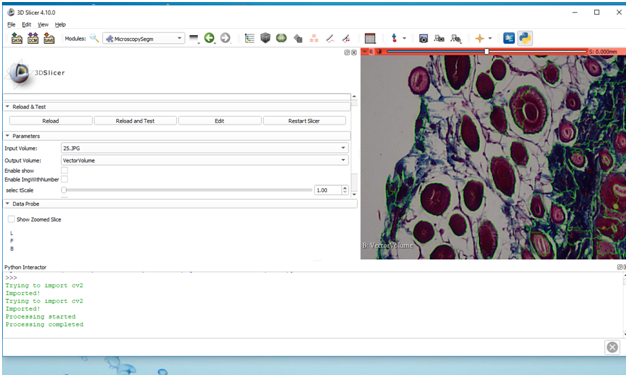
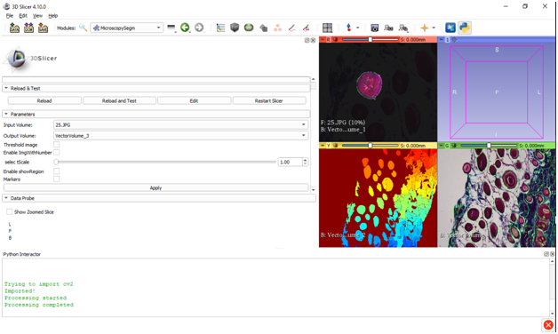

Back to [Projects List](../README.md#ProjectsList)

# Microscopy 3DSlicer Module

## Key Investigators

- Aziza Elmahjoub (MACbioIDi-IUIBS - Sorbone Université)
- Abián Hernández-Guedes (ULPGC - GTMA-IUIBS - MACbioIDi)
- María Dolores Afonso-Suárez (ULPGC - GTMA-IUIBS - MACbioIDi)
- Juan Ruiz-Alzola (ULPGC - GTMA-IUIBS - MACbioIDi)

## Project Description

This project main aim is the development of a new extension/module for 3DSlicer to work with microscopy images. The segmentation is the first approach to the functions to be implemented. More functions will be studied as well as new training material for medical subjects.

## Objectives

1. To develop a new module for 3DSlicer to work with microscopy images.
1. To study the functionalities to be implemented.

## Approach and Plan

1. To study different methods of segmentation. Threshold segmentation and the watershed algorithm.
1. To test algorithms and methods already developed in Matlab.

## Progress and Next Steps

1. We have developed a module to segment microscopic images.<!-- 1. implemented using threshold segmentation and the watershed algorithm. -->
1. We have tested the module with images from an optical microscope.
1. We will continue working with images from electronic microscope and confocal microscope.
1. We have started with the confocal images and we would like to be able to create volumes from these images, trying to deveolp also more functionalities.

## Illustrations

Microscopy images. Histological sections of regenerated skin after injury.

| Microscopy image | Thresholding method | Watershed transformation |
| -----------------|---------------------|--------------------------|
|  |  |  |

Microscopy module.

| Thresholding | Watershed |
| -------------|-----------|
|  |  | 

The other. 

| Watershed with markers for the different regions |
| -----|
||

## Background and References

+ [Previous work in 3DSlicer](https://www.slicer.org/wiki/Documentation/Nightly/Extensions/IASEM)
+ [Segmentation of Microscopic Images](https://ieeexplore.ieee.org/document/6745404)

