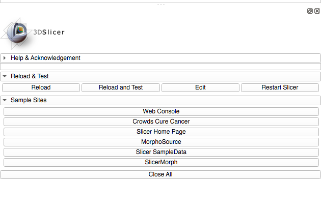
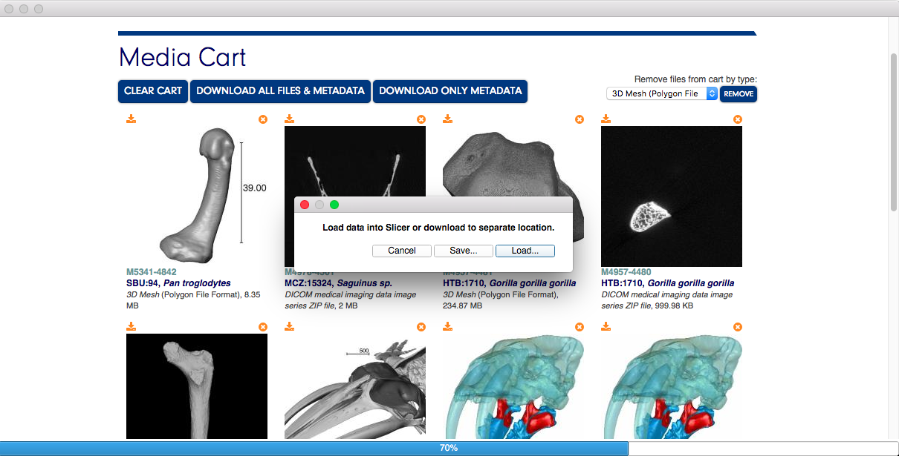
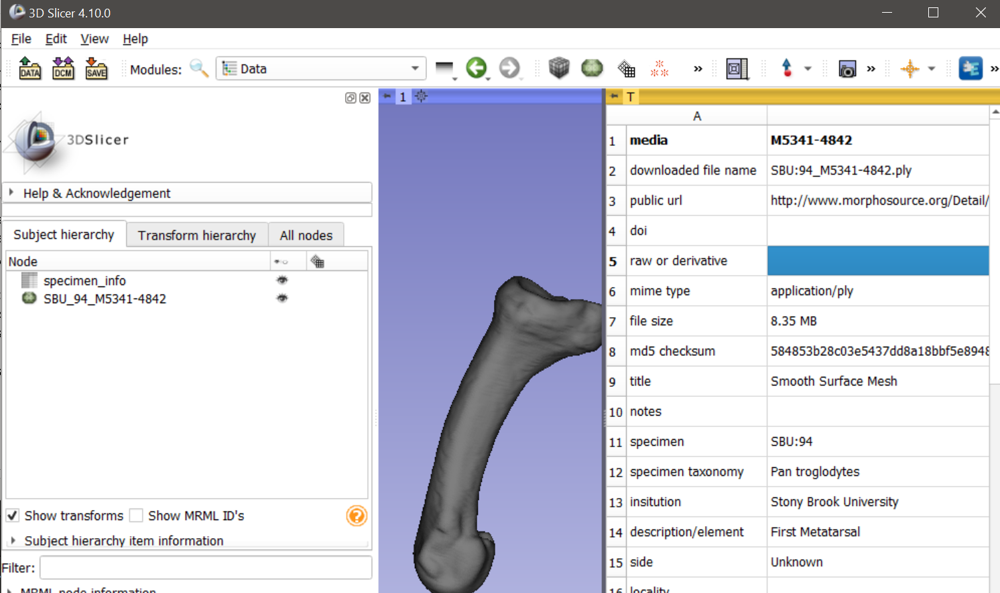

Back to [Projects List](../../README.md#ProjectsList)

# MorphoSource and Data Retrieval

## Key Investigators

- Murat Maga (Seattle Children's Research Institute & University of Washington Dept. of Pediatrics)
- Sara Rolfe (University of Washington Friday Harbor Laboratories)
- Steve Pieper (Isomics)
- Doug Boyer (Duke University)
- Julie Winchester (Duke University)

# Project Description

MorphoSource (M/S) is a publicly available repository for 3D media representing biological specimens. The goal of this project is to integrate M/S with Slicer to provide convenient access to the repository and connection to the image analysis tools within Slicer. This will support the use of M/S by researchers with varying levels of technical expertise and funding. This project is being done in parallel with the development of a geometric morphometric toolset, SlicerMorph, for analysis of shape and form.

## Objective

<!-- Describe here WHAT you would like to achieve (what you will have as end result). -->

1. Objective A. Develop a working prototype for M/S import
1. Objective B. Walk through use cases and brainstorm improvements

## Approach and Plan

<!-- Describe here HOW you would like to achieve the objectives stated above. -->

1.  Use the internal browser distributed by the Slicer to navigate to and authenticate with M/S
2.  On data download, give user the option to save or import directly into Slicer, depending on filetype and user preference.

## Progress and Next Steps

<!-- Update this section as you make progress, describing of what you have ACTUALLY DONE. If there are specific steps that you could not complete then you can describe them here, too. -->

1. Updates to Slicer’s internal browser allow log in to M/S, search, browse, and import of data into Slicer.
2. CSV metadata spreadsheet included with all M/S downloads updated to add fields with more information about data type to support import.
3. Enhancements made to Slicer web view, adding options for data downloads.

## Results
1. Tested prototype design

2. Identified an issue with the unpackaging of zip files that contains image sequence: When importing into Slicer, each image in the sequence is treated as an individual file. This can be changed using the load options, but getting to this step is very slow when the number of files is large. 

3. Next steps: Resolve zip file import issue and refine display of metadata.

# Illustrations

<!-- Add pictures and links to videos that demonstrate what has been accomplished.-->

# Background and References

<!-- If you developed any software, include link to the source code repository. If possible, also add links to sample data, and to any relevant publications. -->
+ WebWidget enhancement source code https://github.com/Slicer/Slicer/pull/1071
+ A video demo of the current state is here: https://youtu.be/t8Dj3rOmt78
