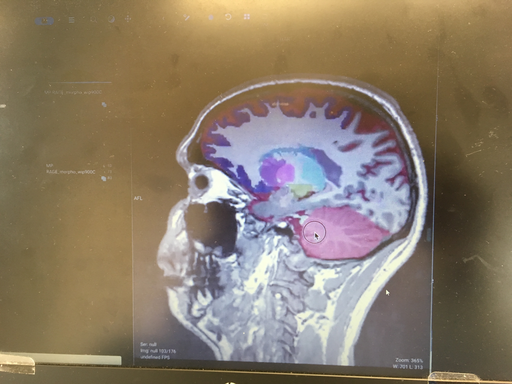
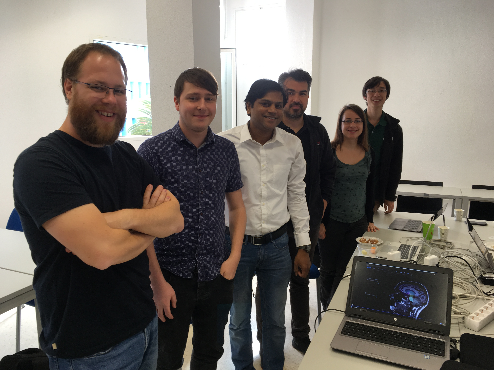

Back to [Projects List](../../README.md#ProjectsList)

# OHIF.AI

## Key Investigators

- Srikrishna Prasad (Siemens Healthineers (OHIF.AI))
- Steve Pieper (Isomics (OHIF.AI))
- Erik Ziegler (Radical Imaging (OHIF.AI))

# Project Description

The aim of this project is to prepare OHIF Viewer for AI use cases. 
Specifically,
1. To visualise encapsulated pdf in OHIF Viewer
2. To provide editable UI interface for segmentation and measurement objects generated by AI Algorithms. 
3. To create audit for any correction applied to generated results.
4. Provision an option to push corrected results back to pacs

## Objective

1. Build on existing codebase and new functionality to OHIF Viewer https://github.com/OHIF/react-viewerbase
2. Further improve OHIF to visualise new datasets.

## Approach and Plan

1. Integrate OHIF with DicomWeb Wado Server
2. Provision call backs to run algorithms
3. Subscribe to results from DicomWeb Server
4. Publish corrected results, if any back to DicomWeb Server
5. Render generated encapsulated pdf for results
6. Visualise the pdf in OHIF Viewer

## Progress

1. Integrate OHIF with DicomWeb Wado Server (Siemens Healthineers teamplay) - completed
- provisioned light weight wrapper to api to integrate with dicom web server
2. Provision call backs to run algorithms - completed
- Algorithm runs automatically to generate Dicom SR report and Measurements.
3. Subscribe to results from DicomWeb Server - completed
- Webhook implemented to subscribe for results (new series availablity)

### OHIF Segmentation Plugin
4. Publish corrected results, if any back to DicomWeb Server - next steps
- Editing of segmentation results and uploading back to dicom web server

### OHIF Pdf Plugin:
5. Render generated encapsulated pdf for results - completed
- New Ohif Pdf plugin is created
- Visualisation of smart report in OHIF is accomplished by OHIF Pdf Plugin
6. Visualise the pdf in OHIF Viewer - completed

## Next Steps
OHIF SR Report Plugin 
- Dicom SR plugin to visualise and Edit SR report results is needed
- 3D volume rendering of Dicom SEG object and editing

OHIF 3D Volume Rendering Integration
- We need to intergrate 3D volume rendering and editing in OHIF

Logging
- Logging for applied corrections to result

# Illustrations

[Brain Morphometry](BrainMorphometry_OHIF.mp4)

Snapshot

Team

# Background and References

Info websites:

OHIF Dicom Viwer
(http://ohif.org/)
