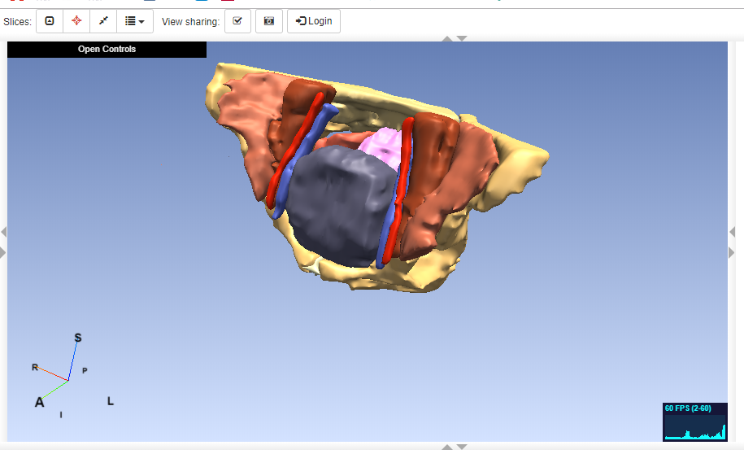
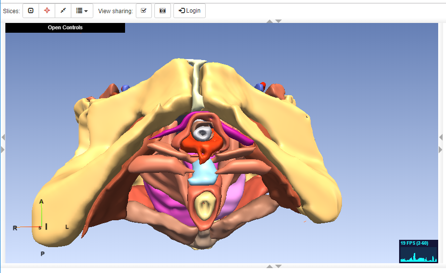
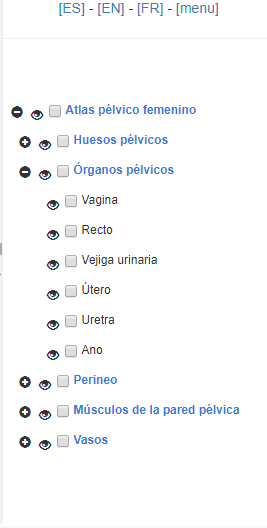
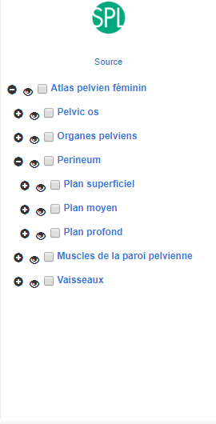
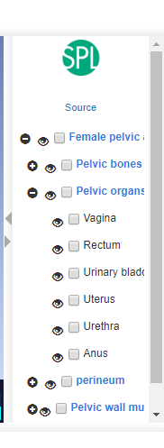
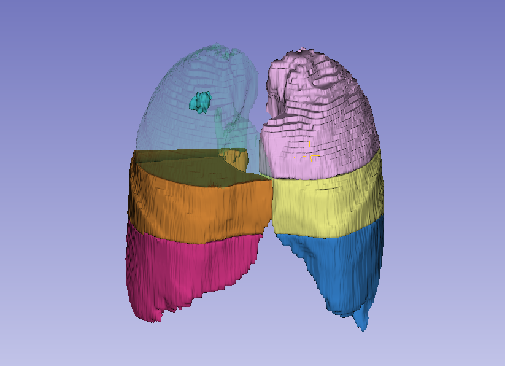
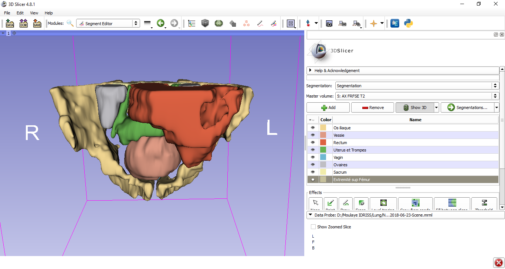

Back to [Projects List](../../README.md#ProjectsList)

# Pelvic Anatomy Atlases (male and female)

## Key Investigators

- Babacar Diao (Ecole Militaire de Santé Dakar)
- Nayra Pumar (ULPGC – GTMA-IUIBS - MACbioIDi)
-	Xerach Suárez (ULPGC – GTMA-IUIBS - MACbioIDi)
-	Cheick Tidiane (Centre Hospitalier National Fann Dakar)
- Abdulaye Ndiaye (Université Cheikh Anta Diop)
- Mike Halle (BWH)
- Juan Ruiz-Alzola (ULPGC - GTMA-IUIBS - MACbioIDi)

## Project Description

This project focuses on the development of anatomical atlases of the pelvic area for educational purposes: creation of the female pelvic atlas and improvement of the male pelvic atlas. Both using the openanatomy platform and also on a frame for Virtual Reality visualization capabilities based on web.

## Objectives

1.	To segment the female pelvic anatomy using 3D Slicer (images provided by Dr. Babacar Diao).
1.	To update the current segmentation of the male pelvic anatomy using 3D Slicer (images provided by Dr. Babacar Diao).
1.	To export the vtk models obtained from the segmentation into the openanatomy structure using the web atlas editor.
1.	To export the vtk models obtained from the segmentation to .obj format, in order to assemble the VR scene using aframe.

## Approach and Plan

1.	Training using the 3D Slicer segment editor
1.	Image study and selection
1.	Use the export tools in 3D Slicer

## Progress and Next Steps

1. Female pelvic anatomy atlas is already finished
1. Translation to english-french-spanish is already finished and revised
1. Male pelvic anatomy atlas is in the process of refinement
1. Lung, with a case of tuberculosis, in on the way
1. A mauritanian team is creating another male pelvic anatomy atlas
1. Exportation to VR of the female pelvic atlas (the male version has been already exported)

## Illustrations
<table border=0 width=100%>
  <tr valign=top align=center>
    <td><b>Overview of the female pelvic atlas</b> </td>
    <td><b>Overview of the female pelvic atlas</b> </td>
  </tr>
  <tr valign=top align=center>
    <td><b>Spanish navigation menu</b> </td>
    <td><b>French navigation menu</b> </td>
    <td><b>English navigation menu</b> </td>
  </tr>
    <tr valign=top align=center>
    <td><b>Lung atlas (in progress)</b> </td>
    <td><b>Male pelvic atlas (in progress)</b> </td>
  </tr>
  </table>

## Background and References

