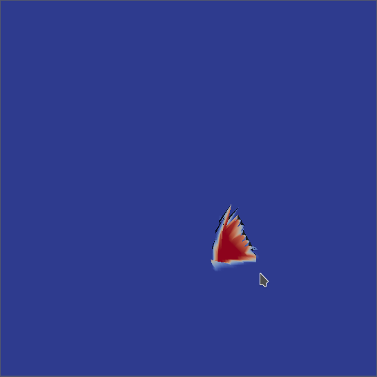
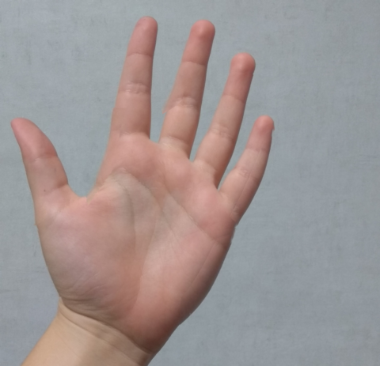
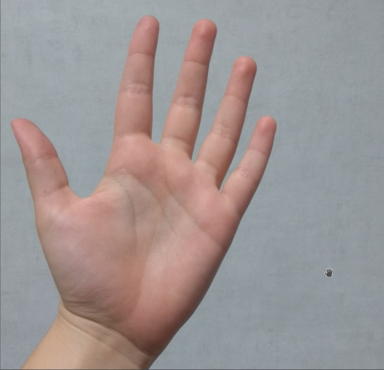
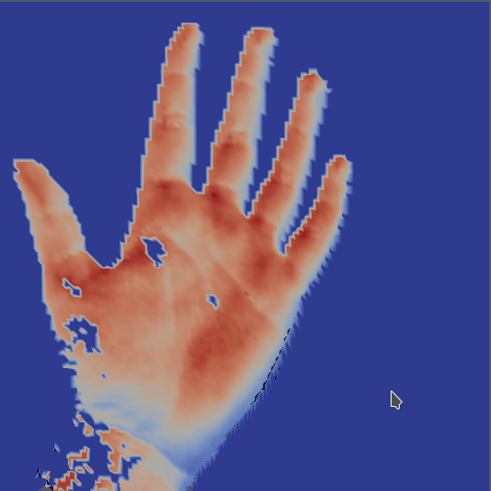

Back to [Projects List](../../README.md#ProjectsList)

# Point set registration

## Key Investigators

- María Armas López-de-Vergara (MACbioIDi)
- Abián Hernández-Guedes (ULPGC - GTMA-IUIBS - MACbioIDi)
- Juan Ruiz-Alzola (ULPGC - GTMA-IUIBS - MACbioIDi)

# Project Description

This project focuses on applying a point set registration in 2D multichannel images and integrating it in a new 3D Slicer 
module. In order to use this kind of registration, it is necesary to obtain spatial features from the image and represent them
as a point cloud.

## Objective

<!-- Describe here WHAT you would like to achieve (what you will have as end result). -->

1. Explore strategies to extract a set of features from a 2D multichannel image and convert it to point cloud
1. Select a registration algorithm for two point clouds and validate it with test cases
1. Adapt the whole flow (features extraction and point cloud registration) to the original image
1. Design and implement the 3D Slicer user interface for the proposed registration module 

## Approach and Plan

<!-- Describe here HOW you would like to achieve the objectives stated above. -->

1. Extract features based on contour information 
1. Select, integrate and validate a point set registration algorithm
1. Apply registration result in the whole data imag

## Progress and Next Steps

<!-- Update this section as you make progress, describing of what you have ACTUALLY DONE. If there are specific steps that 
you could not complete then you can describe them here, too. -->

Progress:
 * Points clouds have been created from the contour information of the images that we wanted to register.
 * As point set registration algorithm the Coherent Point Drift (CPD) one has been chosen. 
 * A simple interpolation has been applied in order to make the deformation of the points set affects all the pixels of the image.
 * The visualization of the obtained results has been performed through ParaView.
 * Some trials have been carried out with both simple and real images. 

Next steps:
* Improve the points cloud sampling strategy and the interpolation applied.
* Integrate the whole workflow in a 3D Slicer module.
* Optimize the developed code.

# Illustrations

<!-- Add pictures and links to videos that demonstrate what has been accomplished.

-->
Point set registration example from a blue point set M to the red point set S:

## First example
### Input images:

### Result:

## Hand example
### Input images:

 

### Result:

# Background and References
<!-- If you developed any software, include link to the source code repository. If possible, also add links to sample data,
and to any relevant publications. -->

* [MedChIPSRegis: Project code](https://github.com/SolidusAbi/MedChIPSRegis)
* [PyCPD: CPD Python Implementation](https://github.com/siavashk/pycpd/tree/fd702d5c7e9dc5b83527aee6d43049e47af58d54)
