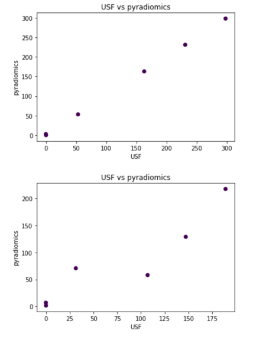
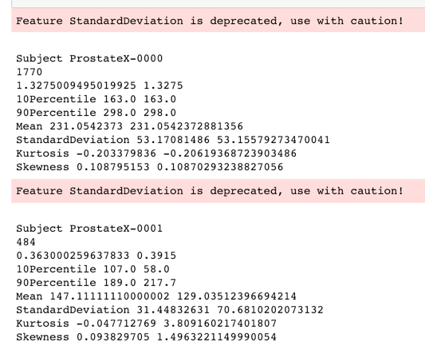

Back to [Projects List](../../README.md#ProjectsList)

# PyRadiomics update and revision of C extensions

## Key Investigators

- Joost van Griethuysen (The Netherlands Cancer Institute)
- Steve Pieper (Isomics)
- Andrey Fedorov (BWH)
- Marco Nolden (DKFZ)
- Hugo Aerts (Dana Farber)

# Project Description

This project aims to develop and maintain the open source software PyRadiomics, which provides easy to use Radiomic feature extraction tools coded in Python.

## Objective

<!-- Describe here WHAT you would like to achieve (what you will have as end result). -->

1. Update the C-Extensions to allow for N-dimensional input (image/mask). Together with updates to the python code, this is to make PyRadiomics more suitable to work with e.g. 2D input (instead of forced 3D input)
1. Investigate possibility of integration with ITK.
1. Update documentation and command line interface for voxel-based extraction. Though already part of the PyRadiomics code, voxel based extraction can currently only be used via Python scripts.
1. Investigate the possibility of reproducing features extracted used by a top PROSTATEx entry using pyradiomics (collaboration with Radka Stoyanova, U. South Florida (USF))

## Approach and Plan

<!-- Describe here HOW you would like to achieve the objectives stated above. -->

1. Replace nested loop per dimension by a dimension less single iterator over voxels. Update input checks to allow N-dimensional input.
1. Talk to developers who have worked with ITK. Review the overlap between PyRadiomics and [ITK Texture Features](https://github.com/InsightSoftwareConsortium/ITKTextureFeatures)
1. Write a command line interface similar to the interface for segment-based extraction. Use output folder instead of file to store results (each feature will be a image file (e.g. .nrrd or .nii.gz))
1. Configure extraction parameters to achieve feature values similar to those obtained by the USF group. This task is supported by a sample dataset and accompanying features provided by the USF collaborators.

## Progress and Next Steps

<!-- Update this section as you make progress, describing of what you have ACTUALLY DONE. If there are specific steps that you could not complete then you can describe them here, too. -->

1. Started rewriting the C extensions. GLCM, GLSZM, NGTDM, NGTDM now support N-dimensional input, GLRLM rewriting in progress. ToDo: rewriting the wrapper to python and update checks and input constraints to allow N-dimensional input. Shape: will remain either 3D or 2D, should add detection of number of dimensions to determine which shape class to use.
1. Done, voxel-wise extraction now available from the command line by setting switch `--mode` (`-m`) to `voxel`, stores feature maps as NRRD images. Merged into PyRadiomics in [PR #457](https://github.com/Radiomics/pyradiomics/pull/457)
1. Radiomics features comparison sub-project.
* developed a Jupyter Notebook for comparing USF radiomics results with pyradiomics (see [https://github.com/Radiomics/pyradiomics/tree/master/labs/pyradiomics-reproduce](https://github.com/Radiomics/pyradiomics/tree/master/labs/pyradiomics-reproduce)). Observed good agreement in one case, but very poor in another, where volume of the structure is very small (see fig. below). We think this is due to the different approaches to rasterizing RTSTRUCT contours. Comparison of texture features underway.
* learned about the radiomics module in MITK [tutorial](http://docs.mitk.org/nightly/org_mitk_views_radiomicstutorial_gui_portal.html) and [detailed info](http://mitk.org/wiki/Phenotyping), will investigate consistency and agreement with IBSI, to be continued! 

# Illustrations

# Background and References

<!-- If you developed any software, include link to the source code repository. If possible, also add links to sample data, and to any relevant publications. -->

- [PyRadiomics Source Code](https://github.com/Radiomics/pyradiomics)
- [SlicerRadiomics Source Code](https://github.com/Radiomics/SlicerRadiomics)
- [Documentation](http://pyradiomics.readthedocs.io)
- PyRadiomics Article: [Computational Radiomics System to Decode the Radiographic Phenotype](http://cancerres.aacrjournals.org/content/77/21/e104)

Other related references:
* Image biomarker standardisation initiative: https://arxiv.org/abs/1612.07003
* Radiomics Ontology: http://www.radiomics.org/RO/01000, http://bioportal.bioontology.org/ontologies/RO
