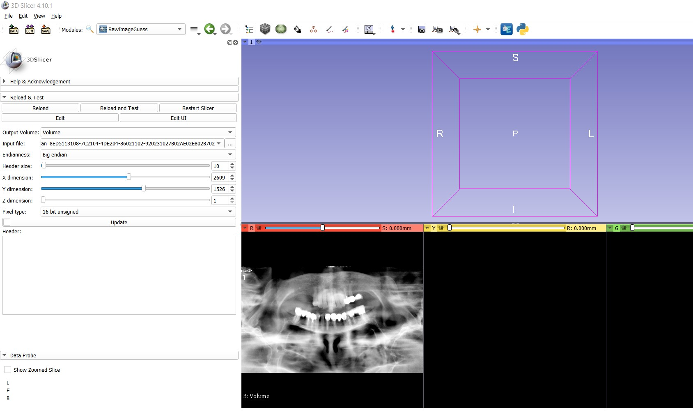

Back to [Projects List](../../README.md#ProjectsList)

# Raw Image Read and Display

## Key Investigators

- [Attila Nagy](http://www2.szote.u-szeged.hu/dmi/eng/index.php/the-department/staff) (SZTE Medical School, Hungary)
- [Csaba Pinter](http://perk.cs.queensu.ca/users/pinter) (Queen's University, Canada)
- [Andras Lassó](http://perk.cs.queensu.ca/users/lasso) (Queen's University, Canada)
- [Steve Pieper](http://isomics.com) (Isomics Inc., Cambridge, MA, USA)
- Jean-Christophe Fillion-Robin (https://www.kitware.com/jean-christophe-fillion-robin/) (KitWare Inc., Chapel Hill, North Carolina, USA)
- whoever wants to join/has ideas/has some time... :)

# Project Description

Sometimes unknown file formats are encountered that contain images. There are free tools to handle these (eg. try to guess the bit depth, X and Y resolution, etc) but it is currently not possible from within Slicer.

## Objective

1. Set basic image read parameters (bytes to skip (header), bitness, etc)
2. Display the loaded image in 3D view

## Approach and Plan

1. Add some more functionality.
2. Add ideas so they can be implemented later.

## Progress and Next Steps

<!--Describe progress and next steps in a few bullet points as you are making progress.-->
Progress:
- all basic image parameters can be set: header to skip, endianness, X, Y and Z dimensions and image bitdepth
Plans:
. set automaic thresholding, automatically update the image, put in into the 3D viewer

# Illustrations

<!--Add pictures and links to videos that demonstrate what has been accomplished.-->

<!---->

<!---->

# Background and References

[Something along these lines (though the thread is old, the problem surfaced a few times since then)]
(http://slicer-devel-archive.65872.n3.nabble.com/CBCT-td4031606.html)

- Source code: https://github.com/acetylsalicyl/SlicerRawImageGuess
- Documentation: In progress
- Test data:
  - Available in the github repository
  - 3D ultrasound from [Slicer forum](https://discourse.slicer.org/t/could-not-load-ultrasound-from-mvl-medison-file-format/3928/6?u=lassoan): [download from dropbox](https://www.dropbox.com/sh/azdck7h9e7b71dq/AACiHg-m-XPOhj2vs2_CFGK5a?dl=0) 
