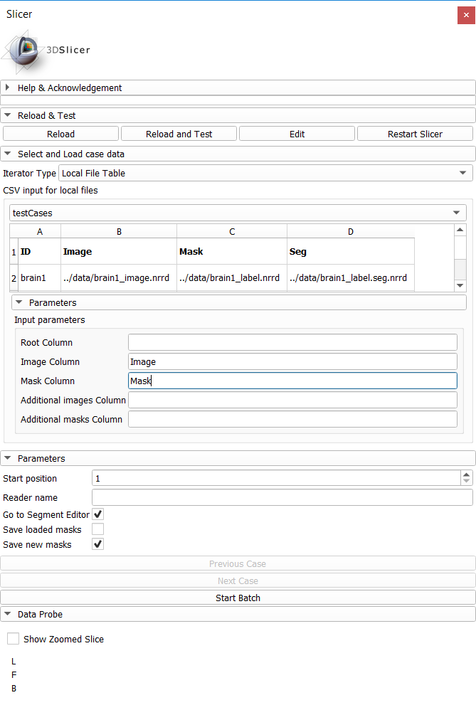
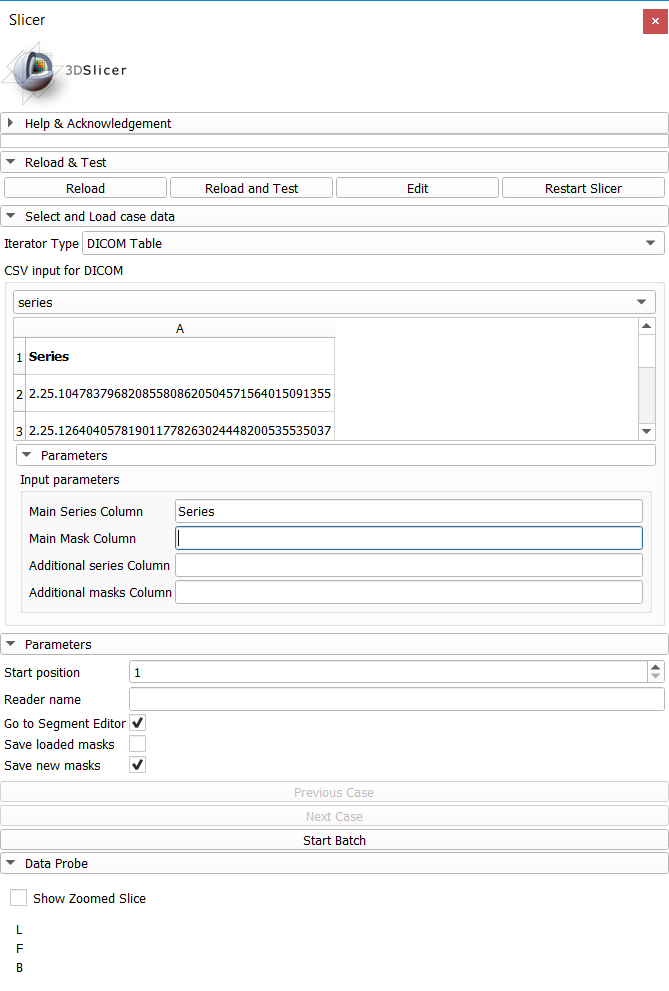

Back to [Projects List](../../README.md#ProjectsList)

# Slicer Case Iterator

## Key Investigators

- Joost van Griethuysen (The Netherlands Cancer Institute)
- Steve Pieper (Isomics)

# Project Description

This project aims to expand the usage of Slicer Case Iterator to work with DICOM(WEB) backend to support workflows where the data is available in DICOM format.

## Objective

<!-- Describe here WHAT you would like to achieve (what you will have as end result). -->

1. Generalize internal batch definition to allow different input modes (CSV, DICOM)
1. Link to Slicers DICOM browser to retrieve images
1. Implement prefetching of next n cases to speed up processing
1. Store segmentation results as DICOM SEG objects

## Approach and Plan

<!-- Describe here HOW you would like to achieve the objectives stated above. -->

1. Create class implementing generator to hold batch, with different input methods a inherited subclasses
1. Talk to Slicer developers on how to best approach this (what kind of identifiers, methods to use, etc.)
1. Closely related to point above. Investigate on how to analyze input to determine best conversion step, how to store results of this evaluation.
1. Talk to Slicer developers on how to store a Slicer Segmentation object as DICOM SEG object (when input image is DICOM format)

## Progress and Next Steps

<!-- Update this section as you make progress, describing of what you have ACTUALLY DONE. If there are specific steps that you could not complete then you can describe them here, too. -->

1. Done, merged with master in [PR #7](https://github.com/JoostJM/SlicerCaseIterator/pull/7)
1. Using SeriesUID, it is now possible to load series using the Slicers DICOM database. Not yet merged with the master [PR #8](https://github.com/JoostJM/SlicerCaseIterator/pull/8)
1. In DICOM input, series is first checked for loadables using MultiVolumeImporterPlugin and if necessary, by DICOMScalarVolumePlugin. Not yet possible to do this using a type of prefetch, or parallel processing.

Next Steps

1. Add possibility to store Segmentations as DICOM SEG objects
1. Add example scripts to help users generate the input tables for their datasets
1. Investigate use of DICOM Web UPS / Modality Work List to define the batch

# Illustrations

<!-- Add pictures and links to videos that demonstrate what has been accomplished.

-->

# Background and References

<!-- If you developed any software, include link to the source code repository. If possible, also add links to sample data, and to any relevant publications. -->

- [Slicer Case Iterator source code](https://github.com/JoostJM/SlicerCaseIterator)
