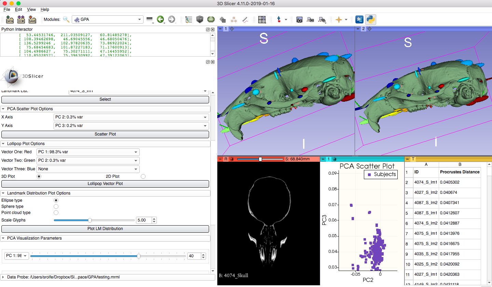
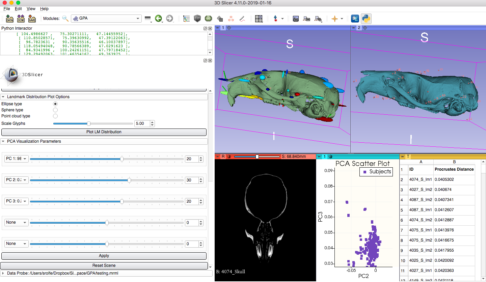

Back to [Projects List](../../README.md#ProjectsList)

# SlicerMorph Geometric Morphometric Toolset

## Key Investigators

- Murat Maga (Seattle Children's Research Institute & University of Washington Dept. of Pediatrics)
- Sara Rolfe (University of Washington Friday Harbor Laboratories)
- Steve Pieper (Isomics)

# Project Description
This project aims to produce a flexible toolset for analysis of shape and form from image data using landmark-based Geometric Morphometric Methods (GMM). This toolset will be capable of handling a broad range of data and file types and will provide support for the full analysis workflow within 3D Slicer.

## Objective

1. Develop a Slicer extension with modules to support each task in the shape analysis workflow from image import through visualization of statistical output.

## Approach and Plan

<!-- Describe here HOW you would like to achieve the objectives stated above. -->

1. Provide image import tools that support a broad range of image modalities and filetypes, including non-DICOM image outputs from research microCT scanners.  
2. Support common preprocessing steps, that may be required before analysis, including downsampling very large files produced by research microCT scanners.
3. Develop a module to implement Generalized Procrustes Analysis (GPA) and Principal Component Analysis (PCA) and visualize output statistics.

## Progress and Next Steps

<!-- Update this section as you make progress, describing of what you have ACTUALLY DONE. If there are specific steps that you could not complete then you can describe them here, too. -->

1. Custom image import tool 
2. Custom landmark file import tool
3. Module to downsize images on import, optimized for speed.
4. Module to downsize images on import, optimized for memory usage.
5. Module to load large images, crop blank space, and saving ROI. 
6. Module to perform GPA, PCA, and visualize statistical output

## Results
1. Added custom layout and display refinements
2. Tested GPA module and fixed bugs
3. Discussed method for comparing original volume to PCA warped volume. Each will be shown in one of the 3D volume viewers and a button will be added to toggle view.
4. Discussed improving 2D vector plots. Plan to implement in VTK and add functionality to Slicer.

# Illustrations

<!-- Add pictures and links to videos that demonstrate what has been accomplished.

-->

# Background and References

<!-- If you developed any software, include link to the source code repository. If possible, also add links to sample data, and to any relevant publications. -->
- Coordinate with [SlicerSALT](http://salt.slicer.org/)
