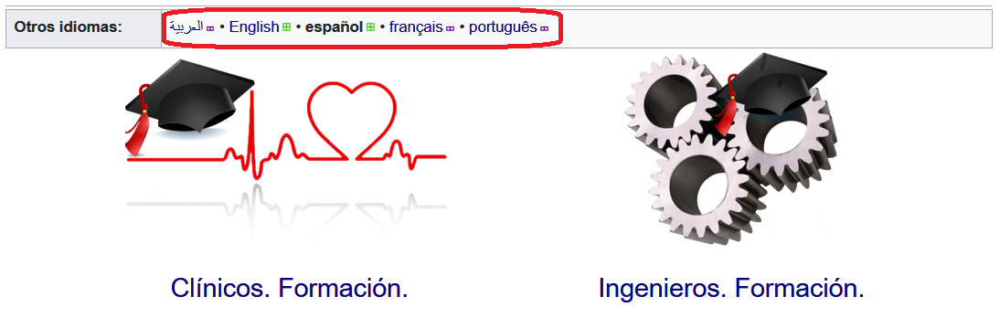

Back to [Projects List](../../README.md#ProjectsList)

# 3DSlicer Training Programs

## Key Investigators

-	Sonia Pujol (BWH/HMS)
- Alexandra Fernandes Rodrigues (Universidade Eduardo Mondlane. Facultad de Medicina)
-	Ahmedou Moulaye Idriss (Université de Nouakchott Al Aasriya - Faculté de Médecine)
-	Yahya Tfeil (Université de Nouakchott Al Aasriya - Faculté de Médecine)
-	Mohamed Septy (Université de Nouakchott Al Aasriya - Faculté de Médecine)
-	Joseanne Alexandra Da Rosa De Pina Ferreira (Hospital Agostinho Neto)
-	GTMA group - IUIBS

## Project Description

The training project is, in this 30PW, in its third edition. New clinician professionals will work in order to develop new training material and study how to enhance and improve the use of 3DSlicer as a training tool. A common program and specific ones, for different countries. In the first edition (27PW NA-MIC) a common training programs was proposed and after a month it was implemented in a tricontinental  workshop. In the second edition (28PW NA-MIC) the professionals that attended the first one shared their experiences and planned specific training programs for their countries working in the transalaton of contents. 

## Objectives

1. To create new contents.
1. To study how to implement these contents in the training progams of each country, adapting them to the students' profile.

## Approach and Plan

1. To gather information about the needs of the different students profiles.
1. To design new training material.
1. To study the results of previous contents.

## Progress and Next Steps

1. We have delivered a Slicer course for African collaborators
1. We have gathered information for each country to introduce the use of 3D Slicer as a tool for clinicians
1. Since African countries have different needs and their students different profiles, different programs will be proposed. 
1. We will develop reports for these different proposals and will study the impact of the whole process. 

## Illustrations

Training contents developed within the framework of the MACbioIDi project.

## Background and References

+ [Project previous edition](https://na-mic.github.io/ProjectWeek/PW28_2018_GranCanaria/Projects/3DSlicerTrainingPrograms/)
+ [A Medical Imaging Computing Learning Program: Transitioning Towards The Medical Technology In Africa](https://library.iated.org/view/AFONSOSUAREZ2018AME)
