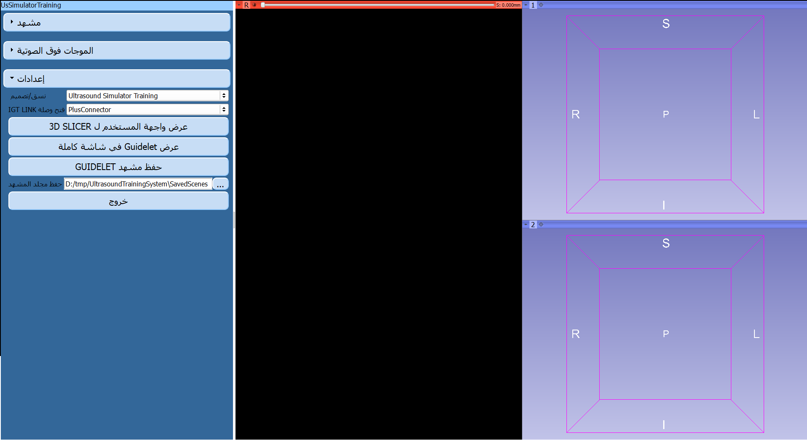
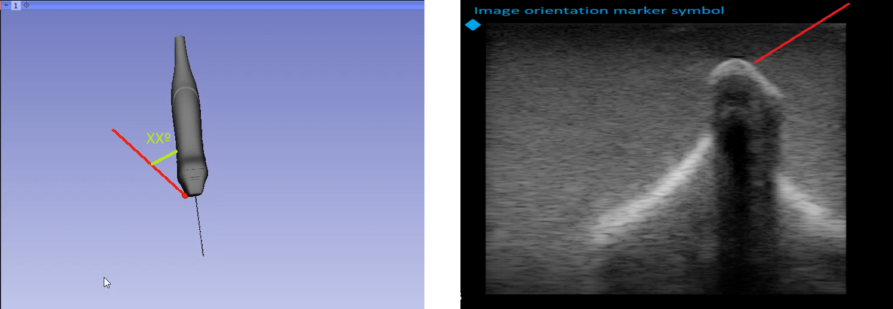
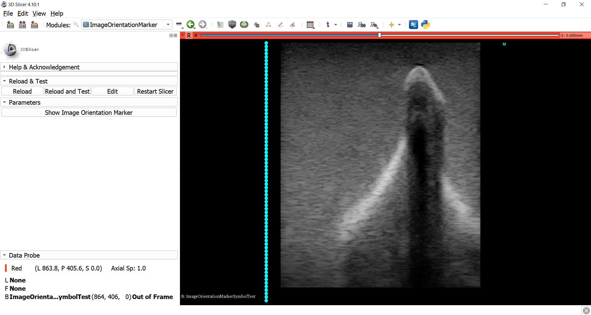
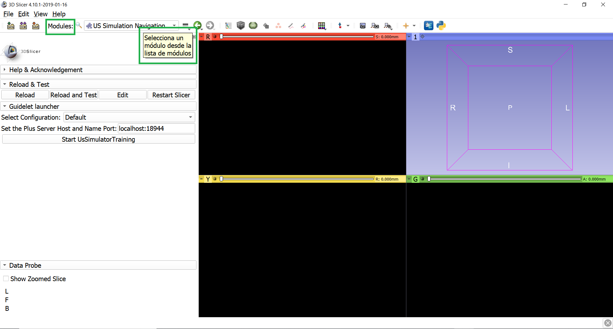

Back to [Projects List](../../README.md#ProjectsList)

# New features for an ultrasound training system

## Key Investigators

- José-Carlos Ruiz-Luque (ULPGC - GTMA-IUIBS - MACbioIDi)
- Guillermo Valentín Socorro-Marrero (ULPGC - GTMA-IUIBS - MACbioIDi)
- [Csaba Pinter](http://perk.cs.queensu.ca/users/pinter) (Queen's University, Canada)
- Samba Diaw (Université Cheikh Anta DIOP)
- Oumar Kane (Centre Hospitalier National Fann Dakar)
- Joseane Ferreira (Hospital Agostinho Neto de Praia)
- Juan Ruiz-Alzola (ULPGC - GTMA-IUIBS - MACbioIDi)

# Project Description

This project is a next step in the one presented during 28th PW NA-MIC and it aims to add new features both the graphic user interface (GUI) and the functionalities of the training system.

## Objectives

1. Supporting the multi-language (Spanish, French, English, Portuguese, and Arabic). 
2. Registering several custom layouts. 
3. Calculating the angle between a plane of the US image and a needle and it will be shown in a 3D scene or a 2D viewer.
4. Visualizing the image orientation marker symbol in an US image.
5. Selection of various clinical procedures for training. 

## Approach and Plan

1. A multi-language proposal was implemented in a Guidelet-based GUI for Slicer 4.8 using to the module “gettext” in Python. We would like to implement this proposal in SlicerIGT for Slicer 4.10.
2. The design of new custom layouts in Guidelet-based GUIs was implemented in collaboration with the Perklab team.
3. Designing a proposal for the angle between a plane of the US image and a needle. At first, we will study the VTK if there is a filter for this objective or other 3D Slicer modules.
4. Studying the MicrUs SDK to visualize the image orientation marker symbol and it will be implemented in the Plus Toolkit or 3D Slicer. 

## Progress and Next Steps
1. The image orientation marker symbol
     - We discussed the image orientation marker symbol with PerkLab team 
     - We developed a prototype (see [Figure 6](ImageOrientationMarkerSymbol_Result.png))
           - The symbol is a new actor in a viewport (2D scene)
           - We´ll integrate a stable version in our system
1. MultiLangauge
     - We worked with Jean-Christophe Fillion-Robin (@jcfr) to improve the current implementation in 3D Slicer
           - We fixed a bug in CMake file
           - Creating a Spanish version in a part of the 3D Slicer GUI (see [Figure 7](SpanishVersion3DSlicerGUI.png) )
     - We are working the multilanguage in the python support 
1. Angle
     - We evaluated several strategies:
           - Module: angle measurement by Andras Lasso
           - Defining various vectors of the needle and image axes from the MRML
     - A selected proposal will be developed in outgoing
     
     
# Illustrations

Guidelet muli-language interface:

Figure1. Language selection for the Guidelet-based GUI 

Figure 2. Guidelet-based GUI in Arabic 

Figure 3. Guidelet-based GUI in Spanish

Sketches:

 

Figure 4.  An angle between a plane of the US image and a needle or a needle model overlays the US image

Figure 5. An image orientation marker symbol (in blue color)

**Outcome:**

 

Figure 6. A prototype for the image orientation marker symbol (M) and the depth (green rectangles)

 

Figure 7. A Spanish version of 3D Slicer GUI

# Background and References

-	[Slicelet documentation](https://www.slicer.org/wiki/Documentation/Nightly/Developers/Slicelets)
-	[Guidelet documentation](http://www.slicerigt.org/wp/developer-tutorial/)
-	[Multi-language GUI](https://github.com/mt4sd/UltrasoundTrainingSystem/tree/i18n_l10n)
-	[Guidelet-based GUI](https://github.com/mt4sd/UltrasoundTrainingSystem/tree/master)
