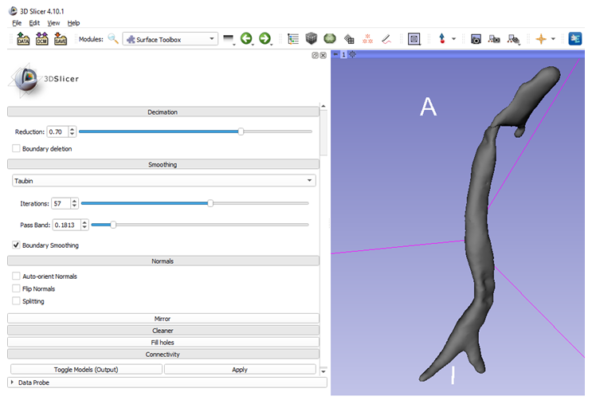
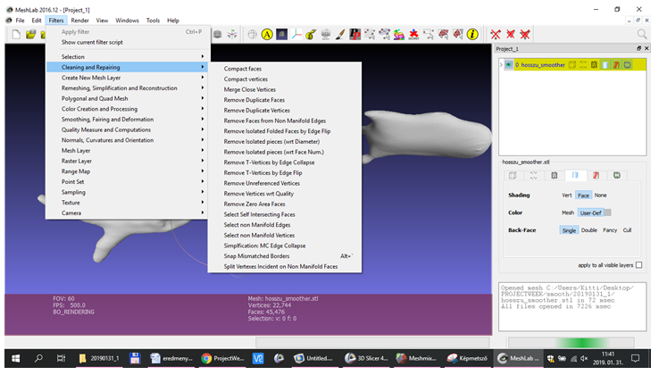
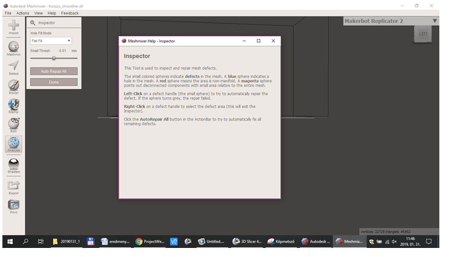
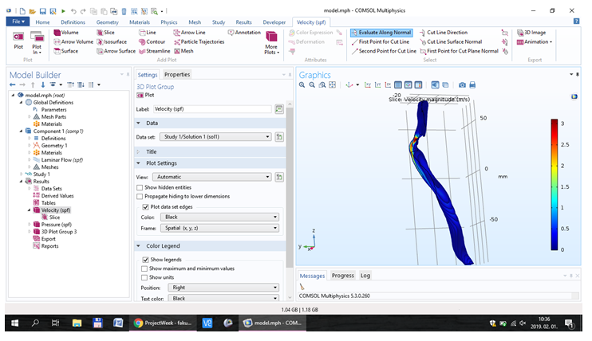
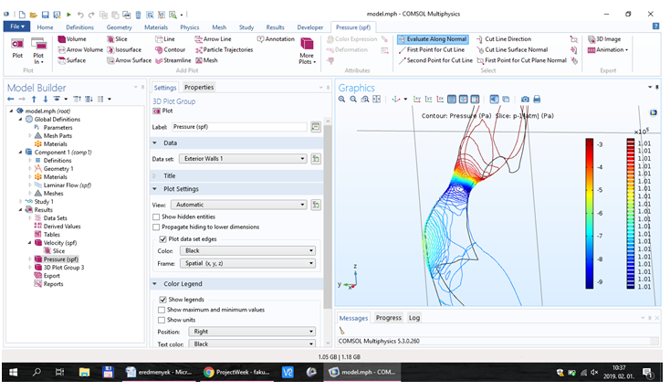

Back to [Projects List](../../README.md#ProjectsList)

# Upper airway segmentation and airflow simulation

## Key Investigators

- Kitti Farkas (University of Szeged)
- Attila Nagy (University of Szeged)
- Bence Horváth (University of Szeged)
- Endre Vecsernyés (University of Szeged)
- Andras Lasso (Queen’s University, Canada)
- Jean-Christophe Fillion-Robin (Kitware Inc.)
 
# Project Description

We want to do some airflow simulations in a finite element software but we didn't managed to import the 3D upper airway models which we made in the Slicer. 
 
<!-- Add a short paragraph describing the project. -->

## Objective

<!-- Describe here WHAT you would like to achieve (what you will have as end result). -->

1. Smooth the 3D models
2. Import the models succesfully to the finite element software and mesh them
3. Do some airflow simulations

## Approach and Plan

<!-- Describe here HOW you would like to achieve the objectives stated above. -->

1. Describe specific steps of **what you plan to do** to achieve the above described objectives.
1. ...
1. ...

## Progress and Next Steps

<!-- Update this section as you make progress, describing of what you have ACTUALLY DONE. If there are specific steps that you could not complete then you can describe them here, too. -->

Potential solutions identified:

A. Fix up STL

- Fix data in Slicer: Smooth segmentation before export (using Segment Editor module), clean up surface using SurfaceToolbox module
- Inspect incorrect element reported by Comsol using Paraview
- Use mesh cleanup functions in MeshLab and MeshMixer

B. Create volumetric mesh directly in Slicer, from segmentation - using SegmentMesher module. Cleaver works directly from labelmap, therefore it is robust and guaranteed to always generate valid mesh. We can save .vtk or .vtu that is note directly readable in Comsol. Convert FE mesh to compatible format:

- Paraview: can read VTK and write few formats, none of them directly readable in Comsol, could write a compatible format (xdf) but Comsol could not read it
- FreeCAD: can read some VTK formats and could write a compatible format but the exported file was invalid
- [MeshIO](:https://github.com/nschloe/meshio): support several file formats, VTK input, but no directly usable output. No binary available, so we would need to build from source.

C. Use [FeBIO](https://febio.org/) solver

Open-source. Free for research use. Pre/post view available with nice GUI.
Can directly read FE mesh saved in Slicer.

It supports airflow analysis and fluid-structure interactions. See [overview](https://pdfs.semanticscholar.org/f054/aaeb1daac39b89d3e92fb1e42ed23b4bcc6b.pdf) and applications in upper airway mechanics:
-  Luo, H., Mittal, R., Zheng, X., Bielamowicz, S. A., Walsh, R. J., and Hahn, J. K., 2008, "An Immersed-Boundary Method for Flow–Structure Interaction in Biological Systems With Application to Phonation," J. Comput. Phys., 227(22), pp. 9303–9332.
- Malve, M., Peerez del Palomar, A., Chandra, S., Loopez-Villalobos, J. L., Mena, A., Finol, E. A., Ginel, A., and Doblare, M., 2011, "[FSI Analysis of a Healthy and a Stenotic Human Trachea Under Impedance-Based Boundary Conditions](Malve2011.pdf)," ASME J. Biomech. Eng., 133(2), p. 021001.

# Illustrations

<!-- Add pictures and links to videos that demonstrate what has been accomplished.

-->
I managed to smooth the models whith surface toolbox and succesfully imported this to the finite element software.

There were some incorrect elements in the model so i used Meshlab and Meshmixer to inspect them.

Finally i managed to do some airflow simulations in Comsol.

# Background and References

<!-- If you developed any software, include link to the source code repository. If possible, also add links to sample data, and to any relevant publications. -->
