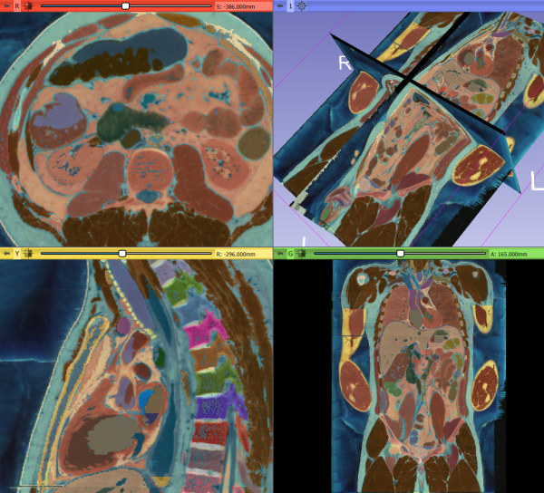

Back to [Projects List](../../README.md#ProjectsList)

# Visible Human in Slicer

## Key Investigators

- Michael Halle (BWH)
- Ron Kikinis (BWH)
- Andras Lasso (Perk Lab)

# Project Description

The Visible Human Project produced a large data set of physical cross sections, MR, and CT of a human cadaver. 
This data has been freely available but not redistributable for more almost two decades. Karl Heinz Hoehne from University of Hamburg 
segmented the data and made beautiful rendering of the data in his VoxelMan system.  He has made his segmentation available for open use, and we hope it 
will allow us to redistribute the original data.

See: 
* [Visible Human Project home page](https://www.nlm.nih.gov/research/visible/visible_human.html)
* [VHP description from Wikipedia](https://en.wikipedia.org/wiki/Visible_Human_Project)
* [VoxelMan gallery](https://www.voxel-man.com/gallery/visible-human/)

## Objective

<!-- Describe here WHAT you would like to achieve (what you will have as end result). -->

Convert the Visible Human Project data into Slicer scenes and evaluate.

## Approach and Plan

<!-- Describe here HOW you would like to achieve the objectives stated above. -->

* Make Slicer Scene of the head and abdomen.
* Evaluate the segmentation and plan for new work.
* Investigate training opportunities.

## Progress and Next Steps

1. Initial VHP Slicer scenes are complete.
2. Lessons learned:
  - VoxelMan abdominal atlas cannot be saved as segmentation (running out of memory). Potential solutions: 1. use advanced nrrd streamed reading/writing, 2. allow writing of non-overlapping regions into single labelmap. (or maybe allow defining groups that are non-overlapping)
  - It seems that some images are corrupted:
    - head/CT: frozenCT1005 .. frozenCT1013
    - head/labels: labels1125
  - Segmentation is not clear (e.g., there are many holes and fractured contours)
  - What to do with multi-value labels? Merge them or assign different names (add suffix)?

# Illustrations

# Background and References

<!-- If you developed any software, include link to the source code repository. If possible, also add links to sample data, and to any relevant publications. -->
