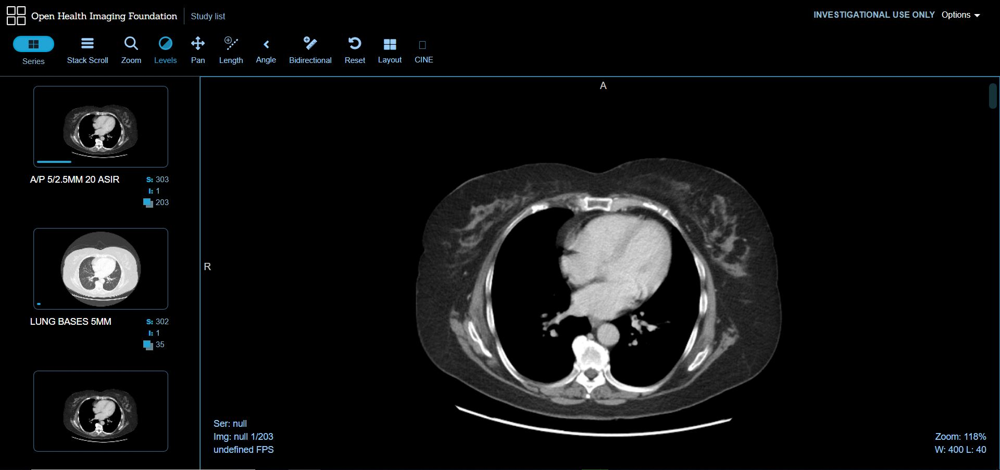
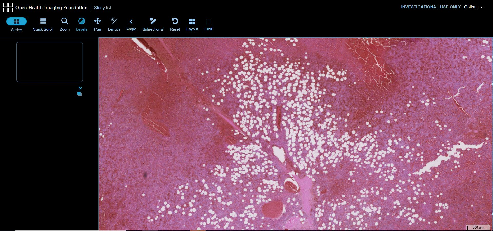
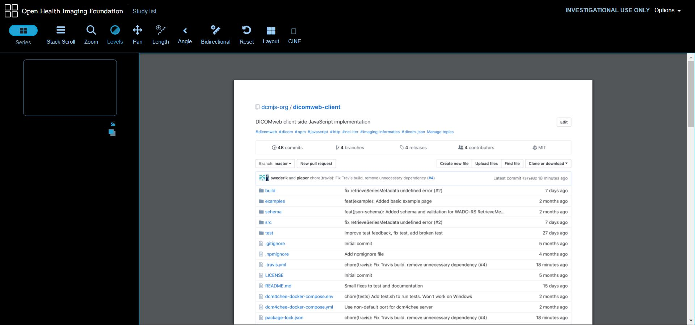
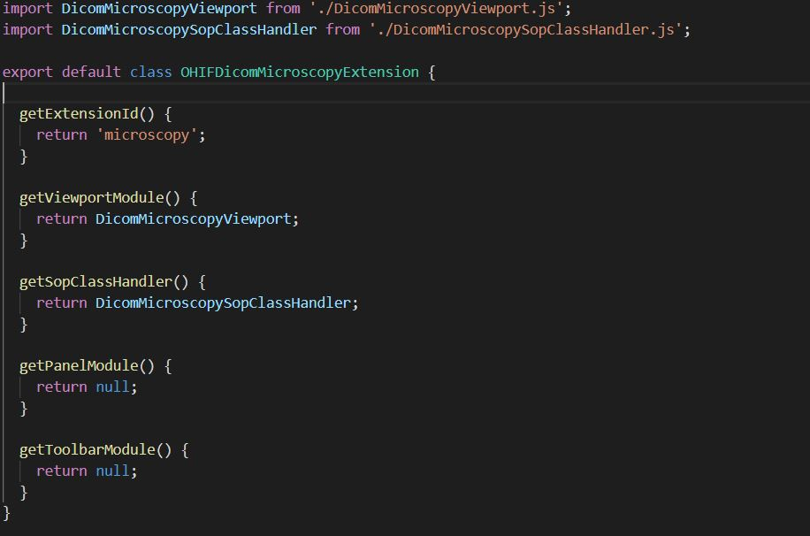

Back to [Projects List](../../README.md#ProjectsList)

# Web components for Medical Imaging Web Applications

## Key Investigators

- Erik Ziegler (Radical Imaging (OHIF))
- Steve Pieper (Isomics (OHIF))
- Sandra Siegel (Mevis)
- Forrest Li (Kitware)
- James A. Petts (ICR)
- Peter Oppermann (Mevis)
- Hans Meine (University of Bremen)
- Markus Herrmann (MGH & BWH CCDS)

# Project Description

The aim of this project is to collaborate on web components (using [react](https://reactjs.org)) to implement parts of web applications.
Specifically to make the [OHIFViewer](https://github.com/OHIF/Viewers) project less monolithic and moving from meteor to react.  This should make it easier to
create plugins for OHIF, and also to create custom projects like [prostatecancer.ai](http://prostatecancer.ai).

- Plugin examples / wishlist
  - [vtkjs](https://kitware.github.io/vtk-js/index.html), [prototype plugin](https://github.com/OHIF/VTKPlugin)
  - [itkjs](http://insightsoftwareconsortium.github.io/itk-js/)
  - OpenLayers ([prototype plugin](https://github.com/OHIF/OpenLayersPlugin))
  - pdf viewer
  - BioImageSuite web (e.g. tensorflowjs-based [deep learning segmentation models](https://bioimagesuiteweb.github.io/unstableapp/tfjsexample.html) - click the red "Run 2D" button)

## Objective
1. Build on existing codebase https://github.com/OHIF/react-viewerbase ([live demo](https://react.ohif.org))
1. Improve the vtkjs component https://github.com/OHIF/react-vtkjs-viewport ([live demo](https://react-vtkjs-viewport.netlify.com/))

## Approach and Plan

1. Bring everyone up to speed on the current react components
1. Identify any missing components and decide who wants to work on them
1. Develop (plans for) additional demos, tutorials, and documentation to help build the community

## Progress

1. Discussing use cases for extensions in OHIF
1. Defining a common interface for extensions
1. Updated the react version to support plugins
1. Extracted two extensions: Dicom PDF and Dicom Microscopy Extension
1. Updated the react version to support development and packaging in one project and added initial documentation

# Illustrations

[Live Link (may not work)](https://deploy-preview-344--ohif.netlify.com/)

## Next Steps

1. Redefining extension submodule interfaces (for SOPClassHandler, ViewportModule, ToolbarModule, PanelModule)
1. Define how extensions interact with the common app state and their internal app state
1. Create a HelloWorld Extension with all types of modules and documentation
1. Improve testing and continuous integration
1. DICOM SR HTML Display Extension
1. DICOM TID1500 Measurement Report Table extension 
1. Extract cornerstone plugin and add VTK extension

# Background and References

Info websites:

- [OHIF Dicom Viwer](https://docs.ohif.org/)
- [CTK Widgets](http://www.commontk.org/index.php/Documentation/ImageGallery)
