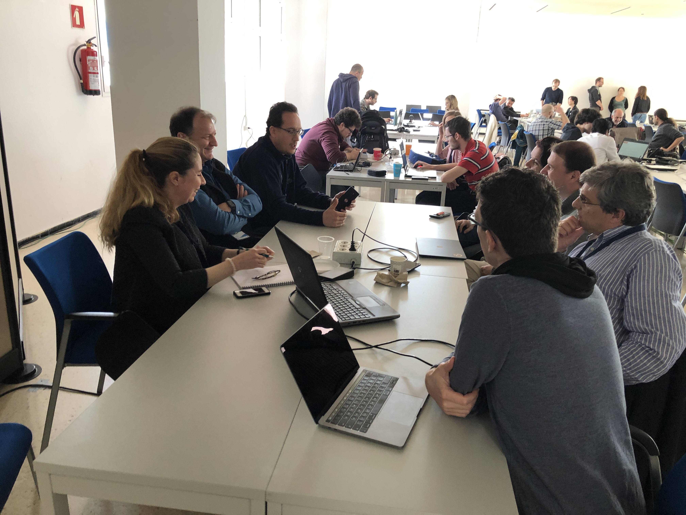
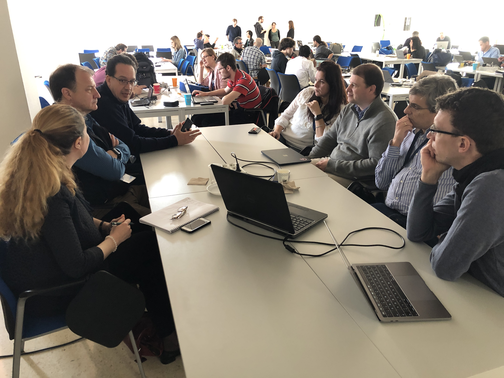
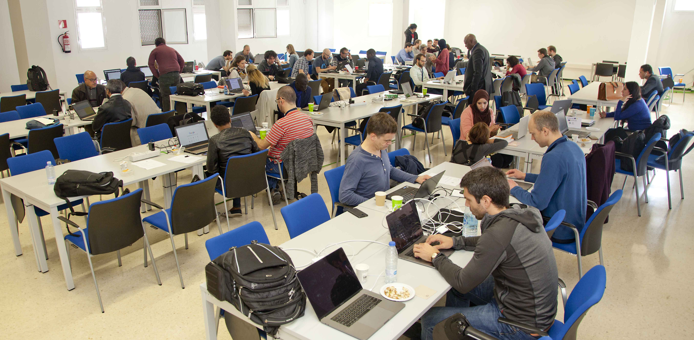
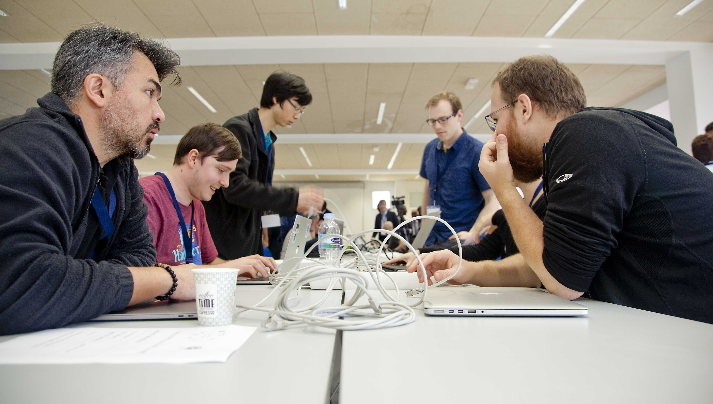

## Welcome to the web page for the 30th Project Week!

<table>
<tr>
    <td>  </td>
    <td>  </td>
</tr>    
<tr>
    <td>  </td>
    <td>  </td>
</tr>
</table>

<table>
<tr>
    <td> </td>
  <td> <b>Local Organizing Committee Host:</b> <ul><li>Juan Ruiz-Alzola, PhD, Professor of Imaging Technologies, director of the Grupo de Tecnología Médica y Audiovisual (GTMA), <a href="http://www.iuibs.ulpgc.es/">Instituto Universitario de Investigaciones Biomédicas y Sanitarias</a> (IUIBS), <a href="http://www.ulpgc.es">Universidad de Las Palmas de Gran Canaria</a> (ULPGC) </li> <li> Email Local Organizing Committee: <a href="mailto:marilola.afonso@ulpgc.es?cc=juan.ruiz@ulpgc.es&subject=ProjectWeek30">Technical Topics: Maria Dolores Afonso Suarez</a> <a href="mailto:asmaa.skareb@ulpgc.es?cc=juan.ruiz@ulpgc.es&subject=ProjectWeek30">Administrative Topics: Asmaa Skareb</a> </li></ul></td>
</tr>
</table>

The 30th NA-MIC Project Week will be held during the week of January 28 - February 1, 2019 at [Universidad de Las Palmas de Gran Canaria](https://www.ulpgc.es/).

Please read about our experience in running these events since 2005: [Increasing the Impact of Medical Image Computing Using
Community-Based Open-Access Hackathons: the NA-MIC and 3D Slicer Experience](http://www.spl.harvard.edu/publications/item/view/3004).

## Photo Album

This is our second Project Week in Las Palmas. [Photos Project Week 30 in a Google Drive folder](https://drive.google.com/drive/folders/19nuPjpcHGNKOfJZozDwPeHQaYxmU3Mjq?usp=sharing) 

[Google Photos album](https://photos.app.goo.gl/qv1mgzwbugnhf1iw8)

30 PW NA-MIC in [the media](PW30InTheMedia.md) 

First project wek in Las Palmas. [Project Week 28](https://na-mic.github.io/ProjectWeek/PW28_2018_GranCanaria/) was held in this location as well, and captured in [Photos Project Week 28](https://drive.google.com/drive/folders/1Gh2L26K96d3jzpT7LReaPWAbc1Ao815p?usp=sharing), and [coverage by the local media](../PW28_2018_GranCanaria/PW28InTheMedia.md).

## Logistics
- **Dates:** January 28 - February 1, 2019.
- **Location:** Las Palmas, Gran Canaria, Spain
- [Venue and Hotel Information](Logistics.md#Venue)
- [Registration](Logistics.md#Registration)
- [Frequently Asked Questions](Logistics.md#Faq)
- [ERASMUS mobility information](Logistics.md#Erasmus)

## Preparatory Videoconferences

<table><tr>
    <td>
        
    </td>
    <td>
        <ul>
            <li>
                Zoom video conference: <a href="https://zoom.us/j/112427205">To join the videoconference</a>
            </li>
            <li>
<a href="https://github.com/NA-MIC/ProjectWeek/blob/master/PW30_2019_GranCanaria/PreparatoryMeetingsNotes.md">Conference call notes</a>
            </li>
        </ul>
    </td>
</tr></table>

## Projects [(How to add a new project?)](Projects/README.md)
<a name="ProjectsList"/>

### DICOM

1. [DICOM for quantitative imaging](Projects/DICOM4QI/README.md) (Andrey Fedorov, Hans Meine, Markus Herrmann, Steve Pieper, James A. Petts, Jasmin Metzger, Marco Nolden)
1. [Roundtrip conversion between DICOM SR and FHIR representations for imaging measurements](Projects/DICOMSRTID1500-FHIR/README.md) (Hans Meine, Peter Oppermann, Andrey Fedorov, Tobias Stein, Jasmin Metzger, Marco Nolden, Markus Herrmann)
1. [Interoperability of DICOM SEG between cornerstonejs/vtkjs/dcmjs](Projects/DICOMSEG-Cornerstone-VTKJS/README.md) (James A. Petts, Erik Ziegler, Steve Pieper, Mete Akdogan, Emel Alkim, Tobias Stein, Forrest Li, Jasmin Metzger, Markus Herrmann)
1. [DICOMweb server and custom database](Projects/DICOMweb-CouchDB/README.md) (Emel Alkim, Steve Pieper, Andrey Fedorov, Markus Herrmann, Tobias Stein, Marco Nolden)
1. [DICOM data management platforms](Projects/DICOM_mgmt_platforms/README.md) (Andrey Fedorov, James A. Petts, Erik Ziegler, Jasmin Metzger)

### Infrastructure

1. [Markups redesign and new markups for curve, line, and angle measurement](Projects/MarkupsRedesign/README.md) (Davide Punzo, Andras Lasso, Sara Rolfe, Kyle Sunderland, Steve Pieper, Jean-Christophe Fillion-Robin)
1. [GLSL shaders for custom volume rendering and image processing](Projects/GLSLShaders/README.md) (Kyle Sunderland, Steve Pieper, Andras Lasso, Jean-Christophe Fillion-Robin)
1. [MorphoSource and Data Retrieval](Projects/MorphoSourceDataRetrieval/README.md) (Sara Rolfe, Steve Pieper, Murat Maga (remote), Doug Boyer (remote), Julie Winchester (remote))
1. [Raw Image Read and Display](Projects/RawImageGuess/README.md) (Attila Nagy, Csaba Pintér (remote), Steve Pieper, András Lassó, Jean-Christophe Fillion-Robin)
1. [OHIF and DCM4CHEe within Kubernetes](Projects/ohif_dcm4chee_kubernetes/README.md) (Jonas Scherer, Andrey Fedorov, Erik Ziegler)
1. [OHIF Web Components](Projects/ohif_web_components/README.md) (Erik Ziegler, Steve Pieper, Sandra Siegel, Forrest Li, James Petts,Peter Oppermann, Hans Meine, Markus Herrmann)

### Image-guided therapy

1. [OpenIGTLinkIO Development](Projects/OpenIGTLinkIODevelopment/README.md) (Kyle Sunderland, Andras Lasso, Houssem Gueziri)
1. [MR Needle Guidance Software](Projects/MRINeedleGuidance/README.md) (Eleni Siampli, Steve Pieper, Kevin Cleary, Andras Lasso, Andrey Fedorov)
1. [Upper airway segmentation and airflow simulation](Projects/UpperAirwayAirflowSimulation/README.md) (Kitti Farkas, Attila Nagy, Bence Horváth, Endre Vecsernyés, Andras Lasso, Jean-Christophe Fillion-Robin)
1. [Automatic Segmentation Using Neural Networks](Projects/NeuroNetworkSegmentationofNeck/README.md) (Bence Horvath, Attila Nagy, Kitti Farkas, Endre Vecsernyés, András Lasso, Tina Kapur (remote), Paolo Zaffino (remote), Deepak Chittajallu)
1. [Data-glove for virtual operations](Projects/Data-glove_for_virtual_operations/README.md) (Endre Vecsernyés, Attila Nagy, Kitti Farkas, Bence Horvath, Kyle Sunderland, Eleni Siampli, András Lasso)

### Segmentation and Quantification

1. [Segment Editor use cases](Projects/SegmentEditor/README.md) (Andras Lasso, Scheherazade Krass)
1. [Refining automatic segmentations from FreeSurfer in 3D Slicer](Projects/AutomSegmentFreeSurfer/README.md) (Nikos Makris, Juan-Andrés Ramírez-González, Yogesh Rathi, Nayra Pumar Carreras, Zora Kikinis, Juan Ruiz Alzola)
1. [SlicerMorph](Projects/SlicerMorphGeometricMorphometricToolset) (Sara Rolfe, Murat Maga (remote), Steve Pieper)
1. [Microscopy Module for 3D Slicer](Projects/Microscopy/README.md) (Aziza Elmahjoub, Abián Hernández-Guedes, María Dolores Afonso-Suárez, Juan Ruiz-Alzola)
1. [OHIF.AI](Projects/OHIF.AI/README.md) (Srikrishna Prasad, Steve Pieper, Erik Ziegler)
1. [PyRadiomics](Projects/PyRadiomics/README.md) (Joost van Griethuysen, Steve Pieper, Andrey Fedorov, Hugo Aerts)
1. [SlicerCaseIterator](Projects/SlicerCaseIterator/README.md) (Joost van Griethuysen, Steve Pieper)

### Education

1. [Improve OpenAnatomy support in Slicer](Projects/OpenAnatomy/README.md) (Andras Lasso, Mike Halle, Steve Pieper)
1. [New features for an ultrasound training system](Projects/UltrasoundSimulatorTraining/README.md) (José-Carlos Ruiz-Luque,  Guillermo Valentín Socorro-Marrero, Csaba Pinter, Samba Diaw, Oumar Kane, Joseane Ferreira, Juan Ruiz-Alzola)
1. [3DSlicer Training Programs](Projects/TrainingPrograms/README.md) (GTMA group, Alexandra Fernandes Rodrigues, Ahmedou Moulaye Idriss, Yahya Tfeil, Mohamed Septy, Joseanne Alexandra Da Rosa De Pina Ferreira, Sonia Pujol)
1. [3DSlicer Models for Brain Quiz](Projects/3DSlicerModelsforBrainQuiz/README.md) (Sergi Bermudez i Badia, Yuri Almeida, Abián Hernández-Guedes, Artemisa Moreno, María Dolores Afonso-Suárez, Juan Ruiz-Alzola)
1. [Using 3D Slicer in University Biomedical Engineering Degrees](Projects/Useof3DSlicerinTrainig/README.md) (Ron Kikinis, Gabor Fichtinger, Andras Lasso, Kevin Cleary, Attila Nagy, Sonia Pujol, Juan Ruiz-Alzola)
1. [Looking Glass 3D Display](Projects/LookingGlass/README.md) (Mike Halle, Andras Lasso)

### Open Anatomy

1. [NeuroNames and the Harvard Oxford Atlas](Projects/NeuroNames-HOA/README.md)  (Mike Halle, Doug Bowden, Nikos Makris)
1. [Pelvic Anatomy Atlases (male and female)](Projects/PelvicAnatomyAtlases/README.md) (Babacar Diao, Nayra Pumar, Xerach Suárez, Cheick Tidiane, Abdoulaye Ndiaye, Juan Ruiz-Alzola)
1. [Opening up the Visible Human](Projects/VisibleHuman/README.md) (Mike Halle, Ron Kikinis, Andras Lasso)

### Registration
1. [Point set registration](Projects/PointSetRegistration/README.md) (María Armas López-de-Vergara, Abián Hernández-Guedes, Juan Ruiz-Alzola)

## Breakout sessions

- Anatomy segmentation
- Use of 3D Slicer in educational programs
- [Slicer core update and plans](BreakoutSessions/SlicerCoreUpdateAndPlans.md)
- [OHIF, vtkjs, and related web technologies](https://docs.google.com/document/d/1ednZqbJEoe-Vg_y2FwK20F1-78SeRMDUDVoplCp3fW4/edit?usp=sharing)
- Neuroanatomy
- [Machine learning](BreakoutSessions/MachineLearning.md)
- [Training of Specialists in Mozambique](BreakoutSessions/CatedraEdMed.pdf)

## Registrants

Do not add your name to this list below. It is maintained by the organizers based on your paid registration. **[Click here to register.](Logistics.md#Registration)**

List of registered participants so far (names will be added here after processing registrations):

<!-- ORGANIZERS: please edit REGISTRANTS.md -->
1. Ron Kikinis (@rkikinis) - Brigham and Women's Hospital and Harvard Medical School - USA
1. Steven Pieper (@pieper)(pieper@isomics.com) - Isomics, Inc. - USA
1. Michael Halle (@mhalle)(mhalle@bwh.harvard.edu) - Brigham and Women's Hospital and Harvard Medical School - USA
1. Juan Ruiz Alzola (@jruizalz)(juan.ruiz@ulpgc.es) - University of Las Palmas de Gran Canaria / Instituto de Astrofísica de Canarias - Spain
1. Zora Kikinis (zora@bwh.harvard.edu) - Brigham and Women's Hospital - USA
1. Juan Andrés Ramírez González (juanandres.ramirez@ulpgc.es) - University of Las Palmas de Gran Canaria - Spain
1. Nikolaos Makris (nikos@bwh.harvard.edu) - Brigham and Women's Hospital and Harvard Medical School - USA
1. Sonia Pujol (spujol@bwh.harvard.edu) - Brigham and Women's Hospital and Harvard Medical School - USA
1. Gabor Fichtinger (gabor@cs.queensu.ca) - Queen’s University - Canada
1. Andrey Fedorov (@fedorov) (andrey.fedorov@gmail.com) - Brigham and Women's Hospital and Harvard Medical School - USA
1. Jean-Christophe Fillion-Robin (@jcfr)(jchris.fillionr@kitware.com) - Kitware Inc. - USA
1. Mohamed El Moctar Septy (@msepty)(moksepty@yahoo.fr) - Faculté de Médecine, Université de Nouakchott Al Aasriya - Mauritania
1. Ahmedou Moulaye Idriss (amdriss6@gmail.com) - Centre Hospitalier National Nouackchott - Mauritania
1. Yahya Ould Tfeil (tefeil2000@gmail.com) - Centre Hospitalier National Nouackchott - Mauritania
1. M Alexandra Fernandes Rodrigues (malexa.rodrigues@gmail.com) - Faculdade de Medicina da Universidade Eduardo Mondlane - Mozambique
1. Joseane Alexandre Da Rosa de Pina Ferreira (joseane.ferreira@han.gov.cv) - Hospital Agostinho Neto de Praia - Cabo Verde
1. Artemisa Mendes Moreno (artemisa.moreno@docente.unicv.edu.cv) - Faculdade de Ciências e Tecnologia, Universidade de Cabo Verde - Cabo Verde
1. Babacar Diao (babacardiao104uro@yahoo.fr) - Ecole Militaire de Santé Dakar -Senegal
1. Cheikh Tidiane Diop (chtdiop81@gmail.com) - Centre Hospitalier National Fann Dakar - Senegal
1. Oumar Kane (droumarkane@gmail.com) - Centre Hospitalier National Fann Dakar - Senegal
1. Samba Diaw (samba.diaw@esp.sn) - Université Cheikh Anta Diop - Senegal
1. Abdoulaye Ndiaye (layyendiaye@yahooo.fr) - Université Cheikh Anta Diop - Senegal
1. José-Carlos Ruiz-Luque (@carlos-luque)(carlos.luque@ulpgc.es) - University of Las Palmas de Gran Canaria - Spain
1. Nayra Pumar Carreras (nayra.pumar@ulpgc.es) - University of Las Palmas de Gran Canaria - Spain
1. Guillermo Valentín Socorro Marrero (@gvsocorro)(guillermo.socorro@ulpgc.es) - University of Las Palmas de Gran Canaria - Spain
1. Abián Hernández Guedes (@SolidusAbi)(abian.hernandez@ulpgc.es) - University of Las Palmas de Gran Canaria - Spain
1. Xerach Suárez Moreno (xerach.suarez@ulpgc.es) - University of Las Palmas de Gran Canaria - Spain
1. Maria Dolores Afonso Suárez (@MarilolaMACbioIDi)(marilola.afonso@ulpgc.es) - University of Las Palmas de Gran Canaria - Spain
1. Yuri Ameida (yuri.almeida@m-iti.org) - Madeira Interactive Technologies Institute - Madeira - Portugal
1. Erik Ziegler (erik@radicalimaging.com) - Open Health Imaging Foundation- France
1. Sara Rolfe (smrolfe@uw.edu) - University of Washington - USA
1. James Petts (james.petts@icr.ac.uk) - Institute of Cancer Research - UK
1. Joost van Griethuysen (@maastrichtuniversity.nl) - Maastricht University - Netherlands
1. Kevin Cleary (kcleary@childrensnational.org) - Sheikh Zayed Institute for Pediatric Surgical Innovation - Children's National - USA
1. Emel Alkim (ealkim@stanford.edu) - Stanford University Department of Biomedical Data Science - Stanford University - USA
1. Mete Akdogan (mete@stanford.edu) - Stanford University Department of Biomedical Data Science - Stanford University - USA
1. Hans Meine (@hmeine) (meine@uni-bremen.de) - University of Bremen - Germany
1. Kitti Farkas (fakuabt@gmail.com) - University of Szeged - Hungary
1. Bence Horvath (horviratus@gmail.com) - University of Szeged - Hungary
1. Endre Vecsernyés (vecsernyesendre@gmail.com) - University of Szeged - Hungary
1. Attila Nagy (@acetylsalicyl) (nagy.attila@med.u-szeged.hu) - Faculty of Medicine, University of Szeged - Hungary
1. Jean-Jacques Lemaire (jjlemaire@chu-clermontferrand.fr) - Université Clermont Auvergne - France
1. Markus Herrmann (mdherrmann@partners.org) - MGH & BWH Center for Clinical Data Science - USA
1. Sandra Siegel (sandra.siegel@mevis.fraunhofer.de) - Fraunhofer MEVIS - Germany
1. Peter Oppermann (peter.oppermann@mevis.fraunhofer.de) - Fraunhofer MEVIS - Germany
1. Houssem Gueziri (houssem.gueziri@mcgill.ca) - Montreal Neurological Institute - Canada
1. Jasmin Metzger (jasmin.metzger@dkfz-heidelberg.de) - German Cancer Research Center - Germany
1. Francisco José Marcano Serrano (fmarcano@ull.edu.es) - Universidad de la Laguna - Spain
1. Jonas Scherer (jonas.scherer@dkfz.de) - Deutsches Krebsforschungszentrum (DKFZ) - Germany
1. Eleni Siampli (esiampli@childrensnational.org) - Sheikh Zayed Institute for Pediatric Surgical Innovation - Children's National
1. Scheherazade Kraß (krass@uni-bremen.de) - University of Bremen - Germany
1. Marco Nolden (M.Nolden@Dkfz-Heidelberg.de) - German Cancer Research Center (DKFZ) - Germany
1. Douglas Bowden (dmbowden@uw.edu) - University of Washington School of Medicine - USA
1. Tobias Stein (t.stein@dkfz-heidelberg.de) - Deutsches Krebsforschungszentrum (DKFZ) - Germany
1. Aziza Elmahjoub (isselmou.aziza@gmail.com) - Sorbone Université -  University of Las Palmas de Gran Canaria - Spain
1. María Armas López-de-Vergara (mariarmaslv@gmail.com) - University of Las Palmas de Gran Canaria - Spain
1. Andras Lasso (@lassoan)(lasso@queensu.ca) - Queen’s University - Canada
1. Kyle Sunderland (1krs1@queensu.ca) - Queen’s University - Canada
1. Srikrishna Prasad (srikrishna.prasad@siemens-healthineers.com) - Siemens Healthineers GmBH - Germany
1. Forrest Li (forrest.li@kitware.com) -  Kitware Inc. - USA

## Statistics

1. 7 Topics
1. 33 projects
1. 60 registrants
1. 28 institutions
1. 13 countries
1. 3 continents

## Parallel Event - Casa Africa

[Casa Africa Agenda](CasaAfricaFinalAgenda.pdf)

## Program Calendar
<iframe src="https://calendar.google.com/calendar/embed?src=kitware.com_sb07i171olac9aavh46ir495c4%40group.calendar.google.com&ctz=Atlantic%2FCanary&dates=20190128%2F20190201&hours=0800%2F2000&mode=WEEK" style="border: 0" width="800" height="600" frameborder="0" scrolling="no"></iframe>

[How to add this calendar to your own?](../common/Calendar.md)
