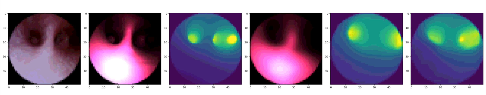
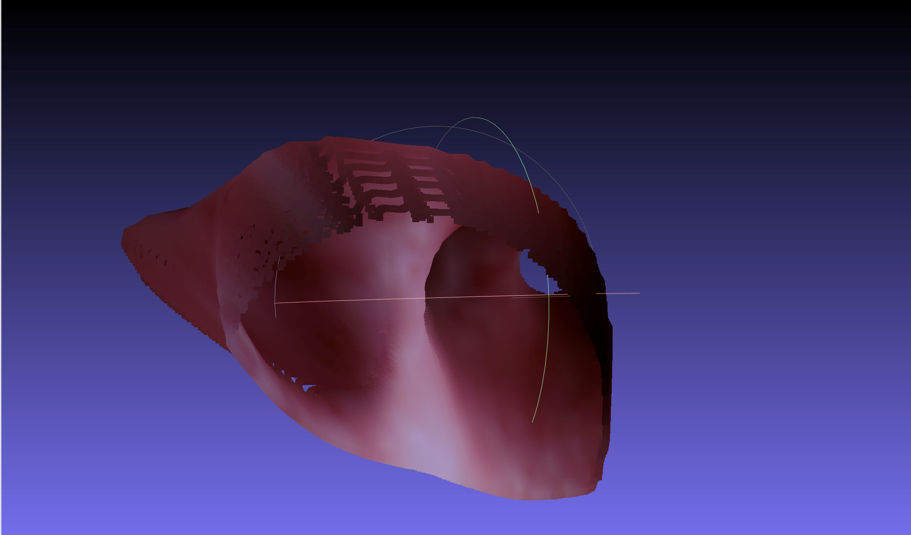
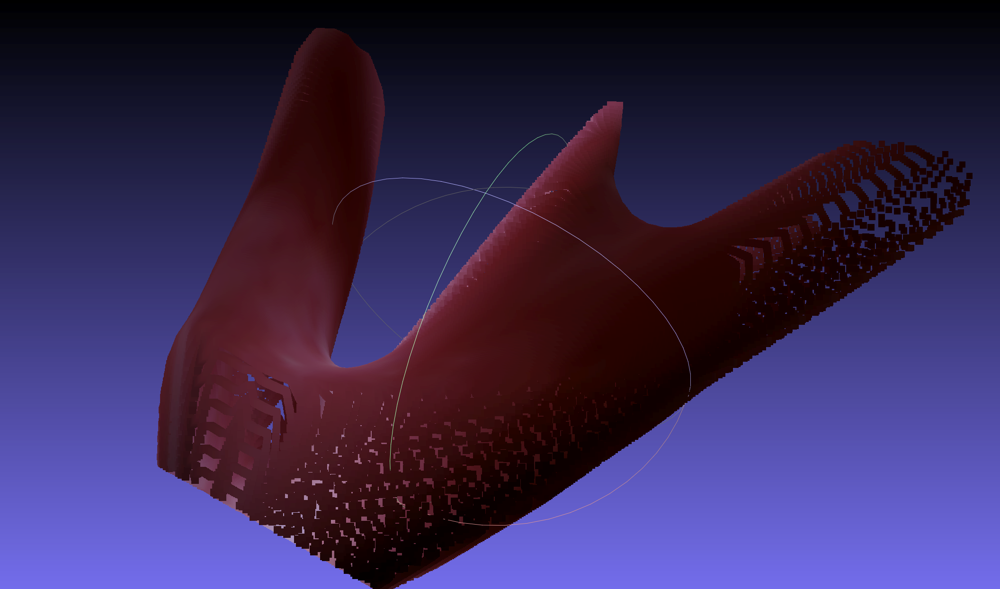
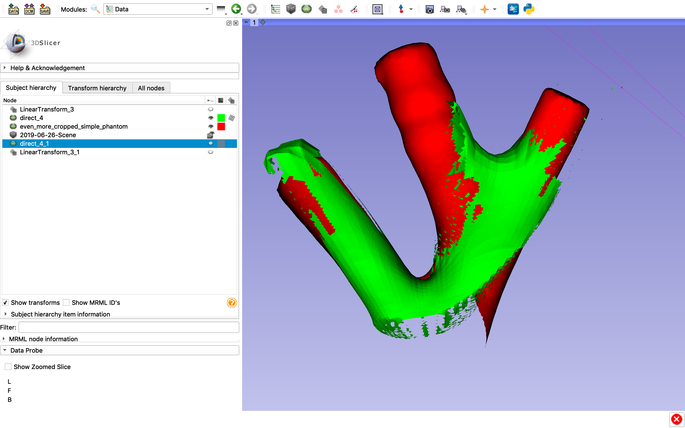

Back to [Projects List](../../README.md#ProjectsList)

# Bronchoscope Localization From Depth Map

## Key Investigators

- Shelly Liu (Concord Academy)
- Jonah Berg (The Rivers School)
- Franklin King (BWH)

# Project Description

<!--   -->
The goal is to localize a bronchoscope through the use of depth maps generated from bronchoscopy images using neural networks.

## Objective

<!-- What we would like to achieve in this project is to be able to localize bronchoscopy images to the CT scan of the lung. -->

1. Objective A. Produce point-cloud/models from depth maps.
2. Objective B. Within slicer, register point-cloud/models to CT scan model.

## Approach and Plan

<!-- Describe here HOW you would like to achieve the objectives stated above. -->

1. We will use data from a bronchoscopy on a phantom lung.
2. We will generate depth maps using a technique by Marco Visentini-Scarzanella[1]
3. We will then convert depth maps into point clouds
4. Finally, we plan to use slicer to register point clouds to the CT scan.

## Progress and Next Steps

<!-- Update this section as you make progress, describing of what you have ACTUALLY DONE. If there are specific steps that you could not complete then you can describe them here, too. -->

1. The steps we have already completed is the training and testing of the neural networks used to generate depth maps.
2. We have converted a depth map into a point cloud.
3. We have fixed the issue regarding the size and location of the point cloud relative to its actual position in the phantom lung.
4. We also were able to register the point cloud to the CT scan in Slicer using Model/Surface Registration.
5. The next step is to improve training so the predicted depth maps are more accurate.

## Images

From left to right: True RGB, True rendered RGB, True depth map, Predicted rendered RGB, Predicted depth map from predicted RGB, Predicted depth map from true RGB

Red: Original model

Green: Reconstructed from depth map

# Background and References

1. https://drive.google.com/file/d/0B0x0v_kN6YuMa0dscEpLUjNnemM/view
