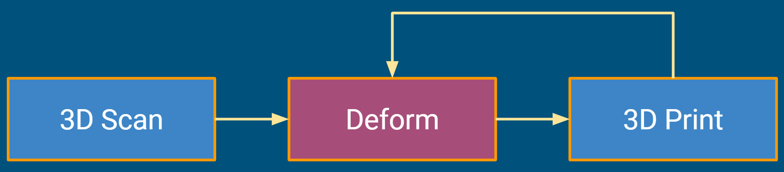
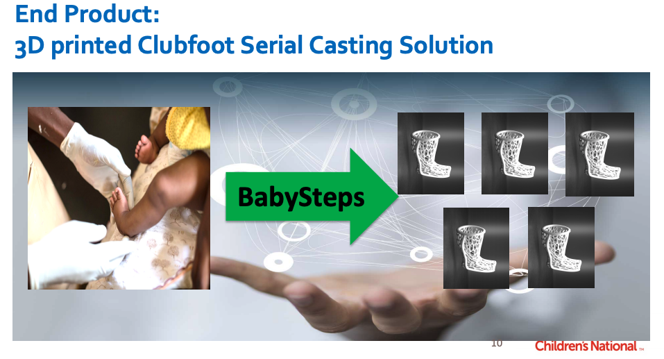

Back to [Projects List](../../README.md#ProjectsList)

# BabySteps: 3D Printing Using Slicer for creating clubfoot casts

## Key Investigators

- Hadi Fooladi, Children's National
- Pooneh Roshanitabrizi, Children's National
- Steve Pieper, Isomics, Inc.
- Kevin Cleary, Children's National
- Anuradha Dayal, Children's National

# Project Description

About 1-2 in every 1000 babies are born with what's called clubfoot, the most common skeletal deformity in children.

Clubfoot is well treated using a plaster casting method developed in the 1960s, but there is a potential to use
3D scanning and printing techniques to make the process more efficient and cost-effective.  Also easier activities of 
daily living for families with plastic instead of plaster casts.

<!-- Add a short paragraph describing the project. -->

## Objective

<!-- Describe here WHAT you would like to achieve (what you will have as end result). -->

1. Ideal system would take a surface scan of baby's foot, either with phone or custom camera
1. Computer would generate sequence of cast shapes customized to baby
1. 3D printing models would be exported (STL) for generating custom casts

## Approach and Plan

<!-- Describe here HOW you would like to achieve the objectives stated above. -->

1. 3D Scaning of the clubfoot cast
1. Loading the 3D model into Slicer
1. Selecting anatomical landmark points on the 3D model
1. Deforming the clubfoot 3D model through provided controls and widgets for printing next cast
1. 3D printing the deformed clubfoot model
1. Repeating the process until printing the normal cast

 

## Progress and Next Steps

<!-- Update this section as you make progress, describing of what you have ACTUALLY DONE. If there are specific steps that you could not complete then you can describe them here, too. -->

1. 3D Scan of normal and clubfoot phantoms
1. ...
1. ...

# Illustrations

<!-- Add pictures and links to videos that demonstrate what has been accomplished.

-->

# Background and References

<!-- If you developed any software, include link to the source code repository. If possible, also add links to sample data, and to any relevant publications. -->
