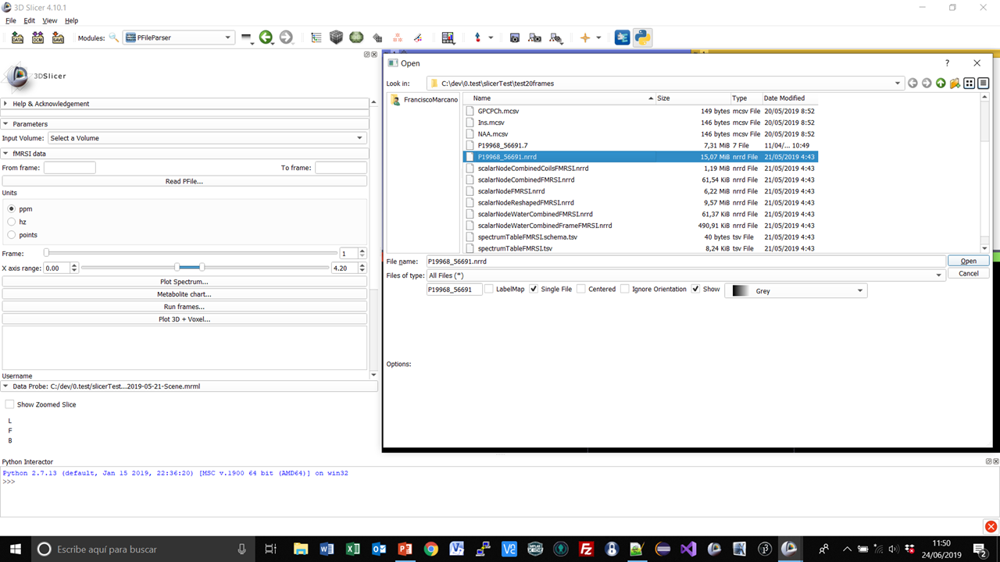

Back to [Projects List](../../README.md#ProjectsList)

# Improve DICOM import for 1H Time resolved Functional Magnetic Resonance Spectroscopy with quantification of metabolites

## Key Investigators

- Francisco Marcano Serrano (ULL - MACbioIDi)
- José Luis González Mora (ULL - MACbioIDi)
- Juan Ruiz-Alzola (ULPGC - GTMA - MACbioIDi)
- Steve Pieper (Isomics)

## Project Description

The aim of this project is to implement algorithms to process single voxel or chemical shift imaging time sequences in Slicer. A sequence is compose of frames with a period of NEX*TR sec each. The output of the processing is an estimated sequence of spectra with increased signal-to-noise ratio (SNR). SNR-improved sequence could be used to extract the chemical kinetic information of metabolites might be found in the original sequence in ideal absence of noise, and improve quantification of low-concentration metabolites in each frame. Processed sequences are quantified by third-party software.
Algorithms have previous been coded in Matlab, and it is proposed their translation to 3D Slicer numeric and scientific library framework. It is also encouraged to implement secure communication routines to interact with quantification software from 3D Slicer application.

## Objectives

1. To implement a standard uploading mechanism of DICOM images and MR spectroscopic data in FMRSI module

## Approach and Plan

1. Select MRI and MRS dataset to be processed
2. Verify the feasibility of including raw MRS data in DICOM repository
2. Checking existing options for linking binary data to MRI brain image in DICOM repository, to have a unified access and view of anatomical and spectroscopic data in Slicer.

## Progress and Next Steps
1. Encapsulation of raw spectroscopy data into a DICOM file structure, to import this data as a new serie in existing patient/study record.
2. In progress: defining a new DICOM plugin to handle encapsulated data properly.

## Illustrations
Fig. 1: FMRSI interface

Fig. 2: Open Dialog

