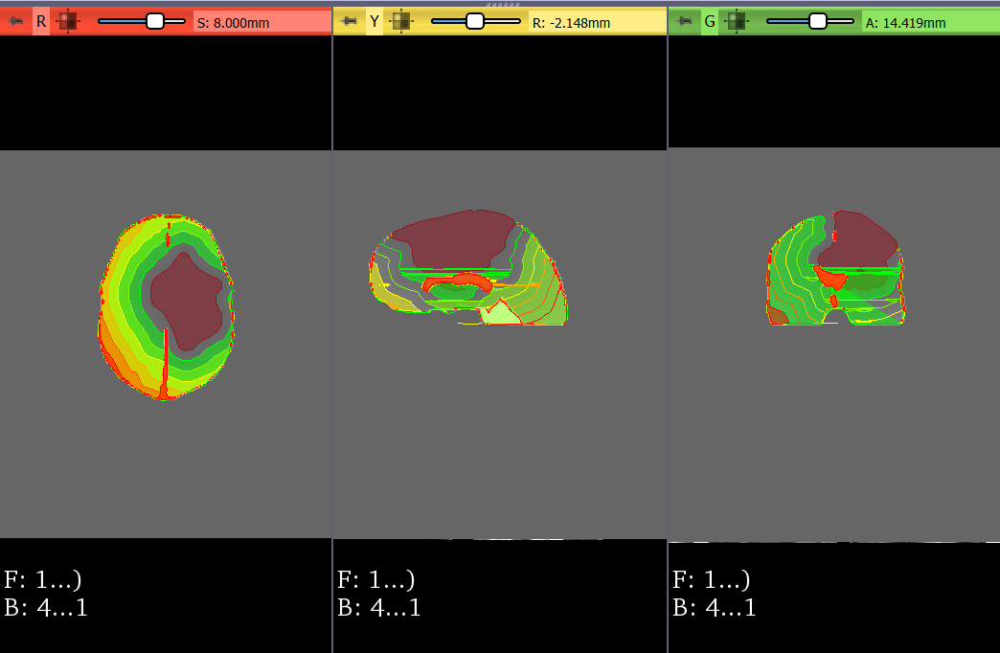
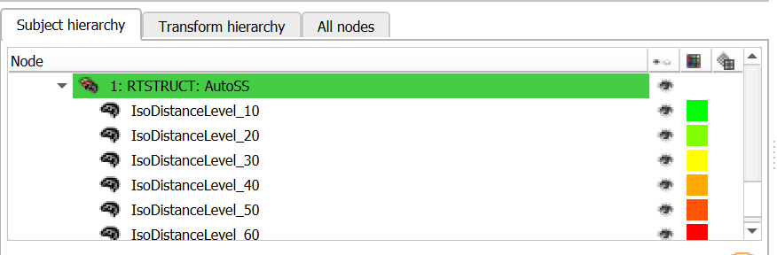

Back to [Projects List](../../README.md#ProjectsList)

# Create DICOM object for 3D volume to represent clinical target volume

## Key Investigators

- Nadya Shusharina (Massachusetts General Hospital)
- Csaba Pinter (Queen's University)

# Project Description

<!-- Add a short paragraph describing the project. -->

## Objective

<!-- Describe here WHAT you would like to achieve (what you will have as end result). -->

1. Create and vizualise in DICOM module 3D distance map as a part of structure set.
2. Additionally have iso-distance levels as structure labelmaps.
1. GUI to select iso-distance levels.

## Approach and Plan

<!-- Describe here HOW you would like to achieve the objectives stated above. -->

1. Describe specific steps of **what you plan to do** to achieve the above described objectives.
1. ...
1. ...

## Progress and Next Steps

<!-- Update this section as you make progress, describing of what you have ACTUALLY DONE. If there are specific steps that you could not complete then you can describe them here, too. -->

1. Describe specific steps you **have actually done**.
1. ...
1. ...

# Illustrations

<!-- Add pictures and links to videos that demonstrate what has been accomplished.
![Description of picture]

-->

# Background and References

<!-- If you developed any software, include link to the source code repository. If possible, also add links to sample data, and to any relevant publications. -->
N. Shusharina, D. Craft, Y.-L. Chen, H. Shih, T. Bortfeld.  The clinical target distribution: a probabilistic approach to the clinical target volume. Phys Med Biol 2018; 63:155001.
