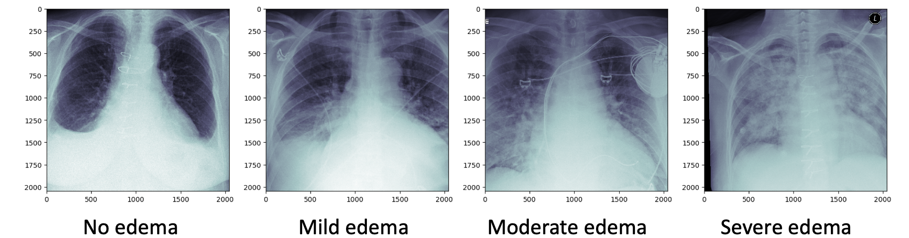

Back to [Projects List](../../README.md#ProjectsList)

# Clinical trajectory visualization based on edema quantification from chest x-ray

## Key Investigators

- Ruizhi Liao (MIT)
- Steve Pieper (ISOMICS)
- Polina Golland (MIT)

# Project Description

We have developed machine learning algorithms to automatically quantify the severity of pulmonary edema from chest x-rays on a continuous scale. The resulting assessment can be used for visualization of heart failure patient recovery trajectories in prior episodes of heart failure to support physicians with a data-driven approach to treating patients. We would like to investigate different ways of visualizing the clinical tracjectories that can inform physicians how different patients responded to different medications/treatment plans.

ML algorithms for quantifying pulmonary edema in chest x-ray: https://www.csail.mit.edu/research/chest-x-ray-analysis

Example x-ray images:

## Objective

1. Look into Crossfilter: http://square.github.io/crossfilter/
2. Look into Vega-lite: https://vega.github.io/vega-lite/

# Background and References

ML algorithms for quantifying pulmonary edema in chest x-ray: https://www.csail.mit.edu/research/chest-x-ray-analysis
