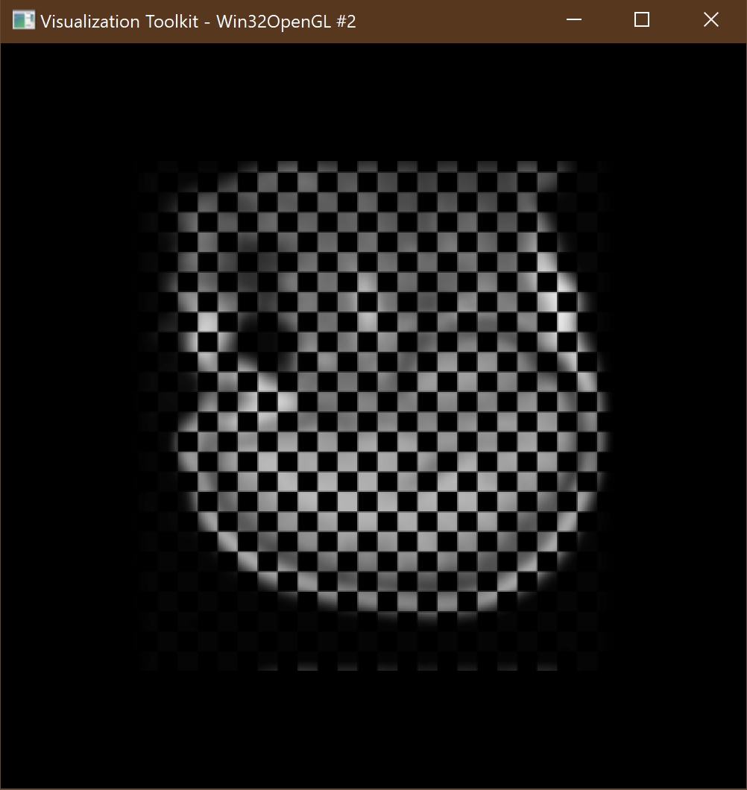

Back to [Projects List](../../README.md#ProjectsList)

# Custom shaders for volume rendering and data processing on GPU

## Key Investigators

- [Kyle Sunderland](http://perk.cs.queensu.ca/users/sunderland) (Queen's University, Canada)
- Steve Pieper (Isomics)
- [Andras Lasso](http://perk.cs.queensu.ca/users/lasso) (Queen's University, Canada)

# Project Description

## Objective

- Make custom GLSL shader pipelines available in Slicer for:
  - Custom volume rendering effects
  - GPU-accelerated image processing

## Approach and Plan

- [Progress made at last project week](../../../PW28_2018_GranCanaria/Projects/GLSLShaders/README.md)
- Evaluate vtkGPUImageData based filters ([Source](https://github.com/Sunderlandkyl/VTK/tree/vtkGPUImageFilter2))

## Progress and Next Steps

- Implemented GLSL based bilateral filter
- Started implementing infrastructure required for rendering to multiple targets in order to support GPU growcut algorithm

### Result
| Approach | Result |
| --- | --- |
| SimpleITK bilateral filter: | 8 min 36 seconds |
| GLSL bilateral filter: | 1.5 seconds |
| Speedup: | 344x |

 

# Illustrations

- Example of vtkGPUShaderAlgorithm pipline ([ShaderAlgorithm](https://github.com/Sunderlandkyl/VTK/blob/vtkGPUImageFilter2/Examples/ShaderAlgorithm/Cxx/ShaderAlgorithm.cxx))
 

| Philips 3D US | Chroma-depth in PRISM | Depth peeling in PRISM |
| --- | --- | --- |
|  |  |  |

# Background and References

<!--Use this space for information that may help people better understand your project, like links to papers, source code, or data.-->
- [Slicer source code](https://github.com/Sunderlandkyl/Slicer/tree/gpu_fractional_3)
- [VTK source code](https://github.com/Sunderlandkyl/VTK/tree/vtkGPUImageFilter3)
- [Bilateral filter extension](https://github.com/Sunderlandkyl/SlicerSandbox/tree/master/GPUTest)
