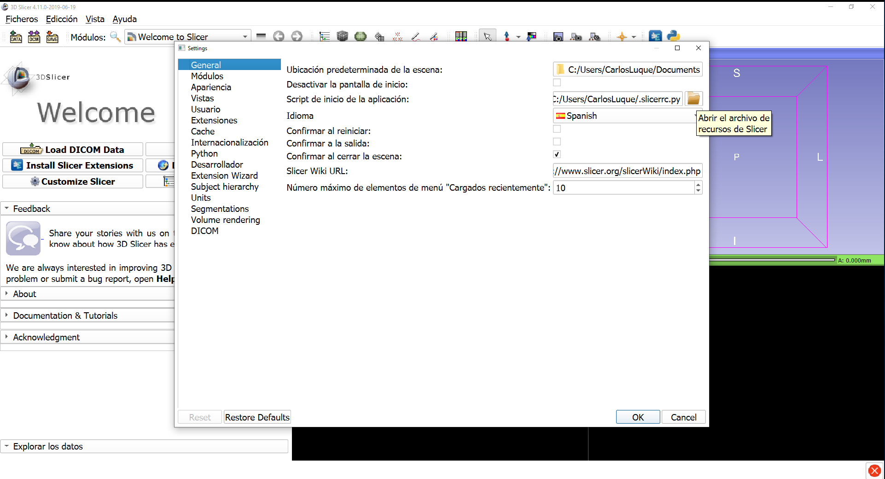
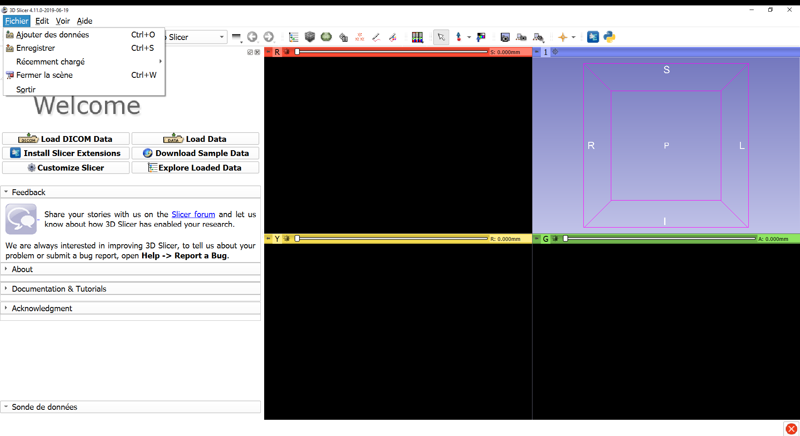

Back to [Projects List](../../README.md#ProjectsList)

# Globalization in 3D Slicer and OHIF

## Key Investigators

- José-Carlos Ruiz-Luque (ULPGC - GTMA-IUIBS - MACbioIDi)
- Jean-Christophe Fillion-Robin (Kitware)
- Erik Ziegler (Radical Imaging / Open Health Imaging Foundation)
- Juan Ruiz-Alzola (ULPGC - GTMA - MACbioIDi)

## Project Description

The software globalization is the translation process of software from a source language into a target language. The process is divided into two steps: software internationalization (i18n) and software localization (L10n). The former is the task of designing software without a specific location i.e. building it independent of any specific language or culture. The latter is the process of adapting a software for a specific location. 

The aim of this project is to develop/improve the 3D Slicer internationalization (i18n) and localization (l10n) support. This project is a next step in the [one](https://github.com/NA-MIC/ProjectWeek/blob/master/PW30_2019_GranCanaria/Projects/UltrasoundSimulatorTraining/README.md) presented during 30th PW NA-MIC.  

Also, we will discuss about the globalization in OHIF.

## Objectives

1. Improving the I18n support in the 3d Slicer core.
1. Supporting the I18n in scripted module.
1. Discussing the number and date formats in the dependence libraries and 3D Slicer core.
1. Defining the step for translation of a module.

## Approach and Plan

1. Enhancing the contexts for the text displayed in GUI for the translation files (ts).
    1. Removing the *QObject::tr* and *q->tr*
    1. Removing the lupdate warnings: 
        1. *Cannot invoke tr() like this*.
        1. *Class MyClass lacks Q_OBJECT macro*.
1. Designing a WEB page so as to store the language files. 
1. Developing the i18n support for scripted module.

## Progress and Next Steps

1. The following fixes have been **integrated into Slicer source**:
   * [r28338](http://viewvc.slicer.org/viewvc.cgi/Slicer4?view=revision&revision=28338): STYLE: i18n: Remove unneeded translation of empty strings
   * [r28339](http://viewvc.slicer.org/viewvc.cgi/Slicer4?view=revision&revision=28339): BUG: i18n: Fix use of tr() function in pimpl of Base and MRML Qt classes
   * [r28340](http://viewvc.slicer.org/viewvc.cgi/Slicer4?view=revision&revision=28340): BUG: i18n: Fix buildsystem to fix generation of .ts files for loadable module
   * [r28341](http://viewvc.slicer.org/viewvc.cgi/Slicer4?view=revision&revision=28341): BUG: i18n: Fix use of tr() function in loadable module classes
   * [r28342](http://viewvc.slicer.org/viewvc.cgi/Slicer4?view=revision&revision=28342): ENH: i18n: Update buildsystem to support generation of .ts files for ModuleWidgets
   * [r28343](http://viewvc.slicer.org/viewvc.cgi/Slicer4?view=revision&revision=28343): BUG: i18n: Fix use of tr() function in loadable module Qt widget classes
   * [r28344](http://viewvc.slicer.org/viewvc.cgi/Slicer4?view=revision&revision=28344): ENH: i18n: Add support for node combox, 3d view controller and qSlicerApp
   * [r28345](http://viewvc.slicer.org/viewvc.cgi/Slicer4?view=revision&revision=28345): STYLE: Remove translation files with old-style suffix
1. Support for i18n was **improved**.
   * See the  [PR-1162: improve-i18n-support](https://github.com/Slicer/SlicerGitSVNArchive/pull/1162)
   * Support for translating scripted modules (`slicer.i18n.tr()`)
   * Generation of `<ModuleName>_untranslated.ts` files
   * Add targets `GenerateSlicerTranslationTemplates` and `GenerateSlicerTranslationQMFiles`
   * Support for generating and updating translation files in extension.
1. Discussed several proposals to **organize the translation effort** and **manage** associated infrastructures
   * Created project https://github.com/Slicer/SlicerTranslations
   * Proposed plan:
      * create a `SlicerTranslations` extension to install languages files for Slicer core
      * Still need to refine and document the approach for maintaining and distributing translation files for extensions
1. Support for **localization**:
   * Displaying numbers with correct local format) is postponed for several months
   * A nightly build of Slicer will be setup in our lab in Canary Islands on system with different language and local.

## Illustrations
Fig. 1: Spanish Slicer GUI
 

Fig. 2: French Slicer GUI
 

## Background and References
- [Translated Files](https://mt4sd.github.io/SlicerTranslatedFiles/)
- [3D Slicer I18n support](https://www.slicer.org/wiki/Documentation/Labs/I18N)
- [Enabling I18n support ](https://discourse.slicer.org/t/slicer-internationalization/579)  
- [Globalization source code](https://github.com/mt4sd/Slicer/tree/support_i18n_l10n)
- [Forgot tr](https://doc.qt.io/archives/qq/qq03-swedish-chef.html)
- [Qt internationalization](https://doc.qt.io/qt-5/internationalization.html)
