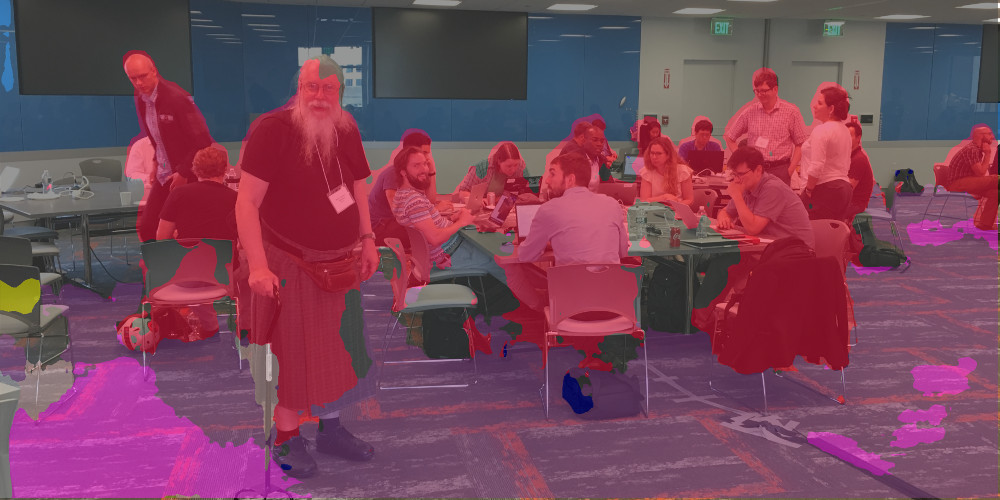

Back to [Projects List](../../README.md#ProjectsList)

# Implementing support for running inference engines in CustusX

## Key Investigators

- Ole Vegard Solberg (SINTEF, Trondheim, Norway)
- Janne Beate Bakeng (SINTEF, Trondheim, Norway)

# Project Description

<!-- Add a short paragraph describing the project. -->
Running trained Deep Learning networks with inference engines. The focus will be on implementing this in [CustusX](https://www.custusx.org).

## Objective

<!-- Describe here WHAT you would like to achieve (what you will have as end result). -->

1. Start with implementing C++ support for running one pre-trained model.

## Approach and Plan

<!-- Describe here HOW you would like to achieve the objectives stated above. -->

1. Use the [FAST](https://github.com/smistad/FAST) library for inference engine support.

## Progress and Next Steps

<!-- Update this section as you make progress, describing of what you have ACTUALLY DONE. If there are specific steps that you could not complete then you can describe them here, too. -->
The task of implementing support for multiple inference engines proved too large for Project Week.
We ended up using the [OpenVINO Toolkit](https://docs.openvinotoolkit.org/) directly. The OpenVINO inference engine allows us to run the trained networks on the various Intel devices (CPU, GPU, FPFA, Movidius Stick, ...), so this choice still provides us with a decent multi-platform solution.

# Illustrations

<!-- Add pictures and links to videos that demonstrate what has been accomplished.

-->

# Background and References

<!-- If you developed any software, include link to the source code repository. If possible, also add links to sample data, and to any relevant publications. -->
[CustusX](https://www.custusx.org) is the toolbox we bring to the OR. It's our tool for reusing results from old reserch projects.

Currently we got several research projects where deep learning networks are created: [Examples from FAST](https://www.eriksmistad.no/)

We want to be able to run these networks from inside CustusX to allow a more seamless integration in the OR. Some projects require the deep learning networks to run in real time, and in these cases they will need to run them on inference engines.

[Video: Highlighting nerves and blood vessels on ultrasound images](https://youtu.be/06HTxmmu0mg)
