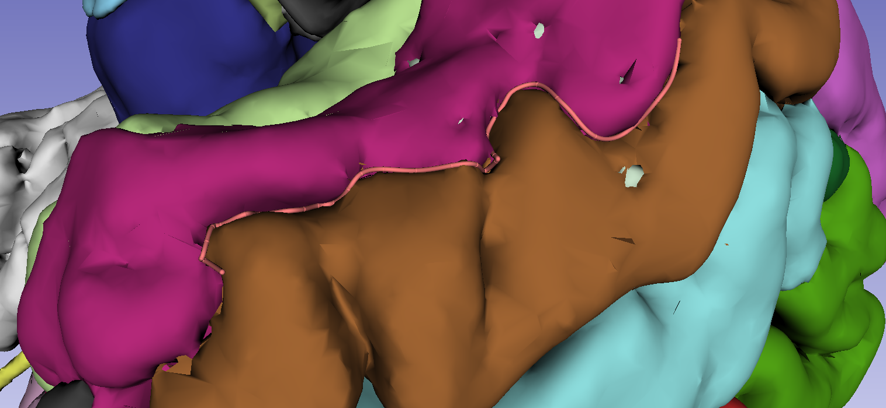

Back to [Projects List](../../README.md#ProjectsList)

# Neuroanatomical Segmentation

## Key Investigators

- Sylvain Bouix (BWH)
- Jarett Rushmore (Boston University)
- Kyle Sunderland (Queen's University)
- Andras Lasso (Queen's University)

# Project Description

<!-- Add a short paragraph describing the project. -->

## Objective

<!-- Describe here WHAT you would like to achieve (what you will have as end result). -->
1. Design and create a dedicated neuroanatomy segmentation module
1. Adopt an approach for sulcal definition

## Approach and Plan
<!-- Describe here HOW you would like to achieve the objectives stated above. -->
- Sulcal definition
  1. Load freesurfer surfaces into Slicer
  1. Using the white matter surfaces, draw two points in Slicer, each at the base of a sulcus
  1. Connect the two points with a line at the bottom of the sulcus (i.e., a minimum value)
  1. Assign the line to a specific sulcal identity (with it's associated ontology, and related reference files)

- Implement a constraint option for markups to force them to be on a surface (i.e. model node, segmentation, or another markup)

## Progress and Next Steps

<!-- Update this section as you make progress, describing of what you have ACTUALLY DONE. If there are specific steps that you could not complete then you can describe them here, too. -->
- Custom module specific to neuroanatomical [General Segmentation](https://www.dropbox.com/s/wwj1twon99j6fy7/CMA-Segmentation-Manual.pdf?dl=0)
1. Presented a mockup module
1. Most functionalities are already in Segment Editor
1. Plan is to modify the design to poptimize speed
1. Presented real-time histogram generation

- New functionalities for [Surface Assisted Cortical Parcellation](https://www.dropbox.com/s/go5q8p49akuj4p8/CMA-SurfaceAssistedCorticalParcellation-Manual.pdf?dl=0)
1. Identified requirements to draw lines in sulcal pits
1. Presented the underlying principles for cortical parcellation (cortical ribbon is being parcellted using a combination of fiducial landmarks representing a set of planes and sulcal lines)

# Illustrations

- [Sulci tracing](https://www.dropbox.com/s/jolgfuswscm7eb3/brainsuite_demo.wmv?dl=0)

# Background and References

<!-- If you developed any software, include link to the source code repository. If possible, also add links to sample data, and to any relevant publications. -->
