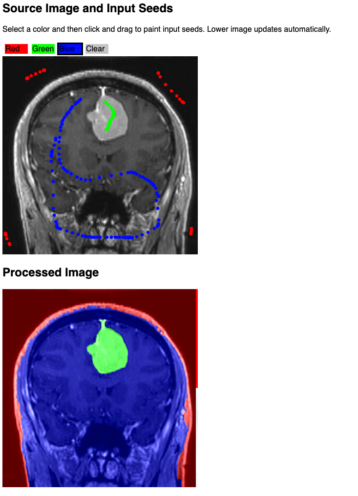

Back to [Projects List](../../README.md#ProjectsList)

# GLSL-based OHIF Viewer Plugin

## Key Investigators

- [Steve Pieper][steve] ([Isomics][isomics])
- [James A Petts][james] ([Institute for Cancer Research, London][icr-london])
- [Danny Brown][danny] ([Radical Imaging][radical])
- [Erik Ziegler][erik] ([Radical Imaging][radical])

## Description

## Objective

Integrate integrated GLSL based algorithmd into OHIF segmentation infrastructure.

Make use of the OHIF plugin infrstructure.

```bash
# INSERT COOL IMAGES OF JAMES'S STUFF HERE
```

## Approach and Plan

<!-- Describe here HOW you would like to achieve the objectives stated above. -->

1. Identify best algorithms to work with, probably start with GrowCut
1. Look at how to pass image data between OHIF and plugin
1. Come up with reasonable user interfacer

## Progress and Next Steps

<!-- Update this section as you make progress, describing of what you have ACTUALLY DONE. If there are specific steps that you could not complete then you can describe them here, too. -->

1. Describe specific steps you **have actually done**.
1. ...
1. ...

# Illustrations




# Background and References

<!-- If you developed any software, include link to the source code repository. If possible, also add links to sample data, and to any relevant publications. -->

* http://pieper.github.io/sites/glimp/index.html
* https://github.com/pieper/sites/tree/gh-pages/step

<!--
    Links
-->

[radical]: http://radicalimaging.com/
[icr-london]: https://www.icr.ac.uk/
[danny]: https://github.com/dannyrb
[isomics]: http://isomics.com/
[james]: https://github.com/jamesapetts
[erik]: https://github.com/swederik
[steve]: https://github.com/pieper
[ohif-viewer]: https://github.com/OHIF/Viewers
[ohif-extensions]: https://docs.ohif.org/advanced/extensions.html
[ohif]: http://ohif.org/
[james-magic]: https://github.com/JamesAPetts/OHIF-Viewer-XNAT/tree/xnatRoi-dev-vNext/Packages/icr-peppermint-tools

