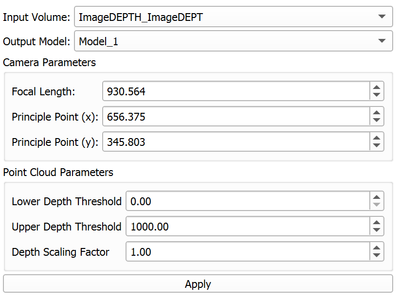
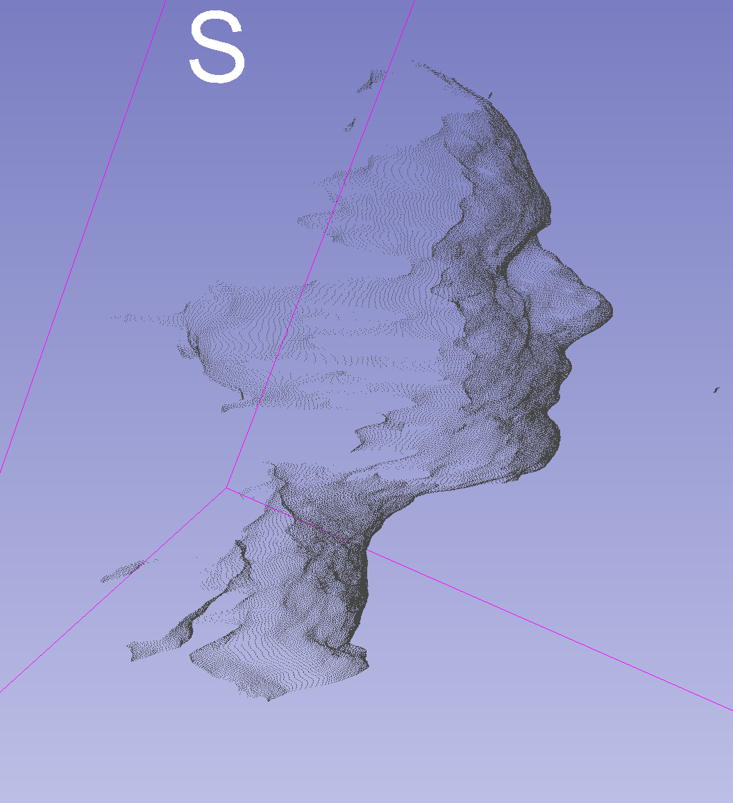
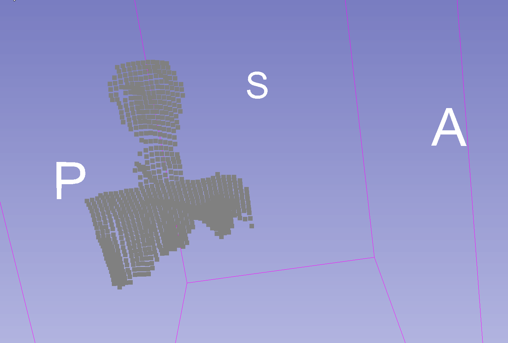
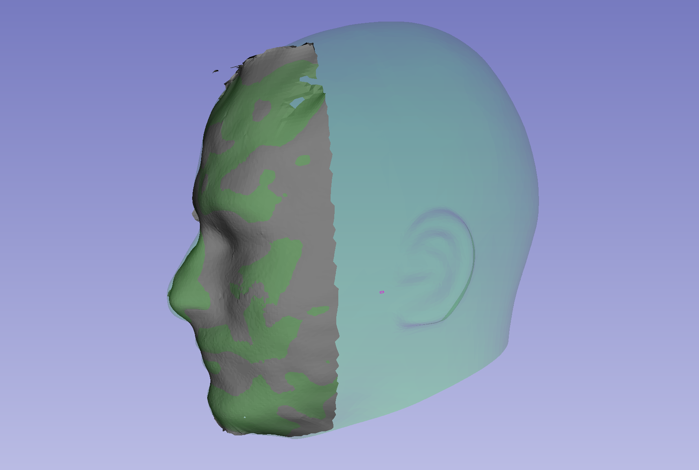
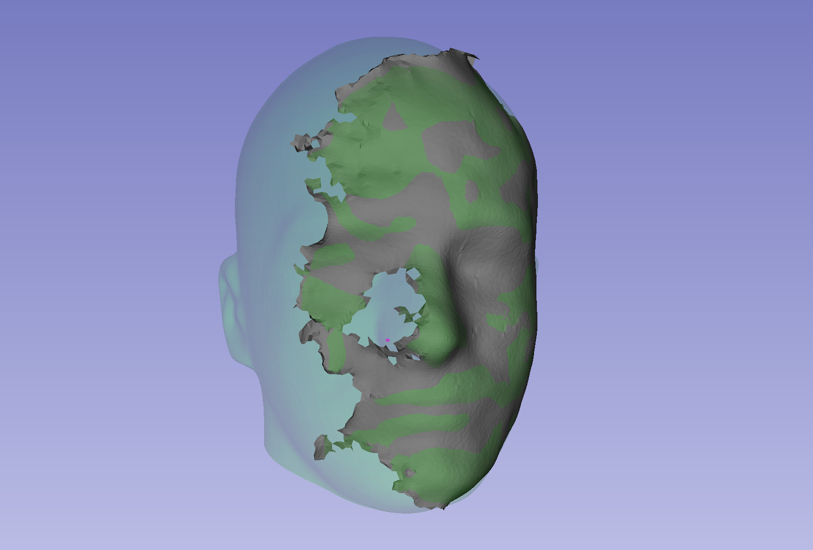
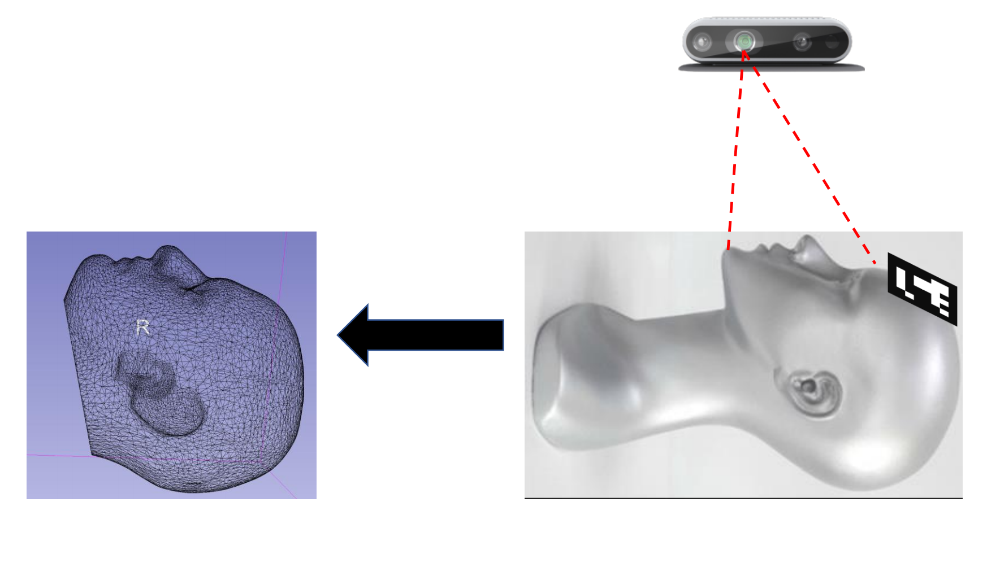

Back to [Projects List](../../README.md#ProjectsList)

# Registration of Intel RealSense depth camera image to CT + marker based tracking

## Key Investigators

- Colton Barr (Queen's University, Canada)
- Andras Lasso (Queen's University, Canada)
- Steve Pieper (Isomics)

# Project Description

The goal of this project is to develop a module in Slicer for registering [Intel RealSense][realsense] depth data to a CT scan of a patient's
head and maintain this
tion using an optical marker. The module will use facial surface anatomy to perform initial
registration between the RealSense and a CT scan. An optical marker will be rigidly fixed to the patient's head within the
camera's field of view and used to preserve registration when the patient's face is no longer visible.

## Objective

Objective A: Perform patient registration using segmented facial surface anatomy and depth images streamed from the Intel RealSense

Objective B: Maintain patient registration after face is no longer visible using an optical marker tracked by the Intel RealSense RGB camera

## Approach and Plan

<!-- Describe here HOW you would like to achieve the objectives stated above. -->

1. Acquire depth images from the RealSense in Slicer and use them to generate a point cloud
2. Determine how to stream these depth images and calculate the point cloud in real time
3. Use a captured point cloud to verify the accuracy of the registration to a model
4. Use Slicer to track an optical marker defined rigidly relative to the real time point cloud
5. Perform registration on the point cloud with the marker and maintain the registration without visibility of the facial anatomy

## Progress and Next Steps

<!-- Update this section as you make progress, describing of what you have ACTUALLY DONE. If there are specific steps that you could not complete then you can describe them here, too. -->

1. Created Slicer module for generating a point cloud from a depth image
2. Demonstrated streaming of real-time point clouds from depth images captured by the RealSense
3. Investigated accuracy of [Model Registration module](https://github.com/SlicerIGT/SlicerIGT/blob/master/ModelRegistration/ModelRegistration.py) for registering captured point clouds to dense models
4. Explored RealSense parameters to find settings best suited to close range facial scanning

# Illustrations

#### User interface of DepthImageToPointCloud module

#### Example of point cloud generated from depth image

#### Demonstration of streamed point cloud generated using RealSense depth data

#### Examples of acquired surface mesh registered to model

#### Basic workflow of the project

# Background and References

<!-- If you developed any software, include link to the source code repository. If possible, also add links to sample data, and to any relevant publications. -->

- [DepthImageToPointCloud](https://github.com/PerkLab/DepthImageToPointCloud): Slicer extension to display point cloud data streamed from IntelRealsense camera
- [Intel RealSense](https://www.intelrealsense.com/stereo-depth)
- [SlicerIGT extension](https://www.slicerigt.org/) - [Model Registration module](https://github.com/SlicerIGT/SlicerIGT/blob/master/ModelRegistration/ModelRegistration.py)
