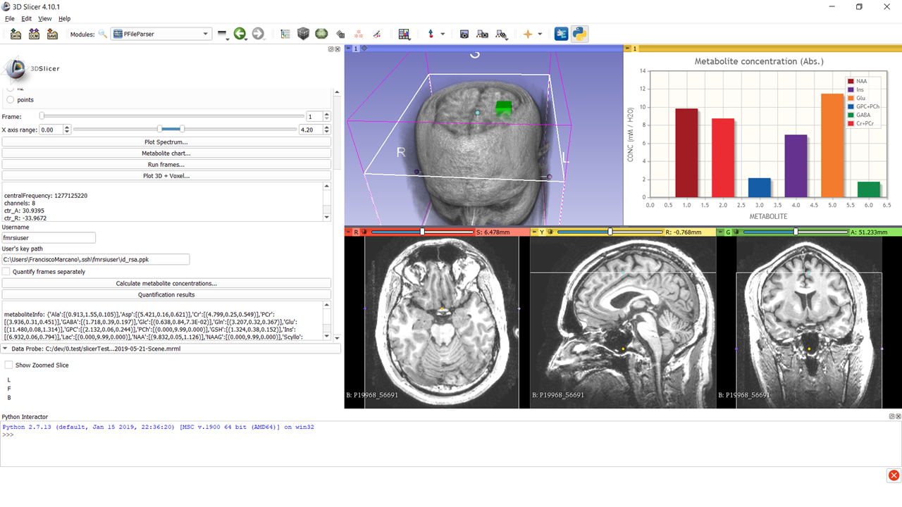
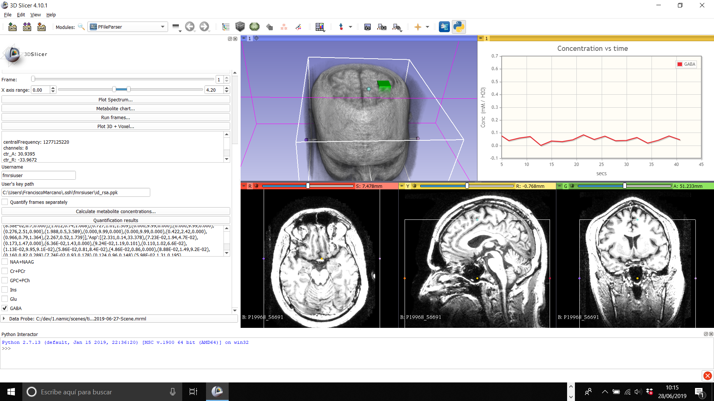

Back to [Projects List](../../README.md#ProjectsList)

# Segmentation based statistics/visualization of 1H Time resolved Functional Magnetic Resonance Spectroscopy with quantification of metabolites

## Key Investigators

- Francisco Marcano Serrano (ULL - MACbioIDi)
- José Luis González Mora (ULL - MACbioIDi)
- Juan Ruiz-Alzola (ULPGC - GTMA - MACbioIDi)

## Project Description

The aim of this project is to implement algorithms to process single voxel or chemical shift imaging time sequences in Slicer. A sequence is compose of frames with a period of NEX*TR sec each. The output of the processing is an estimated sequence of spectra with increased signal-to-noise ratio (SNR). SNR-improved sequence could be used to extract the chemical kinetic information of metabolites might be found in the original sequence in ideal absence of noise, and improve quantification of low-concentration metabolites in each frame. Processed sequences are quantified by third-party software.
Algorithms have previous been coded in Matlab, and it is proposed their translation to 3D Slicer numeric and scientific library framework. It is also encouraged to implement secure communication routines to interact with quantification software from 3D Slicer application.

## Objectives

1. Implementing segmentation and colouring of fMRSI target region in brain image for statistic visualization

## Approach and Plan

1. Implementing highlighting of brain cortex areas related to voxel data taken from magnetic resonance spectroscopy (MRS) files.
1. Implementing and verifying the mechanism for data exchanging between time-resolved module and quantification serviced located in a secure external server.
1. Display time-resolved metabolite concentrations on a plot chart

## Progress and Next Steps
1. Assessment of different options to implement graphic charts, including importing matplotlib library to generate complex graphics
1. Implemented simple graphic viewer of concentration time series for selected metabolites.

## Illustrations
Fig. 1: FMRSI interface

Fig. 2: Open Dialog

Fig. 3: Quantification of average spectrum

Fig. 4: Time-resolved quantification

Fig. 5: Selected metabolite time serie

