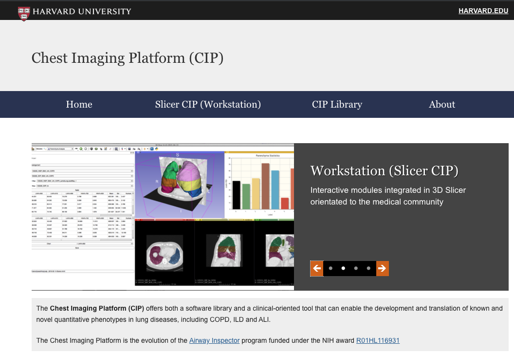

Back to [Projects List](../../README.md#ProjectsList)

# SlicerCIP migration
SlicerCIP migration to Slicer 4.10 / Slicer 5.0?

## Key Investigators

- Jorge Onieva (ACIL, Brigham and Women's Hospital)
- Pietro Nardeli (ACIL, Brigham and Women's Hospital)
- Raúl San José Estépar (ACIL, Brigham and Women's Hospital)

# Project Description

Migrate the SlicerCIP extension to the last Slicer stable release, and "pave the way" towards Slicer 5.

## Objective

1. SlicerCIP 4.10 migration. Extension fully operative.
1. SlicerCIP 5 migration. Build the extension and (at the very least) check for potential issues.

## Approach and Plan

1. Update the required libraries in CIP library (towards Slicer 4.10)
1. Update SlicerCIP extension
1. Experiment with Slicer 5 components

## Progress and Next Steps

<!-- Update this section as you make progress, describing of what you have ACTUALLY DONE. If there are specific steps that you could not complete then you can describe them here, too. -->

1. SlicerCIP is now available in the Slicer 4.10 Release.
2. Pre-packaged SlicerCIP is also available in chestimagingplatform.org

# Illustrations

# Background and References

https://chestimagingplatform.org/
