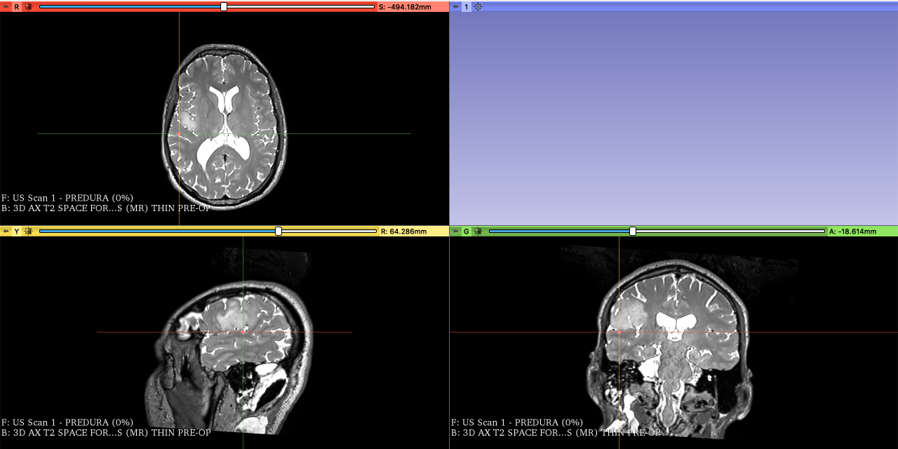
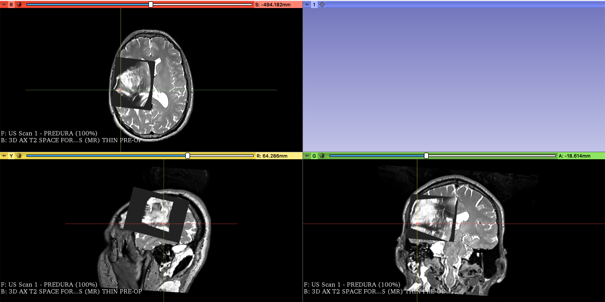
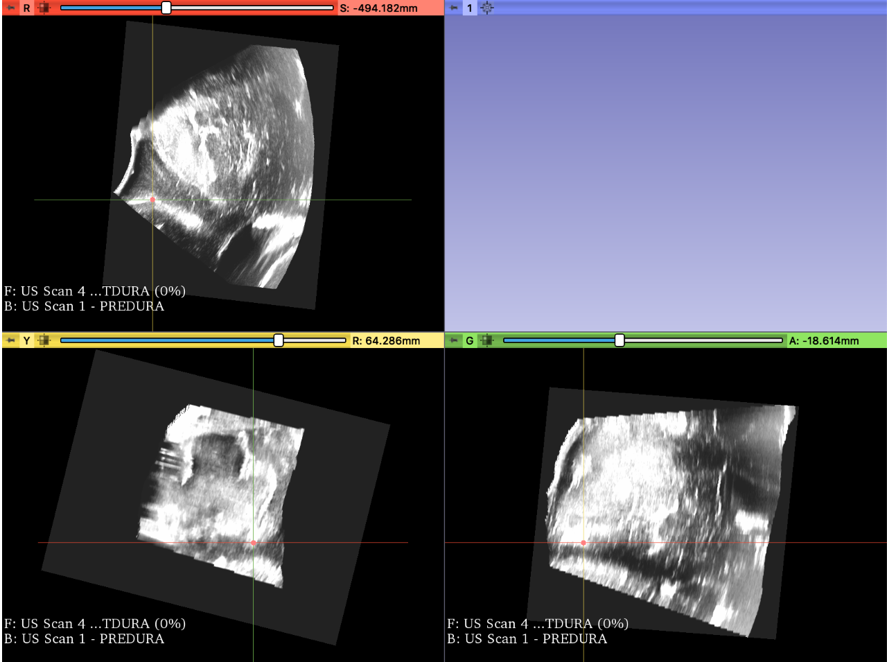
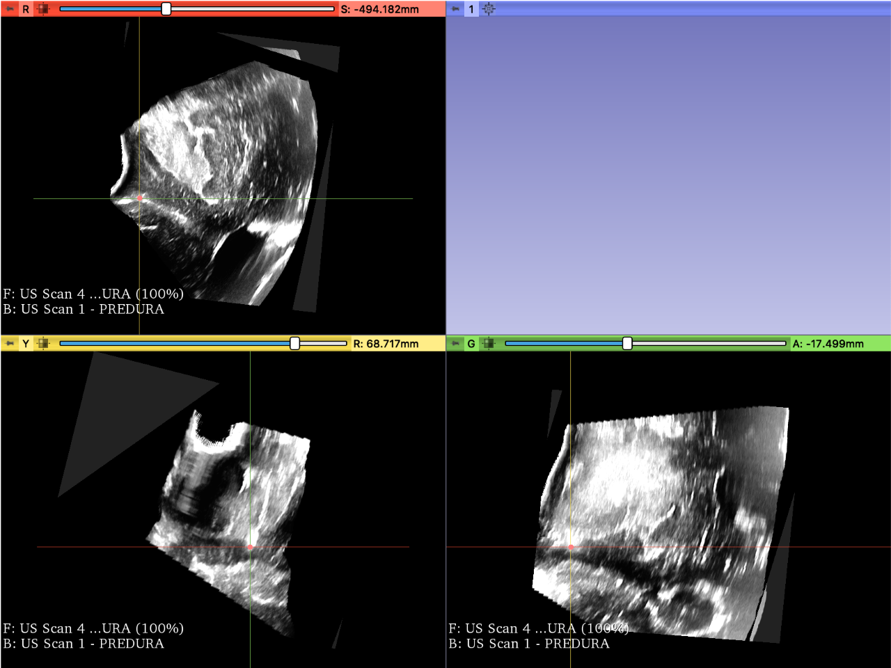
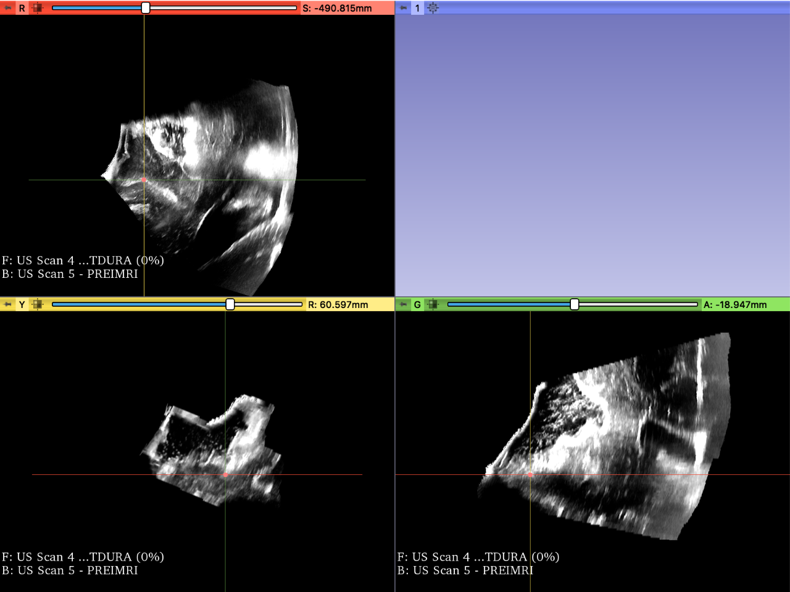

Back to [Projects List](../../README.md#ProjectsList)

# Establishing Feature Correspondences between ultrasound images acquired at different time points during brain tumor resection

## Key Investigators

- Nick Jowkar (Brigham and Women's Hospital)
- Clement Mirabel (Brigham and Women's Hospital)
- Sarah Frisken (Brigham and Women's Hospital)
- Tina Kapur (Brigham and Women's Hospital)

# Project Description

<!-- Add a short paragraph describing the project. -->
The overarching goal of this project is to use pre- and intra-operative imaging to help neurosurgeons determine whether gross total resection has been achieved.

## Objective

<!-- Describe here WHAT you would like to achieve (what you will have as end result). -->

1. Objective A. Manually identify 10-15 corresponding features in ultrasound images from 5 patients. Save results.
1. Objective B.  Review these landmarks with available neurosurgical ultrasound experts at project week

## Approach and Plan

<!-- Describe here HOW you would like to achieve the objectives stated above. -->

1. We will identify corresponding landmarks or features in 3D ultrasound images acquired during different time points in brain tumor resection.
2. We are using 3D Slicer to visualize, explore, and annotate these landmarks in ultrasound images.

## Progress and Next Steps

<!-- Update this section as you make progress, describing of what you have ACTUALLY DONE. If there are specific steps that you could not complete then you can describe them here, too. -->

1. Annotated intra-operative ultrasound for 4 patients.
1. Next step - measure intra-operator and inter-operator variability in these landmarks

# Illustrations

<!-- Add pictures and links to videos that demonstrate what has been accomplished.

-->
1. Picture of the fiducial on the T2 pre-operative MRI image located on a sulcus

2. Picture of the pre-dura Ultrasound scan on top of the MRI scan showing the same fiducial on the sulcus

3. Screenshot of the pre-dura ultrasound with the fiducial on the sulcus

4. Screenshot of the post-dura ultrasound fiducial located on the sulcus

5. Screenshot of the pre-iMRI of the fiducial located on the sulcus

# Background and References

<!-- If you developed any software, include link to the source code repository. If possible, also add links to sample data, and to any relevant publications. -->
