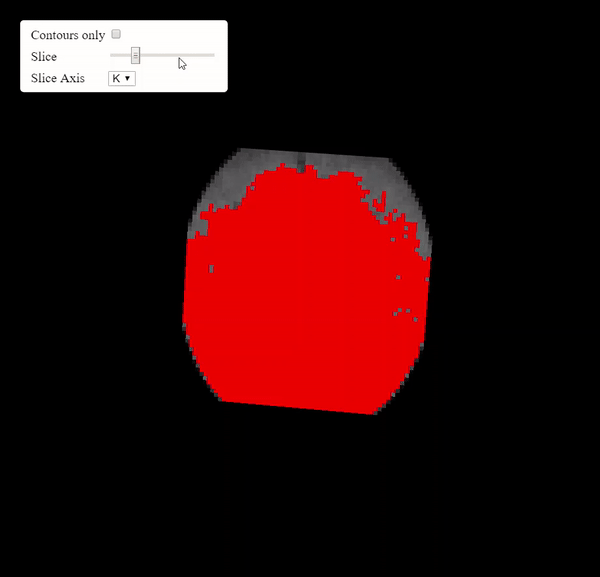

Back to [Projects List](../../README.md#ProjectsList)

# Outline Filter for VTK.js

## Key Investigators
- Andrzej Marciniak (BWH & Harvard)
- Alfredo Morales Pinzón (BWH & Harvard)
- Charles Guttmann (BWH & Harvard)
- Forrest Li (Kitware)

# Project Description

<!-- Add a short paragraph describing the project. -->
Create outline filter in vtk.js based on following code: https://github.com/Slicer/Slicer/blob/a02f79c7c788708a3dccfeb9ff4df76b6a5868be/Libs/MRML/Logic/vtkImageLabelOutline.cxx
Design and implement level tracing filter + widget for controlling and visualization
Apply Widget Manager and improve interactor of SPINE Viewer

## Objective
1. Create functionality of outline filter for VTK js
1. Design and implement level tracing filter + widget for controlling and visualization
1. Apply Widget Manager and improve interactor of SPINE Viewer

## Approach and Plan

<!-- Describe here HOW you would like to achieve the objectives stated above. -->

1. Understand the VTK.js development environment
1. Design and implementation of Outline Filter
1. Design and implementation of Level Tracing Filter and Widget

## Progress and Next Steps

1. Discussed solutions for Outline Filter and Level tracing widget.
1. Implemented Outline filter.
1. Implemented demo (ready to publish)
# Illustrations

# Background and References
https://github.com/SPINEProject/vtk-js/tree/master/Sources/Filters/General/ImageOutlineFilter
