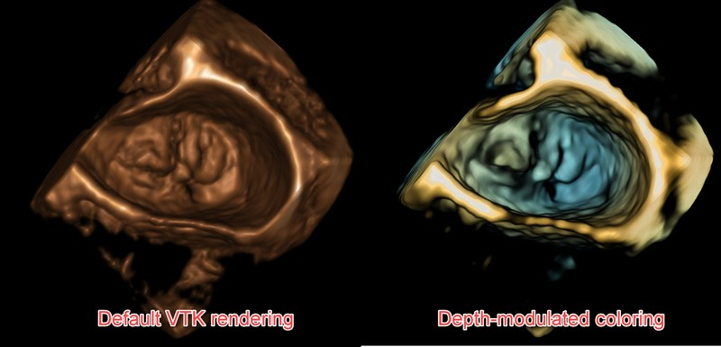

Back to [Projects List](../../README.md#ProjectsList)

# Volume rendering improvements

## Key Investigators

- [Andras Lasso](http://perk.cs.queensu.ca/users/lasso) (PerkLab, Queen's University)
- Christian Herz (CHOP)
- Kyle Sunderland (PerkLab, Queen's University)
- [Matthew Jolley](http://www.chop.edu/doctors/jolley-matthew-a) (Children's Hospital of Philadelphia)
- [Steve Pieper](http://www.spl.harvard.edu/pages/People/pieper) (Isomics)
- [Csaba Pinter](http://perk.cs.queensu.ca/users/pinter) (Queen's University, Canada)
- [Simon Drouin](http://nist.mni.mcgill.ca/?page_id=369) (Montreal Neurological Institute, Canada)

# Project Description

Volume rendering capabilities in VTK and Slicer have been significantly improved. The goal of this project is to explore what are the current unmet volume visualization needs of the Slicer community and how to fulfill.

## Objective

1. Create a list of unmet clinical needs for volume rendering.
1. Propose potential solutions of how Slicer/VTK volume rendering could be improved to fulfill these needs.
1. Create prototypes, demos for selected use cases.

## Approach and Plan

1. Demo of new features: custom GLSL shaders for volume rendering, multi-volume rendering, virtual reality, customizing lighting, photorealistic rendering **Maybe have a breakout session?**
1. Discuss with people who would like to see improvements in volume rendering. **Please talk to Andras Lasso during the project week or during the breakout session?**
1. Implement new volume rendering presets to demonstrate new features

## Progress and Next Steps

1. Clinical needs/use cases:
- 3D ultrasound rendering: Quality of ultrasound images is very poor compared to most other 3D imaging modalities. Depth-modulated coloring is used by all commercial systems to make it easier to distinguish surfaces.
- On-the-fly processing: filtering (e.g., Gaussian or median filter) would improve rendering of noisy images. It would be preferable to not modify the original input images and apply these filters dynamically, on the GPU.
- Multi-volume rendering
- 4D image (3D time sequence) rendering
- Large volume rendering (up to 4-6k per axis)
- Photorealistic rendering ("cinematic rendering"): clinical significance is unclear, but definitely useful for patient communication and training

2. Solutions

- Use recently exposed custom shaders and uniforms in VTK
- Connect GPU-based filters with the renderer
- Implement shading in multi-volume rendering
- Implement caching of recently used 3D volumes in GPU
- Use VTK OSPRay photorealistic rendering backend

# Illustrations

Depth-modulated coloring using GLSL using recent Slicer Preview release:

<!-- Add pictures and links to videos that demonstrate what has been accomplished.

-->

# Background and References

<!-- If you developed any software, include link to the source code repository. If possible, also add links to sample data, and to any relevant publications. -->

- [Related project: Custom shaders for volume rendering and data processing on GPU](../GLSLShaders/README.md)
- [Forum discussion: Is there interest in higher quality rendering for Slicer?](https://discourse.slicer.org/t/is-there-interest-in-higher-quality-rendering-for-slicer/6862)
