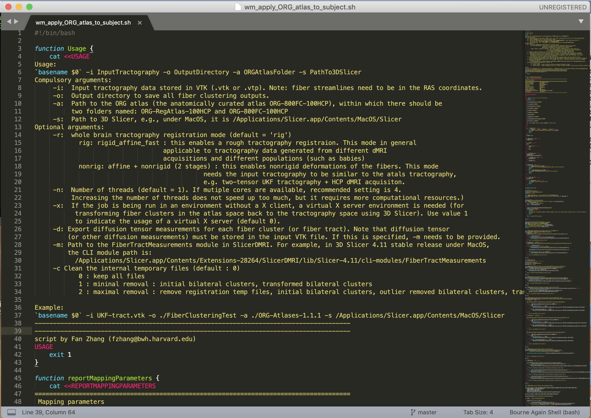
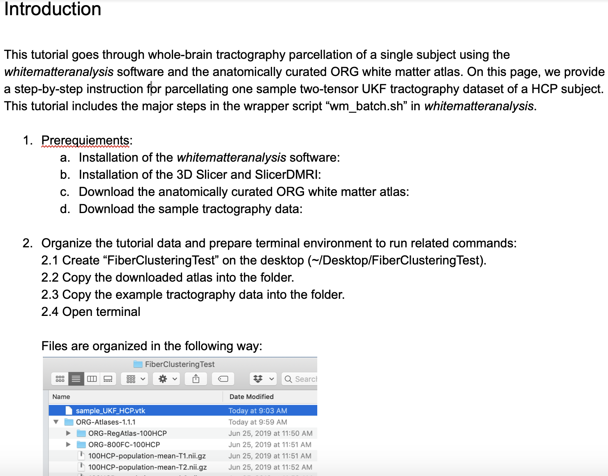

Back to [Projects List](../../README.md#ProjectsList)

# WMA: fiber clustering pipeline documentation

## Key Investigators

- Fan Zhang (BWH)
- Mengying Zhang (BWH)
- Banu Ahtam (BCH)
- Di Fan (University of Southern California)
- Parikshit (Paxy) Juvekar (BWH)
- Lauren J. O'Donnell (BWH)

# Project Description

Software for data-driven white matter parcellation
<!-- Add a short paragraph describing the project. -->

## Objective

<!-- Describe here WHAT you would like to achieve (what you will have as end result). -->

1. Improve user documentation and results checking documentation based on user feedback.
1. Investigate alternatives for documentation.
1. Create batch script to run entire pipeline.
1. Update all versions of documentation; remove unused.
1. http://dmri.slicer.org/whitematteranalysis/
1. https://projects.iq.harvard.edu/whitematteranalysis/publications

## Approach and Plan

<!-- Describe here HOW you would like to achieve the objectives stated above. -->

1. Batch script for running the fiber clustering pipeline.
1. Give details about each processing step and the expected outputs.
1. Have users from technical and clinical fields tested.

## Progress and Next Steps

<!-- Update this section as you make progress, describing of what you have ACTUALLY DONE. If there are specific steps that you could not complete then you can describe them here, too. -->

1. Batch script for running the fiber clustering pipeline is done.
1. Tested by mutltiple collaborators.
1. Documentation of step-by-step instructions is done. It currently in a Google Doc and needs to be released donline soon.

# Illustrations

<!-- Add pictures and links to videos that demonstrate what has been accomplished.

-->

# Background and References

<!-- If you developed any software, include link to the source code repository. If possible, also add links to sample data, and to any relevant publications. -->

1. Zhang, F., Wu, Y., Norton, I., Rathi, Y., Makris, N., O'Donnell, LJ. An anatomically curated fiber clustering white matter atlas for consistent white matter tract parcellation across the lifespan. NeuroImage, 2018 (179): 429-447

1. O'Donnell, LJ., Wells III WM., Golby AJ., Westin CF. Unbiased groupwise registration of white matter tractography, in: International Conference on Medical Image Computing and Computer-Assisted Intervention, 2012 (pp. 123-130).

1. O'Donnell, LJ., and Westin, C-F. Automatic tractography segmentation using a high-dimensional white matter atlas. Medical Imaging, IEEE Transactions on 2007 (26.11): 1562-1575.
