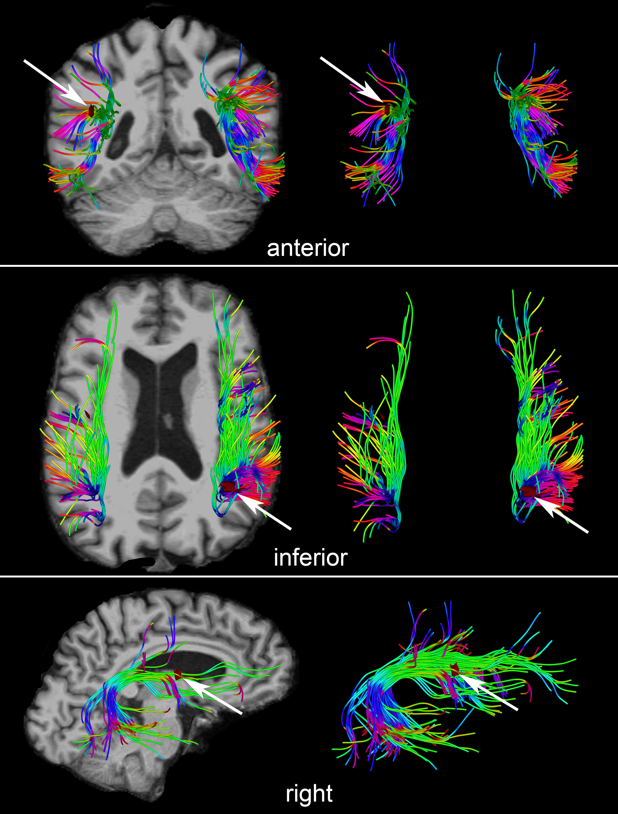

Back to [Projects List](../../README.md#ProjectsList)

# Fiber Clustering Analysis to Quantify White Matter Connectivity in the Aging Human Brain

## Key Investigators

- Andrei Irimia (University of Southern California)
- Di Fan (University of Southern California)
- Fan Zhang (Brigham and Women's Hospital)
- Lauren J O'Donnell (Brigham and Women's Hospital)

# Project Description

<!-- Add a short paragraph describing the project. -->

## Objective

<!-- Describe here WHAT you would like to achieve (what you will have as end result). -->

1. Design and streamline workflow for the analysis of dMRI data from geriatric patients.
1. Identify existing and novel functionality to cluster white matter fiber streamlines.
1. Troubleshot existing problems in the analysis workflow.

## Approach and Plan

<!-- Describe here HOW you would like to achieve the objectives stated above. -->

1. Exchage expertise and information to identify optimal strategies for white matter analysis.
1. Implement and adapt workflows to improve the robustness of the existing approaches.
1. Test and validate the functionality and results obtained.

## Progress and Next Steps

<!-- Update this section as you make progress, describing of what you have ACTUALLY DONE. If there are specific steps that you could not complete then you can describe them here, too. -->

1. The team has made substantial progress on integration UKF tractography and WM labeling tools (BWH team) with existing functionality to identify cerebral microbleeds (USC team).
2. An approach to identify, analyze and quantify changes in FA along major WM fasciculi of the brain was agreed upon and prototyped.
3. Testing and validation of integrated workflows was performed and the two teams made progress on identifying goals for future collaboration.

# Illustrations

<!-- Add pictures and links to videos that demonstrate what has been accomplished.

-->

# Background and References

<!-- If you developed any software, include link to the source code repository. If possible, also add links to sample data, and to any relevant publications. -->
1. Di Fan, Nikhil N. Chaudhari, Kenneth A. Rostowsky, Maria Calvillo, Sean K. Lee, Nahian F. Chowdhury, Fan Zhang, Lauren J. O’Donnell and Andrei Irimia. Post-Traumatic Cerebral Microhemorrhages and Their Effects upon White Matter Connectivity in the Aging Human Brain[C]. 41th Annual International Conference of the IEEE Engineering in Medicine and Biology Society (EMBC 2019).
2. Isaiah Norton, Ibn Essayed, Fan Zhang, Sonia Pujol, Alex Yarmarkovich, Alexandra Golby, Gordon Kindlmann, Demian Wasserman, Raul San José Estepar, Yogesh Rathi, Steve Pieper, Ron Kikinis, Hans Johnson, Carl-Fredrik Westin, and Lauren J. O'Donnell. 2017. “SlicerDMRI: Open Source Diffusion MRI Software for Brain Cancer Research.” Cancer Research, 77, 21, Pp. e101–103.
3. Fan Zhang, Ye Wu, Isaiah Norton, Laura Rigolo, Yogesh Rathi, Nikos Makris, and Lauren J. O'Donnell. 2018. “An anatomically curated fiber clustering white matter atlas for consistent white matter tract parcellation across the lifespan.” NeuroImage, 179, Pp. 429-447.
