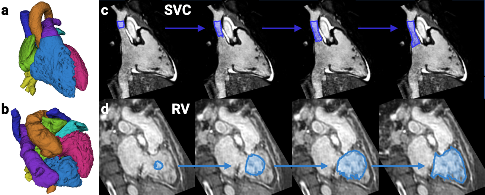

Back to [Projects List](../../README.md#ProjectsList)

# Whole Heart Segmentation for Congenital Heart Disease

## Key Investigators

- Danielle Pace (MIT)

# Project Description

We are working on segmenting the cardiac chambers and great vessels from 3D MRI, for patients with congenital heart disease. The aim is to enhance surgical planning via rendered or 3D-printed heart models.

We have previously developed a recurrent neural network (RNN) model that evolves a segmentation of each structure over time, and shown that it is more generalizable to severe CHD defects than conventional models that segment the image in one step.

## Objective

<!-- Describe here WHAT you would like to achieve (what you will have as end result). -->

1. Objective A. Use data augmentation for inference.
1. Objective B. Finish data augmentation (during training) that mimics stents and 'distractor' vessels.

## Approach and Plan

<!-- Describe here HOW you would like to achieve the objectives stated above. -->

1. Implement and test various data augmentation schemes during inference for a growing segmentation.
1. Debug NaN bug for data augmentation that mimics stents and 'distractor' vessels.

## Progress and Next Steps

<!-- Update this section as you make progress, describing of what you have ACTUALLY DONE. If there are specific steps that you could not complete then you can describe them here, too. -->

1. Made good progress towards objective A: fixed bugs and implemented data augmentation during inference for a growing segmentation.

# Illustrations

# Background and References

<!-- If you developed any software, include link to the source code repository. If possible, also add links to sample data, and to any relevant publications. -->

[Iterative segmentation from limited training data: Applications to congenital heart disease](http://dx.doi.org/10.1007/978-3-030-00889-5_38)

D.F. Pace, A.V. Dalca, T. Brosch, T. Geva, A.J. Powell, J. Weese, M.H. Moghari, P. Golland
MICCAI Workshop on Deep Learning in Medical Image Analysis, 2018
